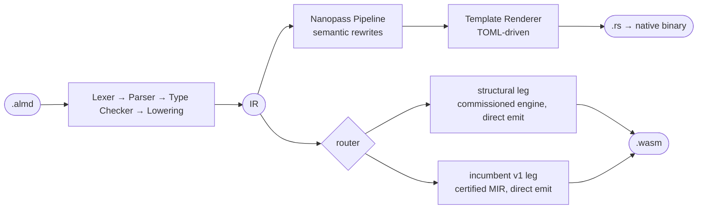

<p align="center">
  <picture>
    <source media="(prefers-color-scheme: dark)" srcset="./docs/assets/brand/almide-cover-dark.png">
    
  </picture>
</p>

<p align="center"><strong>モデルが間違えたとき、コンパイラが直し方を名指しする。</strong></p>

<p align="center">
  <a href="https://github.com/almide/almide/actions/workflows/ci.yml"></a>
  <a href="./LICENSE"></a>
  <a href="https://deepwiki.com/almide/almide"></a>
</p>

<p align="center">
  <a href="https://almide.github.io/playground/">Playground</a> ·
  <a href="./docs/CHEATSHEET.md">チートシート</a> ·
  <a href="./docs/SPEC.md">仕様</a> ·
  <a href="#なぜ-almide-か">なぜ</a> ·
  <a href="#クイックスタート">クイックスタート</a> ·
  <a href="#何を測っているか">証拠</a> ·
  <a href="#仕組み">仕組み</a> ·
  <a href="#プロジェクトの状態">状態</a>
</p>

<p align="center">
  <a href="README.md"></a>
  <a href="README.ja.md"></a>
  <a href="README.zh-CN.md"></a>
</p>

---

## 生き残る編集

Almide は、AI が書き AI が編集するコードのための静的型付け言語です。主張は「モデルが正しく書く」ことではありません。**モデルが間違えたとき、コンパイラが書いている時点でそれを指摘し、直し方を名指しする。モデルが正しかったとき、ビルドはその成果物が安全であるという証明書を伴う。** ネイティブバイナリ（Rust 経由）と WebAssembly の両方にコンパイルされ、その二つはバイト単位で同一の出力を出します。

主張の前半を 1 画面で。モデルが型に case をひとつ足し、モデルがよくやるように、他には何も触らなかったとします。

```almd
type Shape =
  | Circle(Float)
  | Square(Float)
  | Triangle(Float, Float)   // この編集

fn area(s: Shape) -> Float =
  match s {
    Circle(r) => 3.14159 * r * r
    Square(w) => w * w
  }
```

```text
error[E010]: non-exhaustive match: missing Triangle(_, _)
  --> shape.almd:7:9
  in match
  here: match s {
  hint: add arms for Triangle(_, _):
  Triangle(arg1, arg2) => _
Or use `_ => todo()` to compile incrementally.
```

コンパイラは欠けた case をその場で名指しし、足すべき arm を書き下し、残りを書く間もコンパイルを通し続ける方法を示します。モデルの次の一手は `Triangle(b, h) => 0.5 * b * h` です。プログラムはそのままネイティブでも wasm でも走り、同じバイト列を出力します。編集、それ自体が修正になっている診断、通るビルド —— このループが、以下のすべての決定が仕えている対象です。同じ問いを Python に対して、8 件の注入した改変ミスで問うたもの：[demo/make-verify](./demo/make-verify/)。

## なぜ Almide か

- **予測可能** —— 各概念に正準形がひとつだけ。LLM のトークン分岐を減らす
- **局所的** —— どのコードを理解するにも、近くの文脈だけで足りる
- **修復可能** —— 診断は複数の可能性ではなく、特定の修正へ導く（上の例のように）
- **簡潔** —— 意味の密度が高く、構文の雑音が少ない

設計の全論拠は [Design Philosophy](./docs/design/DESIGN.md)。凍結された表面と破壊的変更の方針は [STABILITY.md](./docs/STABILITY.md)（2026-08-20 宣言）—— チートシートと `llms.txt` に載っているものは、意味が変わりません。

## クイックスタート

**[ブラウザで試す →](https://almide.github.io/playground/)** —— インストール不要。

```bash
curl -fsSL https://raw.githubusercontent.com/almide/almide/main/tools/install.sh | sh   # macOS / Linux
irm https://raw.githubusercontent.com/almide/almide/main/tools/install.ps1 | iex        # Windows (PowerShell)
```

インストーラは展開前に、アーカイブをリリースの `almide-checksums.sha256` と照合します。ダウンロードした資産を自分で検証するには —— チェックサムファイルを含むすべてのリリース資産が、リリースワークフローによって Sigstore で証明されています（[SECURITY.md](./SECURITY.md) を参照）：

```bash
gh attestation verify almide-macos-aarch64.tar.gz -R almide/almide   # 来歴: almide/almide のリリースワークフローが作った
sha256sum -c --ignore-missing almide-checksums.sha256                # ダイジェストが公開チェックサムと一致する
```

各アーカイブには `almide-verify`（独立してバージョン管理される証明書チェッカ）も入っています。`almide verify app.almd` はプログラムの所有権・名前・能力・呼び出しモードの証跡を出力し、それを渡します（`almide` の隣か `PATH` 上に置く必要があります。組み込みのフォールバックはありません）。

ソースからは、[Rust](https://rustup.rs/) 1.94 以上で（バイナリは wasmtime ホストを埋め込みます）：`cargo build --release && cp target/release/almide target/release/almide-verify ~/.local/bin/`（または `make install`）。

```almd
fn main() -> Unit = {
  println("Hello, world!")
}
```

```bash
almide run hello.almd                 # ネイティブ
almide run hello.almd --target wasm   # 同じバイト列を wasmtime で
```

## 機能

- **マルチターゲット** —— 同じソースがネイティブバイナリ（Rust 経由）にも WebAssembly（直接出力、LLVM 不要）にもなる
- **ジェネリクス** —— 関数（`fn id[T](x: T) -> T`）、レコード、variant 型、自動 Box 包みつきの再帰 variant
- **パターンマッチ** —— variant の分解を伴う網羅的な `match`
- **effect 関数** —— 明示的なエラー伝播のための `effect fn`。`expr!` が伝播し、裸の可謬呼び出しはエラーになる。黙って進むことはない
- **双方向型推論** —— 注釈が式へ流れ込む（`let xs: List[Int] = []`）
- **Codec** —— `Type.decode(value)` / `Type.encode(value)` を自動導出
- **Map リテラル** —— `["key": value]`、`m[key]`、`for (k, v) in m`
- **Fan** —— 構造化並行性。`fan { a(); b() }` はネイティブでは実スレッド、wasm では逐次。`fan.map` / `fan.any` は両方でリスト順に決定的
- **パイプライン演算子** —— `data |> transform |> output`
- **モジュールシステム** —— パッケージ、サブ名前空間、可視性制御、ダイヤモンド依存の解決
- **標準ライブラリ** —— 自己ホストの `.almd` モジュール。string、list、map、json、http、fs ほか（[リファレンス](./docs/stdlib/)。関数の数は[プロジェクトの状態](#プロジェクトの状態)で導出）
- **組み込みテスト** —— `test "name" { assert_eq(a, b) }` を `almide test` で

## 何を測っているか

この節のすべての主張は、スクリプトによって導出されているか、測定した日付を持っています。`scripts/check-readme-numbers.sh` は CI で裸の数字を拒否し、90 日より古い、あるいは由来する almide-dojo の run を名指ししない LLM 可読性スコアカードも拒否します。

### LLM 可読性

[almide-dojo](https://github.com/almide/almide-dojo) により 2026-09-22 に、38 タスク（basic / intermediate / advanced）のバンクに対し、固定コンパイラ `almide 0.62.0` で、同リポジトリの CI レーンが測定。両 run ともハーネスによって **`comparable`** と刻印されています —— 計画されたタスクがすべてモデルに届いたので、各率は区間ではなく点です。いずれも固定シード（`20260922`）・温度 0 でサンプリングされ、プロバイダが実際に送出した値として run のマニフェストに記録されています。run はコミット済み（[`almide-dojo@8af34bc`](https://github.com/almide/almide-dojo/commit/8af34bc3)）なので、下の表は信じる対象ではなく `summary.md` から再計算できます。以降の run は[ライブダッシュボード](https://almide.github.io/almide-dojo/)にあります。方針として CI に Anthropic / OpenAI の鍵を置いていないので、ここに並ぶのはレーンが鍵なしで到達できるモデルです：

| Model | Pass Rate | 1-Shot Rate |
|---|---|---|
| Llama 3.3 70B (fp8-fast) | 65% (25/38) | 39% (15/38) |
| Llama 3.1 8B | 44% (17/38) | 34% (13/38) |

同一モデルでの最新の比較は MiniGit ベンチです。2026-07-15、Sonnet 5 × 20 試行、100% 通過、5 言語中もっとも簡潔（233 LOC）、Gleam と MoonBit に対してエージェントの実時間が最速。これは 6〜9 倍の自己並列下で測った **LLM 可読性**の数字であって、生成コードの速度では**ありません**（[図](docs/figures/lang-bench-snapshot-2026-07.png) · [方法](research/benchmark/lang-bench/README.md) · [上流](https://github.com/mame/ai-coding-lang-bench)）。

### ターゲット間でバイト単位に同一

**両ターゲットでコンパイルできるすべてのプログラムは、ネイティブバイナリとして走ろうと WebAssembly として走ろうと、観測可能な出力 —— stdout、stderr、終了コード —— がバイト単位で同一になります。** ネイティブが基準であり、`native == wasm` は「ターゲット差異」として文書で回避するものではなく、硬い不変条件です。

この保証は**継続的で、台帳で管理された明示的な範囲**を持ちます。「バイト単位に同一」が指すのは実行の出力であって、コンパイル済み成果物ではありません。本質的に非決定的な源は、正確なバイト列の代わりに決定的な*不変条件*を証明します。wasm で未実装の API はコンパイル時または実行時の*拒否*であり、誤ったバイト列には決してなりません。そして役割がホストの報告そのものである 2 つの fn —— `env.os()` と `env.temp_dir()` —— だけが C-189 に区切られて除外されます。これらをターゲット間で一致させることは、保証ではなく欠陥になるからです。

この主張は散文ではありません。観測可能な約束はすべて[振る舞い契約台帳](docs/contracts/)の名前付き契約であり、それぞれが実行可能な証拠まで辿れます。下の数字は台帳から再生成されます（`scripts/gen-claims.sh`、CI では `scripts/check-contracts.sh` が強制）：

<!-- claims:generated:start — derived from docs/contracts/contracts.toml by scripts/gen-claims.sh; DO NOT EDIT between the markers -->
> <!-- counts:generated:start (as of 2026-09-29) — stamped totals from proofs/ledger-counts.toml; refreshed only by scripts/gen-ledger-counts.sh, never by a fixture/contract PR; DO NOT EDIT between the markers -->
> **Ledger: 370 contracts — 370 active, 0 flagged-for-revision.**
> <!-- counts:generated:end -->
>
> **Divergences awaiting a fix: none.** Every contract in the ledger is
> `active`, carrying executable evidence of class >= `fixture`. The one
> by-design carve-out in the law — the platform-reporting fns `env.os`
> and `env.temp_dir` — is bounded by C-189.
<!-- claims:generated:end -->

範囲、台帳の仕組み、証拠の積み重ね（契約台帳、クロスターゲット fixture ゲート、差分ファジング、出力時 Σ プローブ、Lean ベルト、org 横断のバイト検証掃引）：**[docs/design/EQUIVALENCE.md](./docs/design/EQUIVALENCE.md)**。

### メモリ安全性 —— 証明された所は証明で、信頼している所は信頼で

所有権注釈もライフタイムも `free` も書きません。コンパイラ内の [Perceus](https://www.microsoft.com/en-us/research/publication/perceus-garbage-free-reference-counting-with-reuse/) 式の所有権推論が、すべてのヒープ値をどこで生成し、複製し、消費するかを決めます —— GC なし、停止なし。**incumbent wasm leg** ではその決定がビルドごとの所有権証明書とともに出荷され、**カーネル証明されたチェッカが再検証**します（Rocq/Coq の背骨、96 の監査済み定理と補題、公理クリーン、`coqchk` による独立再検査。数は `proofs/check.sh` が表明）。**structural wasm leg**（#1599 以降の既定）と**ネイティブ leg** は、証明ではなく信頼です。その証拠は差分的 —— 契約コーパス上で証明済み leg とバイト単位に同一の出力であること、単調増加の下限とセマンティック変異ネットで保持されます。`Built …` の行が、あなたのバイト列を作った leg を名指しします。段階ごとの境界は **[proven-vs-trusted.md](docs/contracts/proven-vs-trusted.md)**、設計の出発点となった Lean 4 Perceus ベルトを含む全体像は **[docs/design/MEMORY-SAFETY.md](./docs/design/MEMORY-SAFETY.md)**。

### 性能

ランタイムなし、GC なし、インタプリタなし —— ネイティブは Rust を通って機械語になり、WASM は自己完結したモジュールとして直接出力されます。

<!-- wasm-size:generated:start — rendered from docs/benchmarks/wasm-size.txt by scripts/gen-readme-stats.sh; DO NOT EDIT between the markers -->
| Program (`almide build --target wasm`, verified, as shipped) | incumbent v1 leg | structural leg |
|---|---:|---:|
| Hello, world | **1,096 B** | **1,330 B** |

Measured on almide 0.62.0, 2026-09-12, from `docs/benchmarks/wasm-size.txt`; no post-hoc optimizer touches the shipped bytes (`--wasm-opt` is opt-in and its output is not the verified module).
<!-- wasm-size:generated:end -->

同じ wasm ターゲットの Rust は、サイズを詰め切っても Hello, world で 40 KB 以上になります。ネイティブの minigit CLI バイナリは strip 後 418 KB、依存 0。バイト単位の解剖（2026-07-23、incumbent leg で測定）：**[docs/wasm/WASM-OUTPUT.md](./docs/wasm/WASM-OUTPUT.md)**。

手書き Rust に対して、算術カーネルは同等です（n-body、spectral-norm ともに 1.00×。ratchet の固定行）。Almide が Rust の持たない情報を持つ場合 —— 木の寿命全体が `check(make(depth))` という 1 つの式であることを effect system が証明している場合 —— 同じプログラムに対する普通の Rust より速くなります：

<!-- native-victory:generated:start — rendered from docs/benchmarks/native-victory.txt by scripts/gen-readme-stats.sh; DO NOT EDIT between the markers -->
| Workload (`bench.py`, median of 9, interleaved) | optimization | Almide / ordinary Rust | without it (`ALMIDE_REGION_OFF=1` / `ALMIDE_FAN_SEQUENTIAL=1`) | CI runner |
|---|---|---:|---:|---:|
| binarytrees | region window (#1991) | **0.35 (d17)** / **0.32 (d19)** | 1.25 | 0.61 |
| treealloc | region window (#1991) | **0.30 (d20)** / **0.30 (d21)** | 1.10 | 0.61 (est.) |
| fannkuchredux | parallel fan (#2044) | **0.21 (n10)** / **0.12 (n11)** | 1.06 | 0.60 (est.) |

Two ratios per row are the two input sizes (the win holds at both); the Rust side is the ordinary program a person writes for it — a `Box` per node, one thread, no arena, no `unsafe`, no SIMD — compiled with the same `rustc` flags, and the "without it" column is the same Almide source with the region window turned off, so the whole gap is that one optimization. The absolute ratio is allocator-dependent (the CI runner frees a `Box` cheaper), the direction is not: the `perf-ratchet` job fails if either row reaches 1.0 or the ablation stops paying. Declaration and methodology: [docs/project/BENCHMARKS.md](./docs/project/BENCHMARKS.md#faster-than-ordinary-rust-1330). Ledger: `docs/benchmarks/native-victory.txt` (almide 0.62.0, 2026-09-08).
<!-- native-victory:generated:end -->

<!-- build-speed:generated:start — derived from docs/benchmarks/build-speed.txt by the almide-gates `bench` subcommand; DO NOT EDIT between the markers -->
Measured on almide 0.59.1, arm64 Darwin, `examples/lisp.almd` (268 lines), 2026-08-27. Every row is an N-run MEAN —
a single run of a 30ms process is scheduler noise. Cold clears BOTH `$TMPDIR/almide-run`
and the dependency cache before each repetition; clearing only the latter measures a warm
build. Regenerate with `almide run tools/almide-gates/src/main.almd -- bench`; the ratchet
(`-- bench --check`) fails CI at 1.5x.

| scenario | time | runs |
|---|---|---|
| `almide check` | **15.2 ms** | 20 |
| build, warm (content-cache hit) | **237.2 ms** | 5 |
| build, cold | **635.3 ms** | 3 |
| build, cold, `--target wasm` | **61.7 ms** | 3 |
<!-- build-speed:generated:end -->

`almide check` は線形にスケールします。このリポジトリ自身の stdlib による 2k → 30k 行の階段で、検査時間のプロジェクト行数に対する両対数の傾きは **1.13**（1.0 が線形、2.0 が二次）、10k 行の段は空プロジェクトの床の **4.4 倍** —— 2026-08-13 測定、`scripts/check-edit-loop-scale.sh` が保持、表は [BENCHMARKS.md](./docs/project/BENCHMARKS.md#edit-loop-scale-1334)。手書き Rust に対するネイティブ実行時間は n-body と spectral-norm で **1.00×**、fasta と FFT で 1.16〜1.18×、リストの実体化が主となるワークロードで約 1.6×（#1004）、CI が比率 ratchet で保持（[スコアボード](./docs/project/BENCHMARKS.md)）。wasm 実行時間も測定・ゲート済み（#1701）：

<!-- wasm-runtime:generated:start — rendered from docs/benchmarks/wasm-runtime.txt by scripts/gen-readme-stats.sh; DO NOT EDIT between the markers -->
| Benchmark (`almide bench`, verify-then-time, median of 5) | wasm/native ratio |
|---|---:|
| nbody | **2.19×** |
| spectralnorm | **1.73×** |
| binarytrees | **1.36×** |
| treealloc | **1.04×** |
| fasta | **1.69×** |
| mandelbrot | **1.29×** |
| fft | **2.85×** |
| strchurn | **0.87×** |
| listbuild_append | **3.04×** |
| listbuild_combinator | **3.13×** |
| listbuild_prealloc | **2.85×** |
| mapbuild | **0.86×** |

Embedded wasm host (Perceus RC in linear memory) against the native binary, same machine, same run. Cross-engine ratios do NOT cancel hardware (a 2-core CI runner measures nbody ~10x worse), so the stamped ratio verdict runs on the stamping machine class; CI gates the STATUS taxonomy below and judges the wasm leg by a same-runner A/B against the latest release binary (interleaved, min-of-runs, `ab_band` in the ledger — #2143) (`scripts/check-wasm-runtime-ratio.sh`). binarytrees runs its fan arms on the embedded host's thread pool, which is why wasm WINS there. The unmeasured corpus cells stay honest instead of estimated: 1 route to the incumbent artifact, 1 wall on the wasm build path, 0 exhaust the embedded heap (#1729) — each re-measured every gate run, so a cell that starts benching fails the gate until its row is promoted. Ledger: `docs/benchmarks/wasm-runtime.txt` (almide 0.63.0 (dev), 2026-09-24).
<!-- wasm-runtime:generated:end -->

## 仕組み

フロントエンドひとつ、IR ひとつ、2 つのターゲットの背後に 3 つのレンダラ：



**ネイティブ。** Nanopass パイプラインがターゲット固有の変換を適用します —— `ResultPropagation`（Rust の `?`）、`CloneInsertion`（Rust の借用解析）、`LICM`（ループ不変式の移動）。Template Renderer は純粋に構文的で、意味に関わる決定はすべて IR の時点で済んでいます。

**WebAssembly。** commissioning（[#1599](https://github.com/almide/almide/pull/1599)）以降、2 つの検証済みレンダラが 1 つのルータの背後にあります（`src/cli/build.rs` の `render_wasm_module_routed`）。**structural leg** —— commissioned エンジン、`almide::wasm_leg` フロント + `crates/almide-wasm` エミッタ —— は、`main` を持ち、外部パッケージがなく、ビルド経路にホスト差のある I/O がないプログラムをすべて受け取ります。`wasm_cross` コーパスで 610/610 がネイティブとバイト単位に同一として受理され、その成果物は WASI 形式（[#1588](https://github.com/almide/almide/issues/1588)）で出荷されるので素のランタイムで走ります。**incumbent v1 leg** —— `crates/almide-mir` の証明済み MIR トラストスパイン —— は、`main` を持たないライブラリモジュール、依存を持つプロジェクト、ホスト差のあるプログラム、そして structural leg が拒否したあらゆる形を受け取ります。検証済みから検証済みへの引き渡しであって、退役した未検証エミッタには決して戻りません。どちらの leg も降ろせないプログラムは、正直なエラーになります。`ALMIDE_WASM_INCUMBENT=1` で incumbent を強制、`ALMIDE_VERIFIED_DEBUG=1` でルーティングを実況します。

```bash
almide run app.almd                  # コンパイル + 実行（ネイティブ）
almide build app.almd --target wasm  # WebAssembly をビルド（WASI）
almide test                          # test ブロックを再帰的に探して実行
almide check app.almd                # 型検査のみ
almide check app.almd --target wasm  # + wasm ビルド経路: 検査時に E081/E082（#1922）
almide fmt app.almd                  # ソースを整形
```

全コマンド一覧は `almide --help`（compile、add、deps、clean …）。パイプラインとモジュールの地図は [docs/ARCHITECTURE.md](./docs/ARCHITECTURE.md)、2 つの wasm leg の詳細は [docs/wasm/](./docs/wasm/README.md)。

### 次に来るもの —— v1、トラストスパイン

上の Perceus 証明が証明するのは、コンパイラの 1 パスを 1 回だけです。v1 はその原理を**パイプライン全体**に一般化します —— 10 万行のコンパイラを証明する代わりに、小さな*チェッカ*を証明し、コンパイラにはビルドごとに証明書を出させて、チェッカがそれを再検証します。チェッカが受理すれば、その成果物はその性質を持つ —— コンパイラの内部に一切言及しない定理です。これにより信頼基盤は約 10 万行から、抽出されたチェッカ（証明から機械導出された OCaml 約 1,400 行）まで縮みます。そしてテストより難しい問いを立てます。**「テストは通るか」ではなく「出力が正しいと機械が証明できるか」。** 構成、受領証（C-SAFE / C-REPRO / C-FAITHFUL / C-PROVEN）、そしてビルドが意図的に遅い理由は **[docs/TRUST-SPINE.md](./docs/TRUST-SPINE.md)**。

## プロジェクトの状態

| 項目 | 状態 |
|----------|--------|
| 成熟度 | 1.0 前、`develop` で活発に開発中。LLM に面する表面は [STABILITY.md](docs/STABILITY.md) で凍結（2026-08-20 宣言） |
| サポート | 最新リリースラインのみ、1.0 前 —— 方針とバージョニングの保証は [SUPPORT.md](./SUPPORT.md) · 脆弱性は [SECURITY.md](./SECURITY.md) |
| コンパイラ | 純 Rust、単一バイナリ、ICE 0 件 |
| ターゲット | Rust（ネイティブ）、WASM（直接出力 —— 1 つのルータの背後に検証済み 2 leg。[仕組み](#仕組み)を参照） |
| 検証済みコード生成 | incumbent v1 leg: 0.29.0 以降、毎ビルドで PCC 証明書を再検証（`--no-verified` で除外）。structural leg: バイト厳密なコーパスと変異ゲート、証明書はまだ |
| コード生成 | Rust: Nanopass + TOML テンプレート。wasm: structural エンジンまたは証明済み MIR → 直接出力（未検証の v0 エミッタは退役。拒否はエラーであって、フォールバックではない） |
| 成果物 | `almide compile` による `.almdi` モジュールインタフェースファイル |
| Playground | [稼働中](https://almide.github.io/playground/) —— コンパイラがブラウザで WASM として動く |

<!-- stats:generated:start — derived from docs/stdlib/*.md, spec/, and docs/contracts/contracts.toml by scripts/gen-readme-stats.sh; DO NOT EDIT between the markers -->
<!-- counts:generated:start (as of 2026-09-28) — stamped totals from proofs/ledger-counts.toml; refreshed only by scripts/gen-ledger-counts.sh, never by a fixture/contract PR; DO NOT EDIT between the markers -->
| Derived count | Value |
|---|---|
| Stdlib | 1015 functions across 45 modules — self-hosted `.almd`, signature indexes regenerated from the compiler by `tools/gen-stdlib-doc-index.py` |
| Tests | 468 `.almd` test files under `spec/` (`almide test spec/`) + the 370-contract cross-target ledger |
<!-- counts:generated:end -->
<!-- stats:generated:end -->

<!-- mutation-score:generated:start (as of 2026-09-22) — stamped from proofs/mutation-score.toml by scripts/gen-mutation-score.sh; re-measured by every mutation-sweep run, refreshed only by `--from-run`; DO NOT EDIT between the markers -->
**Mutation score** — 41/41 mutants caught (100.0 %), 0 survived, 0 stale: the full release-shape net sweep of `ci/mutations/` ([`scripts/check-mutation-gate.sh`](./scripts/check-mutation-gate.sh)), stamped 2026-09-22 from mutation-sweep run [35650396971](https://github.com/almide/almide/actions/runs/35650396971) at `3b02f7dc4`.
<!-- mutation-score:generated:end -->

## Almide で書かれたもの

このリポジトリの中で最大の Almide プログラムは標準ライブラリです。以下は別の場所で Almide で書かれたもので、表面上の主張が「言語をよく見せるために書かれたのではないコード」と出会う場所です。

- **コーディングエージェント** —— [comide](https://github.com/O6lvl4/comide)、ディレクトリの中の会話 · [golemide](https://github.com/O6lvl4/golemide)、単一の静的バイナリ、観察してから編集し、すべての書き込みが構文ゲートを通る · [homullus](https://github.com/almide-ai/homullus)、モジュラーなエージェントランタイム · [manus](https://github.com/almide-ai/manus)、macOS のコンピュータ操作
- **エージェント基盤** —— [porta](https://github.com/almide/porta)、WASM 隔離と OS サンドボックス、Docker 不要 · [ctxgate](https://github.com/O6lvl4/ctxgate)、ツールフックに住むコンテキストファイアウォール · [hew](https://github.com/O6lvl4/hew)、エージェント向けの構造認識 `cat`/`grep`/`sed` · [almai](https://github.com/almide-ai/almai)、あらゆるプロバイダを覆う単一の LLM インタフェース
- **構文解析** —— [gramide](https://github.com/O6lvl4/gramide)、コーディングエージェントのための構文木。文法パッケージは [TypeScript](https://github.com/O6lvl4/gramide-typescript)、[Python](https://github.com/O6lvl4/gramide-python)、[Rust](https://github.com/O6lvl4/gramide-rust)、[Go](https://github.com/O6lvl4/gramide-go)、[JavaScript](https://github.com/O6lvl4/gramide-javascript)、[Almide](https://github.com/O6lvl4/gramide-almide) 用があり、それぞれその言語自身のパーサと突き合わせて検査されている · [parsegen](https://github.com/almide/parsegen)、C も動的ロードもない tree-sitter 互換パーサジェネレータ
- **グラフィックス** —— [snaidhm](https://github.com/almide-graphics/snaidhm)、コンピュートシェーダ優先の 2D/3D レンダラ · [ceangal](https://github.com/almide-graphics/ceangal)、その上のレイアウトとウィジェット · [obsid](https://github.com/almide-graphics/obsid)、WASM 経由の Canvas 2D / WebGL / 3D · [nn](https://github.com/almide-graphics/nn) と [slabhra](https://github.com/almide-graphics/slabhra)、ニューラルネット基盤と逆モード自動微分 · [cruth](https://github.com/almide-graphics/cruth)、VRM/glTF キャラクタ · [lumen](https://github.com/almide-graphics/lumen)、`@extern` を要さないグラフィックス数学
- **デスクトップ** —— [almide-shell](https://github.com/almide-graphics/almide-shell)、Hyprland のシェル（バー、ランチャー、通知、オンスクリーン表示） · [sprid](https://github.com/almide-graphics/sprid)、厳しいメモリ予算の下でスクロールバックを持つ端末エミュレータ
- **バインディングと配布** —— [almide-bindgen](https://github.com/almide/almide-bindgen)、20 言語ターゲットへの FFI · [almide-wasm-bindgen](https://github.com/almide/almide-wasm-bindgen) · [almide-lander](https://github.com/almide/almide-lander)、Almide をネイティブ共有ライブラリとして · [almide-web](https://github.com/almide/almide-web)、ブラウザ API
- **ライブラリ** —— [toml](https://github.com/almide/toml) · [yaml](https://github.com/almide/yaml) · [csv](https://github.com/almide/csv) · [svg](https://github.com/almide/svg) · [dfa](https://github.com/almide/dfa) · [bigint](https://github.com/almide/bigint) · [aes](https://github.com/almide/aes) · [rsa](https://github.com/almide/rsa) · [sha1](https://github.com/almide/sha1) · [base64](https://github.com/almide/base64) · [almide-sqlite](https://github.com/almide/almide-sqlite)
- **適合性と測定** —— [als](https://github.com/almide/als)、独自の判定器を持つ規範的仕様。任意の `almide` バイナリに対して走る · [almide-dojo](https://github.com/almide/almide-dojo)、LLM 可読性の測定場。ハーネス自体が Almide で書かれている · [bonsai-almide](https://github.com/almide/bonsai-almide)、ブラウザで動く 1-bit LLM

2026-09-30 測定：このリポジトリの外にある 144 の公開リポジトリが Almide のソースを含みます。生成物を除いた手書きの行数は、[nn](https://github.com/almide-graphics/nn) 21,815 行、[gramide](https://github.com/O6lvl4/gramide) ファミリが 8 リポジトリ合計 19,780 行、[almide-shell](https://github.com/almide-graphics/almide-shell) 8,502 行、[snaidhm](https://github.com/almide-graphics/snaidhm) 6,800 行、[almide-bindgen](https://github.com/almide/almide-bindgen) 5,871 行、[ceangal](https://github.com/almide-graphics/ceangal) 5,099 行、[sprid](https://github.com/almide-graphics/sprid) 4,565 行、[porta](https://github.com/almide/porta) 4,419 行。

## エコシステムとドキュメント

- [almide-grammar](https://github.com/almide/almide-grammar) —— 構文（キーワード、演算子、優先順位、TextMate スコープ）の単一の正。Almide で書かれており、コンパイラはビルド時にここから字句解析器のキーワード表を生成するので、コンパイラとツールがずれることがない
- [vscode-almide](https://github.com/almide/vscode-almide) · [tree-sitter-almide](https://github.com/almide/tree-sitter-almide)（Neovim、Helix、Zed） · [playground](https://github.com/almide/playground)
- [docs/CHEATSHEET.md](./docs/CHEATSHEET.md) —— AI コード生成向けクイックリファレンス · [docs/SPEC.md](./docs/SPEC.md) —— 言語仕様 · [docs/GRAMMAR.md](./docs/GRAMMAR.md) —— EBNF 文法 + stdlib リファレンス
- [docs/design/DESIGN.md](./docs/design/DESIGN.md) —— 設計哲学 · [docs/design/EQUIVALENCE.md](./docs/design/EQUIVALENCE.md) —— バイト同一性の主張 · [docs/design/MEMORY-SAFETY.md](./docs/design/MEMORY-SAFETY.md) —— 証明と信頼の区分 · [docs/TRUST-SPINE.md](./docs/TRUST-SPINE.md) —— v1
- [docs/contracts/](./docs/contracts/) —— 振る舞い契約台帳 · [docs/stdlib/](./docs/stdlib/) —— モジュール別の標準ライブラリ · [docs/project/BENCHMARKS.md](./docs/project/BENCHMARKS.md) —— サイズ、実行時間、編集ループのスケール · [docs/roadmap/](./docs/roadmap/README.md) —— 進化計画

## コントリビュート

Issue と Pull Request を [GitHub](https://github.com/almide/almide) で歓迎します。クローン後、git フックを入れてください（`brew install lefthook && lefthook install`）。コミットは英語である必要があります（commit-msg フックが強制）。プロジェクトの規約は [CLAUDE.md](./CLAUDE.md)。

## ライセンス

[MIT](./LICENSE-MIT) または [Apache 2.0](./LICENSE-APACHE) のいずれか、お好きなほうで。
