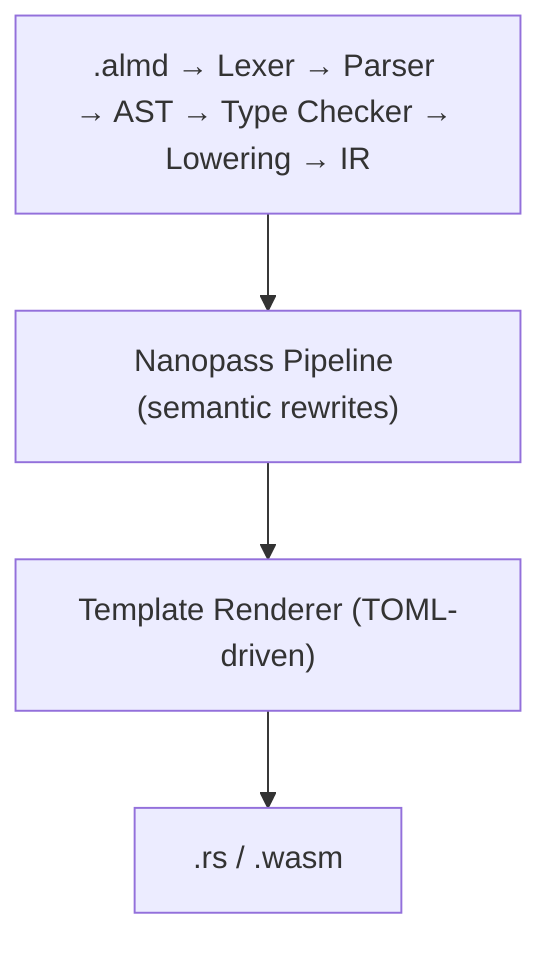

<p align="center">
  
</p>

<h1 align="center">Almide</h1>

<p align="center">A programming language designed for LLM code generation.</p>

<p align="center">
  <a href="https://almide.github.io/playground/">Playground</a> ·
  <a href="./docs/SPEC.md">Specification</a> ·
  <a href="./docs/GRAMMAR.md">Grammar</a> ·
  <a href="./docs/CHEATSHEET.md">Cheatsheet</a> ·
  <a href="./docs/DESIGN.md">Design Philosophy</a>
</p>

<p align="center">
  <a href="https://github.com/almide/almide/actions/workflows/ci.yml"></a>
  <a href="./LICENSE"></a>
  <a href="https://deepwiki.com/almide/almide"></a>
</p>

## What is Almide?

Almide is a statically-typed language optimized for AI-generated code. It compiles to native binaries (via Rust) and WebAssembly.

The core metric is **modification survival rate** — how often code still compiles and passes tests after a series of AI-driven modifications. The language achieves this through unambiguous syntax, actionable compiler diagnostics, and a standard library that covers common patterns out of the box.

The flywheel: LLMs write Almide reliably → more code is produced → training data grows → LLMs write it better → the ecosystem expands.

### MSR Scorecard

Measured by [almide-dojo](https://github.com/almide/almide-dojo) across 30 tasks (basic / intermediate / advanced):

| Model | Pass Rate | 1-Shot Rate |
|---|---|---|
| Claude Sonnet 4.6 | **100%** (30/30) | 47% |
| Llama 3.3 70B | 61% (17/28) | 33% |

## Quick Start

**[Try it in your browser →](https://almide.github.io/playground/)** — No installation required.

### Install (macOS / Linux)

```bash
curl -fsSL https://raw.githubusercontent.com/almide/almide/main/tools/install.sh | sh
```

### Install (Windows)

```powershell
irm https://raw.githubusercontent.com/almide/almide/main/tools/install.ps1 | iex
```

### Install from source

Requires [Rust](https://rustup.rs/) (stable, 1.89+):

```bash
git clone https://github.com/almide/almide.git
cd almide
cargo build --release
cp target/release/almide ~/.local/bin/
```

### Hello World

```almd
fn main() -> Unit = {
  println("Hello, world!")
}
```

```bash
almide run hello.almd
```

## Features

- **Multi-target** — Same source compiles to native binary (via Rust) or WebAssembly (direct emit)
- **Generics** — Functions (`fn id[T](x: T) -> T`), records, variant types, recursive variants with auto Box wrapping
- **Pattern matching** — Exhaustive match with variant destructuring
- **Effect functions** — `effect fn` for explicit error propagation (`Result` auto-wrapping)
- **Bidirectional type inference** — Type annotations flow into expressions (`let xs: List[Int] = []`)
- **Codec system** — `Type.decode(value)` / `Type.encode(value)` convention with auto-derive
- **Map literals** — `["key": value]` syntax with `m[key]` access and `for (k, v) in m` iteration
- **Fan concurrency** — `fan { a(); b() }`, `fan.map`, `fan.race`, `fan.any`, `fan.settle`
- **Top-level constants** — `let PI = 3.14` at module scope, compile-time evaluated
- **Pipeline operator** — `data |> transform |> output`
- **Module system** — Packages, sub-namespaces, visibility control, diamond dependency resolution
- **Standard library** — 834 functions across 39 modules (string, list, map, json, http, fs, etc.)
- **Built-in testing** — `test "name" { assert_eq(a, b) }` with `almide test`
- **Actionable diagnostics** — Every error includes file:line, context, and a concrete fix suggestion

## The Equivalence Claim — Byte-Identical Across Targets

**Every program that compiles for both targets produces byte-identical observable output — stdout, stderr, exit code — whether it runs as a native binary or as WebAssembly.** Native is the oracle; `native == wasm` is a hard invariant, not a "target difference" to be documented around.

The guarantee is **continuous, with an explicit, ledger-managed scope**: "byte-identical" means the execution output, not the compiled artifacts; inherently nondeterministic sources certify deterministic *invariants* instead of exact bytes; and APIs not yet implemented on wasm are compile- or run-time *refusals* — never wrong bytes.

This claim is not prose. Every observable promise is a named contract in the [behavior-contract ledger](docs/contracts/), each traceable to executable evidence, and the numbers below are regenerated from the ledger (`scripts/gen-claims.sh`, enforced by `scripts/check-contracts.sh` in CI) so this section cannot drift from what the gates actually verify:

<!-- claims:generated:start — derived from docs/contracts/contracts.toml by scripts/gen-claims.sh; DO NOT EDIT between the markers -->
> **Ledger: 133 contracts — 133 active, 0 flagged-for-revision.**
>
> **Exceptions: none.** Every contract in the ledger is `active`, carrying
> executable evidence of class ≥ `fixture`.
<!-- claims:generated:end -->

Full scope, ledger mechanics, and the evidence stack (contract ledger, cross-target fixture gate, differential fuzz, emit-time Σ-probes, Lean belt, org-wide byte-verify sweep): **[docs/EQUIVALENCE.md](./docs/EQUIVALENCE.md)**.

## Memory Safety — Formally Verified

You write no ownership annotations, no lifetimes, no `free` — memory management is decided by [Perceus](https://www.microsoft.com/en-us/research/publication/perceus-garbage-free-reference-counting-with-reuse/)-style ownership inference in the compiler: garbage-collector-free, pause-free. The inference computes where every heap value is introduced, duplicated, and consumed; what differs per target is only the *execution mechanism* for those decisions:

- **WebAssembly** — the decisions execute as reference counting: precise, compiler-placed RC with no GC. This is the path the Lean proofs below certify.
- **Native (Rust)** — the same decisions are realized by Rust's own ownership machinery: the compiler emits ownership-idiomatic Rust, inserting borrows and clones for you; every heap value is freed by Rust's scope-end drops.

Sharing one mechanically-checked Perceus MIR across both renderers — so the decisions are literally the same certified artifact on both legs — is the [native trust-spine ladder](docs/roadmap/active/native-trust-spine.md) ([#764](https://github.com/almide/almide/issues/764)); shared scalar and list ops already render on both targets from the same MIR.

Where Rust gives you *zero-cost* abstraction (paid for in ownership annotations), Almide gives you **zero-annotation** abstraction: you write none, and every heap free is machine-proven — *write none, prove all.*

```lean
theorem perceus_all_heap_freed (fb : FnBody) :
    allHeapFreed (perceusTransform fb)
```

**For any program, the compiler produces code where every heap allocation is freed on all execution paths.** 22 theorems, 0 sorry — verified by the Lean 4 kernel, wired into the compiler's own verify pipeline (not a separate paper proof), with CI blocking any `sorry` from merging. Details: [`crates/almide-perceus-belt/`](./crates/almide-perceus-belt/) — [Specification](./docs/specs/perceus.md)

## What's Next — v1: The Trust Spine

> In active development on the `develop` branch. A ground-up redesign of the compiler's *trust model*, not a feature on top of v0.

The Perceus proof above proves one compiler pass, once. v1 generalizes that principle to the **whole pipeline** — but instead of proving the 100k-line compiler, it proves a tiny *checker* and has the compiler emit a certificate on every build that the checker re-verifies. If the checker accepts, the artifact has the property — a theorem that never mentions the compiler's internals. That single move collapses the trusted base from ~100,000 lines to a few hundred, and asks a harder question than testing ever can: **not "do the tests pass?" but "can a machine prove the output is correct?"**

The full architecture — the untrusted/trusted split, the ALS normative semantics in Coq, the verify-it-yourself receipts (C-SAFE / C-REPRO / C-FAITHFUL / C-PROVEN), and why builds are slower on purpose: **[docs/TRUST-SPINE.md](./docs/TRUST-SPINE.md)**.

## Why Almide?

- **Predictable** — One canonical way to express each concept, reducing token branching for LLMs
- **Local** — Understanding any piece of code requires only nearby context
- **Repairable** — Compiler diagnostics guide toward a specific fix, not multiple possibilities
- **Compact** — High semantic density, low syntactic noise

For the full design rationale, see [Design Philosophy](./docs/DESIGN.md).

## Example

```almd
let PI = 3.14159265358979323846
let SOLAR_MASS = 4.0 * PI * PI

type Tree[T] =
  | Leaf(T)
  | Node(Tree[T], Tree[T])

fn tree_sum(t: Tree[Int]) -> Int =
  match t {
    Leaf(v) => v
    Node(left, right) => tree_sum(left) + tree_sum(right)
  }

effect fn greet(name: String) -> Result[Unit, String] = {
  guard string.len(name) > 0 else err("empty name")
  println("Hello, ${name}!")
  ok(())
}

effect fn main() -> Result[Unit, String] = {
  greet("world")
}

test "greet succeeds" {
  assert_eq("hello".len(), 5)
}
```

## How It Works

Almide source (`.almd`) is compiled by a pure-Rust compiler through a three-layer codegen architecture:



The Nanopass pipeline applies target-specific transformations: `ResultPropagation` (Rust `?`), `CloneInsertion` (Rust borrow analysis), `LICM` (loop-invariant code motion). The Template Renderer is purely syntactic — all semantic decisions are already encoded in the IR.

```bash
almide run app.almd                  # Compile + execute (native)
almide build app.almd --target wasm  # Build WebAssembly (WASI)
almide test                          # Find and run all test blocks (recursive)
almide check app.almd                # Type check only
almide fmt app.almd                  # Format source code
```

Run `almide --help` for the full command list (compile, add, deps, clean, …).

## Performance

No runtime, no GC, no interpreter — native compiles through Rust to machine code, and WASM is emitted directly (no LLVM, no Cranelift) as self-contained binaries.

| Headline | Value |
|---|---|
| WASM "Hello World" binary | **467 B** — raw output, self-contained, `wasm-opt` saves only 1–5 more bytes |
| Native minigit CLI binary | **444 KB** stripped, 0 dependencies |
| MiniGit AI-coding benchmark | **100% pass** (41/41) vs 15 established languages |

Full tables, methodology, and charts: **[docs/BENCHMARKS.md](./docs/BENCHMARKS.md)**.

## Project Status

| Category | Status |
|----------|--------|
| Compiler | Pure Rust, single binary, 0 ICE |
| Targets | Rust (native), WASM (direct emit) |
| Codegen | v3 — Nanopass + TOML templates, fully target-agnostic walker |
| Stdlib | 834 functions across 39 modules |
| Tests | 240 test files pass (Rust), 232 pass (WASM) |
| MSR | 23/25 exercises pass (Sonnet 4.6, WASM, max 3 attempts) |
| MiniGit Bench | 41/41 tests pass, 100% success rate ([ai-coding-lang-bench](https://github.com/mame/ai-coding-lang-bench)) |
| Artifacts | `.almdi` module interface files via `almide compile` |
| Playground | [Live](https://almide.github.io/playground/) — compiler runs as WASM in browser |

## Ecosystem

### Grammar — [almide-grammar](https://github.com/almide/almide-grammar)

Single source of truth for Almide syntax — keywords, operators, precedence, and TextMate scopes, written in Almide itself. All tooling imports it instead of maintaining its own keyword lists, and the compiler generates its lexer keyword table from the same TOML files at build time — so the compiler and tooling cannot drift.

### Editor Support

- **VS Code** — [vscode-almide](https://github.com/almide/vscode-almide) — Syntax highlighting, bracket matching, comment toggling, code folding
- **Tree-sitter** — [tree-sitter-almide](https://github.com/almide/tree-sitter-almide) — Tree-sitter grammar for editors that support it (Neovim, Helix, Zed)

### Playground — [playground](https://github.com/almide/playground)

Browser-based compiler and runner. The Almide compiler runs as WASM — no server, no installation. Try it at [almide.github.io/playground](https://almide.github.io/playground/).

## Documentation

- [docs/ARCHITECTURE.md](./docs/ARCHITECTURE.md) — Compiler pipeline, module map, design decisions
- [docs/SPEC.md](./docs/SPEC.md) — Full language specification
- [docs/GRAMMAR.md](./docs/GRAMMAR.md) — EBNF grammar + stdlib reference
- [docs/CHEATSHEET.md](./docs/CHEATSHEET.md) — Quick reference for AI code generation
- [docs/DESIGN.md](./docs/DESIGN.md) — Design philosophy and trade-offs
- [docs/EQUIVALENCE.md](./docs/EQUIVALENCE.md) — The byte-identity claim: scope, ledger mechanics, evidence layers
- [docs/TRUST-SPINE.md](./docs/TRUST-SPINE.md) — v1 proof-carrying compilation architecture
- [docs/BENCHMARKS.md](./docs/BENCHMARKS.md) — Binary sizes, native performance, AI coding benchmark
- [docs/contracts/](./docs/contracts/) — Behavior-contract ledger (cross-target equivalence)
- [docs/stdlib/](./docs/stdlib/) — Standard library reference, per module (834 functions across 39 modules)
- [docs/roadmap/](./docs/roadmap/README.md) — Language evolution plans

## Contributing

Contributions are welcome! Please open an issue or pull request on [GitHub](https://github.com/almide/almide).

After cloning, install the git hooks:

```bash
brew install lefthook  # macOS; see https://github.com/evilmartians/lefthook for other platforms
lefthook install
```

All commits must be in English (enforced by the commit-msg hook). See [CLAUDE.md](./CLAUDE.md) for project conventions.

## License

Licensed under either of [MIT](./LICENSE-MIT) or [Apache 2.0](./LICENSE-APACHE) at your option.
