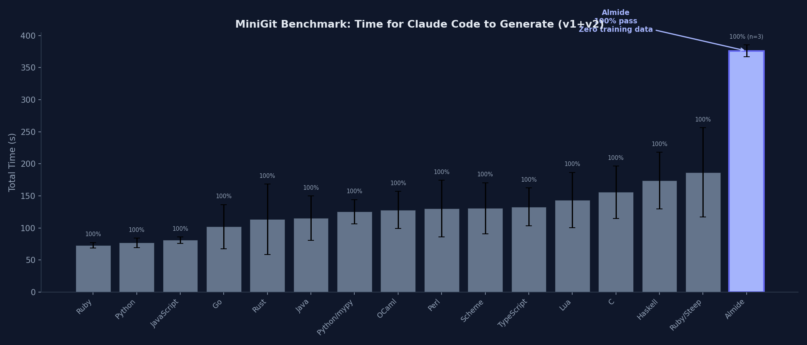

<p align="center">
  
</p>

<h1 align="center">Almide</h1>

<p align="center">A programming language designed for LLM code generation.</p>

<p align="center">
  <a href="https://almide.github.io/playground/">Playground</a> ·
  <a href="./docs/SPEC.md">Specification</a> ·
  <a href="./docs/GRAMMAR.md">Grammar</a> ·
  <a href="./docs/CHEATSHEET.md">Cheatsheet</a> ·
  <a href="./docs/DESIGN.md">Design Philosophy</a>
</p>

<p align="center">
  <a href="https://github.com/almide/almide/actions/workflows/ci.yml"></a>
  <a href="./LICENSE"></a>
</p>

## What is Almide?

Almide is a statically-typed language optimized for AI-generated code. It compiles to Rust, TypeScript, and WebAssembly.

The core metric is **modification survival rate** — how often code still compiles and passes tests after a series of AI-driven modifications. The language achieves this through unambiguous syntax, actionable compiler diagnostics, and a standard library that covers common patterns out of the box.

The flywheel: LLMs write Almide reliably → more code is produced → training data grows → LLMs write it better → the ecosystem expands.

## Quick Start

**[Try it in your browser →](https://almide.github.io/playground/)** — No installation required.

### Prerequisites

- [Rust](https://rustup.rs/) (stable, 1.85+)

### Install from source

```bash
git clone https://github.com/almide/almide.git
cd almide
cargo build --release
```

Copy the binary to a directory on your `PATH`:

```bash
# macOS / Linux
cp target/release/almide ~/.local/bin/

# or system-wide
sudo cp target/release/almide /usr/local/bin/
```

Verify the installation:

```bash
almide --version
# almide 0.5.13
```

### Hello World

```almd
fn main() -> Unit = {
  println("Hello, world!")
}
```

```bash
almide run hello.almd
```

## Features

- **Multi-target** — Same source compiles to Rust (native binary), TypeScript, or WebAssembly
- **Generics** — Functions, records, variant types, recursive variants with auto Box wrapping
- **Pattern matching** — Exhaustive match with variant destructuring
- **Effect functions** — `effect fn` for explicit error propagation (`Result` auto-wrapping)
- **Bidirectional type inference** — Type annotations flow into expressions (`let xs: List[Int] = []`)
- **Map literals** — `["key": value]` syntax with `m[key]` access and `for (k, v) in m` iteration
- **Top-level constants** — `let PI = 3.14` at module scope, compile-time evaluated
- **Pipeline operator** — `data |> transform |> output`
- **Module system** — Packages, sub-namespaces, visibility control, diamond dependency resolution
- **Built-in testing** — `test "name" { assert_eq(a, b) }` with `almide test` (1,700+ language tests)
- **Actionable diagnostics** — Every error includes file:line, context, and a concrete fix suggestion

## Why Almide?

- **Predictable** — One canonical way to express each concept, reducing token branching for LLMs
- **Local** — Understanding any piece of code requires only nearby context
- **Repairable** — Compiler diagnostics guide toward a specific fix, not multiple possibilities
- **Compact** — High semantic density, low syntactic noise

For the full design rationale, see [Design Philosophy](./docs/DESIGN.md).

## Example

```almd
let PI = 3.14159265358979323846
let SOLAR_MASS = 4.0 * PI * PI

type Tree[T] =
  | Leaf(T)
  | Node(Tree[T], Tree[T])

fn tree_sum(t: Tree[Int]) -> Int =
  match t {
    Leaf(v) => v
    Node(left, right) => tree_sum(left) + tree_sum(right)
  }

type AppError =
  | NotFound(String)
  | Io(IoError)
  deriving From

effect fn greet(name: String) -> Result[Unit, AppError] = {
  guard name.len() > 0 else err(NotFound("empty name"))
  println("Hello, ${name}!")
  ok(())
}

effect fn main(args: List[String]) -> Result[Unit, AppError] = {
  let name = match list.get(args, 1) {
    some(n) => n
    none => "world"
  }
  greet(name)
}

test "greet succeeds" {
  assert_eq("hello".len(), 5)
}
```

## How It Works

Almide source (`.almd`) is compiled by a pure-Rust compiler to Rust, TypeScript, or WebAssembly.

```
.almd → Lexer → Parser → AST → Type Checker → Lowering → IR → CodeGen → .rs / .ts / .wasm
```

Codegen operates solely on the typed IR — it never references the AST.

```bash
almide run app.almd              # Compile + execute
almide run app.almd -- arg1      # With arguments
almide build app.almd -o app     # Build standalone binary
almide build app.almd --target wasm  # Build WebAssembly (WASI)
almide test                      # Find and run all test blocks (recursive)
almide check app.almd            # Type check only (no compilation)
almide fmt app.almd              # Format source code
almide clean                     # Clear dependency cache
almide app.almd --target rust    # Emit Rust source
almide app.almd --target ts      # Emit TypeScript source
```

## Benchmark

<p align="center">
  
</p>

Tested with the [MiniGit benchmark](https://github.com/almide/benchmark) — Claude Code implements a mini version control system from a spec, with multiple trials per language.

| Language | Total Time | Avg Cost | Pass Rate |
|----------|-----------|----------|-----------|
| Ruby | 73.1s | $0.36 | 40/40 |
| Python | 77.5s | $0.39 | 48/48 |
| Go | 102.0s | $0.50 | 46/46 |
| Rust | 113.7s | $0.54 | 38/40 |
| TypeScript | 133.0s | $0.62 | 40/40 |
| **Almide (no warmup)** | **239.1s** | **$1.13** | **20/20** |
| **Almide (with warmup)** | **261.6s** | **$1.03** | **20/20** |

Almide has no training data in any public LLM corpus yet — the generation speed gap is expected to narrow as more Almide code enters training sets. Despite being slower, Almide achieves **100% pass rate** with zero failures across 40 trials (20 no-warmup + 20 warmup). See [full results](https://github.com/almide/benchmark) for all 16 languages.

## Native Performance

Almide compiles to Rust, which then compiles to native machine code. No runtime, no GC, no interpreter.

| Metric | Value |
|--------|-------|
| Binary size (minigit CLI) | 635 KB (stripped) |
| Runtime (100 ops) | 1.6s |
| Dependencies | 0 (single static binary) |
| WASM target | `almide build app.almd --target wasm` |

## Ecosystem

### Grammar — [almide-grammar](https://github.com/almide/almide-grammar)

Single source of truth for Almide syntax — keywords, operators, precedence, and TextMate scopes. Written in Almide itself.

All tools that need to know Almide's syntax import this module rather than maintaining their own keyword lists:

```toml
# almide.toml
[dependencies]
almide-grammar = { git = "https://github.com/almide/almide-grammar", tag = "v0.1.0" }
```

```almide
import almide_grammar
almide_grammar.keyword_groups()    // 6 groups, 41 keywords
almide_grammar.precedence_table()  // 8 levels, pipe → unary
```

The compiler itself uses `almide-grammar`'s TOML files (`tokens.toml`, `precedence.toml`) at build time to generate its lexer keyword table — ensuring the compiler and all tooling stay in sync.

### Editor Support — [almide-editors](https://github.com/almide/almide-editors)

VS Code extension with syntax highlighting, bracket matching, comment toggling, and code folding for `.almd` files. The TextMate grammar is generated from `almide-grammar`.

- **VS Code** — Download `.vsix` from [Releases](https://github.com/almide/almide-editors/releases), then `code --install-extension almide-lang-*.vsix`

## Documentation

- [docs/ARCHITECTURE.md](./docs/ARCHITECTURE.md) — Compiler pipeline, module map, design decisions
- [docs/SPEC.md](./docs/SPEC.md) — Full language specification
- [docs/GRAMMAR.md](./docs/GRAMMAR.md) — EBNF grammar + stdlib reference
- [docs/CHEATSHEET.md](./docs/CHEATSHEET.md) — Quick reference for AI code generation
- [docs/DESIGN.md](./docs/DESIGN.md) — Design philosophy and trade-offs
- [docs/roadmap/](./docs/roadmap/README.md) — Language evolution plans

## Contributing

Contributions are welcome! Please open an issue or pull request on [GitHub](https://github.com/almide/almide).

After cloning, install the git hooks:

```bash
brew install lefthook  # macOS; see https://github.com/evilmartians/lefthook for other platforms
lefthook install
```

All commits must be in English (enforced by the commit-msg hook). See [CLAUDE.md](./CLAUDE.md) for project conventions.

## License

Licensed under either of [MIT](./LICENSE-MIT) or [Apache 2.0](./LICENSE-APACHE) at your option.
