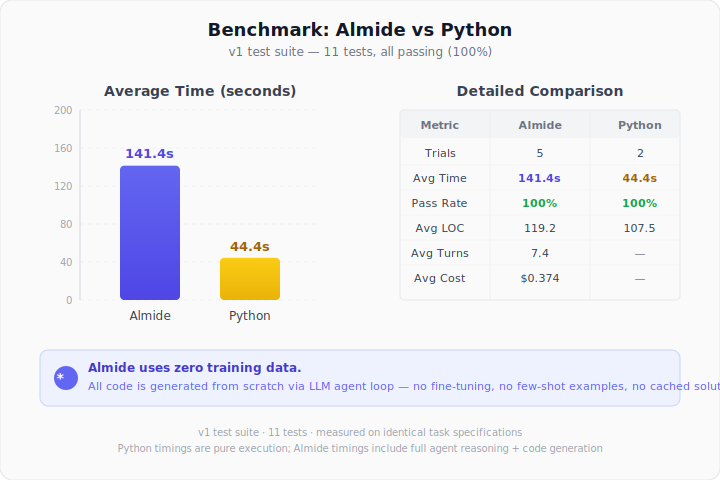

<p align="center">
  
</p>

<p align="center">A programming language designed for LLM code generation — optimized for AI proliferation.</p>

Almide is not a language for humans to write freely — it is a language for AI to converge correctly. Every design decision minimizes the set of valid next tokens at each generation step, reducing hallucination and syntax errors.

The core thesis: **if AI can write a language reliably, code proliferates → training data grows → AI writes it even better → modules multiply**. Almide is designed to start this flywheel.

## Key Design Principles

- **Predictable** — At each point in code generation, the set of valid continuations is small
- **Local** — Understanding any piece of code requires only nearby context
- **Repairable** — Compiler diagnostics guide toward a unique fix, not multiple possibilities
- **Compact** — High semantic density, low syntactic noise

## Ambiguity Elimination

Almide is designed by **enumerating LLM failure modes and removing each one**. Every design decision is subtractive — reducing the space of valid programs so the AI converges faster.

### Syntax Ambiguity Removed

| Ambiguity source | Other languages | Almide | Token branching impact |
|---|---|---|---|
| Null handling | `null`, `nil`, `None`, `undefined` | `Option[T]` only | Eliminates null-check hallucination |
| Error handling | `throw`, `try/catch`, `panic`, error codes | `Result[T, E]` only | Error path always visible in types |
| Generics | `<T>` (ambiguous with `<` `>`) | `[T]` | No parser ambiguity with comparisons |
| Loops | `while`, `for`, `loop`, `forEach`, recursion | `do { guard ... else ... }` | Single construct, break condition explicit |
| Early exit | `return`, `break`, `continue`, `throw` | Last expression + `guard ... else` | No early-return confusion |
| Lambdas | `=>`, `->`, `lambda`, `fn`, `\x ->`, blocks | `fn(x) => expr` only | One syntax, zero alternatives |
| Statement termination | `;`, optional `;`, ASI rules | Newline-separated | No insertion ambiguity |
| Conditionals | `if` with optional `else`, ternary `?:` | `if/then/else` (else mandatory) | No dangling-else |
| Side effects | Implicit anywhere | `effect fn` annotation required | Restricts callable set at each point |
| Operator meaning | Overloading, implicit coercion | Fixed meaning, no overloading | Operators always resolve identically |
| Type conversions | Implicit widening, coercion | Explicit only | No hidden type changes |

### Semantic Ambiguity Removed

| Ambiguity source | What Almide does | Why it matters for LLMs |
|---|---|---|
| Name resolution | All names require explicit `import`; no implicit prelude | LLM never guesses at available names |
| Type inference | Local only — annotations required on function signatures | No inference across distant definitions |
| Overloading | None — each function name has exactly one definition | No ad-hoc dispatch resolution |
| Implicit conversions | None — `int.to_string(n)`, never auto-coerce | Every conversion visible in source |
| Trait/interface lookup | No traits, no implicit instances | No global instance search |
| Method resolution | UFCS with canonical function form (`module.fn(args)`) | Module prefix makes resolution local |
| Declaration order | Functions can reference each other freely | No forward-declaration confusion |
| Import style | `import module` only — no `from`, no `*`, no aliasing | One import form, zero variation |

### The `effect` System as Generation Space Reducer

`effect fn` is not primarily a safety feature — it is a **search space reducer for code generation**.

- A pure function can only call other pure functions → the set of valid completions shrinks dramatically
- An `effect fn` explicitly marks I/O boundaries → the LLM knows exactly where side effects are legal
- Effect mismatch is caught at compile time → wrong calls are rejected before execution
- Function signatures alone tell the LLM what is callable at each point, without reading function bodies

This means the LLM can generate code by looking only at the current function's signature and its imports — no global analysis required.

### UFCS: Why Two Forms is Acceptable

`f(x, y)` and `x.f(y)` are equivalent, which superficially adds a synonym. We accept this because:

- **Canonical form is function style**: `module.fn(args)` — the module prefix makes resolution unambiguous
- **Method form is syntactic sugar for chaining only**: `x.f(y).g(z)` reads left-to-right
- The compiler does not need method lookup — it rewrites `x.f(y)` to `f(x, y)` at parse time
- A future formatter will normalize to canonical form, eliminating style drift

### `do` Blocks: One Construct, Context-Determined

`do { ... }` serves two roles: loop (when `guard` is present) and error propagation block. This is intentional:

- **With `guard`**: becomes a loop — `guard condition else break_expr` is the only way to exit
- **Without `guard`**: becomes a sequential block with automatic `Result` propagation
- The parser determines the role statically from the presence of `guard` — no runtime ambiguity
- This replaces `while`, `for`, `loop`, `try`, and `do-notation` from other languages with one keyword

## Compiler Diagnostics: Single Likely Fix

Almide's diagnostics are designed so that **each error points to exactly one repair**. This is critical for LLM fix-loops:

- Rejected syntax (`!`, `while`, `return`, `class`, `null`) includes a hint naming the exact Almide equivalent
- Expected tokens at each parse position are kept to a small, enumerable set
- Parser recovery does not guess — it fails fast with a precise location and expectation
- `_` holes and `todo()` let LLMs generate incomplete but type-valid code, then fill incrementally

```
'!' is not valid in Almide at line 5:12
  Hint: Use 'not x' for boolean negation, not '!x'.

'while' is not valid in Almide at line 8:3
  Hint: Use 'do { guard condition else break_expr }' for loops.

'return' is not valid in Almide at line 12:5
  Hint: Use the last expression as the return value, or 'guard ... else' for early exit.
```

## Stdlib Naming Conventions

The standard library follows strict naming rules to minimize LLM guessing:

| Convention | Rule | Example |
|---|---|---|
| Module prefix | Always explicit: `module.function()` | `string.len(s)`, `list.get(xs, i)` |
| Predicate suffix | `?` for boolean-returning functions | `fs.exists?(path)`, `string.contains?(s, sub)` |
| Return type consistency | Fallible lookups return `Option`, I/O returns `Result` | `list.get() -> Option`, `fs.read_text() -> String` (effect fn) |
| No synonyms | One name per operation, no aliases | `len` not `length`/`size`/`count` |
| Symmetric pairs | Matching names for inverse operations | `read_text`/`write`, `split`/`join`, `to_string`/`to_int` |
| No method overloading | Same name never appears in two modules with different semantics | `string.len` and `list.len` both mean "count elements" |

## What Almide Sacrifices

These are intentional trade-offs — things we gave up to make LLM generation reliable:

| Sacrificed | Why |
|---|---|
| Expressiveness | Fewer syntax forms = fewer generation paths. A verbose but predictable program is better than a clever but ambiguous one. |
| Operator overloading | `+` always means integer addition or is not valid. No custom operators. |
| Metaprogramming | No macros, no reflection, no code generation. The language surface is fixed. |
| Ad-hoc polymorphism | No traits, no typeclasses. Functions are monomorphic. Generics are limited to built-in containers. |
| Named/default arguments | All arguments are positional. No optionality, no reordering. |
| Multiple return styles | No `return` keyword. The last expression is always the value. No exceptions. |
| Syntax sugar variety | One way to write each construct. No shorthand forms, no alternative spellings. |
| DSL capabilities | No operator definition, no custom syntax. Almide code always looks like Almide. |

These are not missing features — they are **features removed to reduce the LLM's search space**.

## Quick Example

```
module app

import fs
import string
import list

type AppError =
  | NotFound(String)
  | Io(IoError)
  deriving From

effect fn greet(name: String) -> Result[Unit, AppError] = {
  guard string.len(name) > 0 else err(NotFound("empty name"))
  println("Hello, ${name}!")
  ok(())
}

effect fn main(args: List[String]) -> Result[Unit, AppError] = {
  let name = match list.get(args, 1) {
    some(n) => n,
    none => "world",
  }
  greet(name)
}

test "greet succeeds" {
  assert_eq(string.len("hello"), 5)
}
```

## File Extension

`.almd`

## Documentation

- [docs/GRAMMAR.md](./docs/GRAMMAR.md) — EBNF grammar + stdlib reference (compact, for AI consumption)
- [CHEATSHEET.md](./CHEATSHEET.md) — Quick reference for AI code generation
- [SPEC.md](./SPEC.md) — Full language specification

## How It Works

Almide source (`.almd`) is compiled by a pure-Rust compiler to Rust or TypeScript, then executed natively.

```
.almd → Lexer → Parser → AST → CodeGen → .rs (Rust) or .ts (Deno)
```

### Usage

```bash
# Run directly (compile + execute in one step)
almide run app.almd

# Run with arguments
almide run app.almd -- arg1 arg2

# Build a standalone binary
almide build app.almd -o app

# Emit Rust source
almide app.almd --target rust

# Emit TypeScript source
almide app.almd --target ts
```

### Install

```bash
cargo build --release
cp target/release/almide ~/.local/bin/
```

## Benchmark

<p align="center">
  
</p>

Tested with the [MiniGit benchmark](https://github.com/mizchi/ai-coding-lang-bench) — a task where Claude Code implements a mini version control system from a spec, with zero prior knowledge of the language.

| Trial | Time | Turns | Tests | LOC |
|-------|------|-------|-------|-----|
| 1 | 187s | 7 | 11/11 | 118 |
| 2 | 115s | 11 | 11/11 | 129 |
| 3 | 131s | 6 | 11/11 | 113 |
| 4 | 139s | 7 | 11/11 | 124 |
| 5 | 135s | 6 | 11/11 | 112 |

**Pass rate: 5/5 (100%)** — The AI converges to correct code every time, given only a ~60-line EBNF grammar reference.

### Why It Works

We hypothesize that Almide achieves 100% pass rate because:

1. **No syntax ambiguity** — The LLM never has to choose between equivalent forms (one loop, one lambda, one error style)
2. **Explicit error handling** — `Result[T, E]` makes the error path visible in every function signature, preventing silent failures
3. **Diagnostics as repair guides** — When the LLM writes `!x` or `while`, the compiler tells it exactly what to write instead, closing the fix-loop in one turn
4. **Local reasoning sufficiency** — No implicit imports, no trait resolution, no overloading means the LLM can generate correct code from the function signature alone
5. **60-line grammar reference** — The entire language fits in a single context window with room to spare, unlike languages where stdlib documentation alone exceeds the context limit

### Proliferation Potential

The 100% pass rate across all trials demonstrates Almide's core value proposition: **reliability breeds proliferation**.

- AI generates correct Almide code consistently → generated code becomes training data
- Constrained syntax means generated code is uniform → training signal is clean
- New modules can be AI-generated with the same reliability → ecosystem grows organically
- Fewer syntax choices = faster convergence = lower cost per generation

The generation time gap vs established languages (Python ~40s, Almide ~140s) reflects zero training data, not language quality. Each successful generation adds to the corpus, narrowing this gap over time.

## License

MIT
