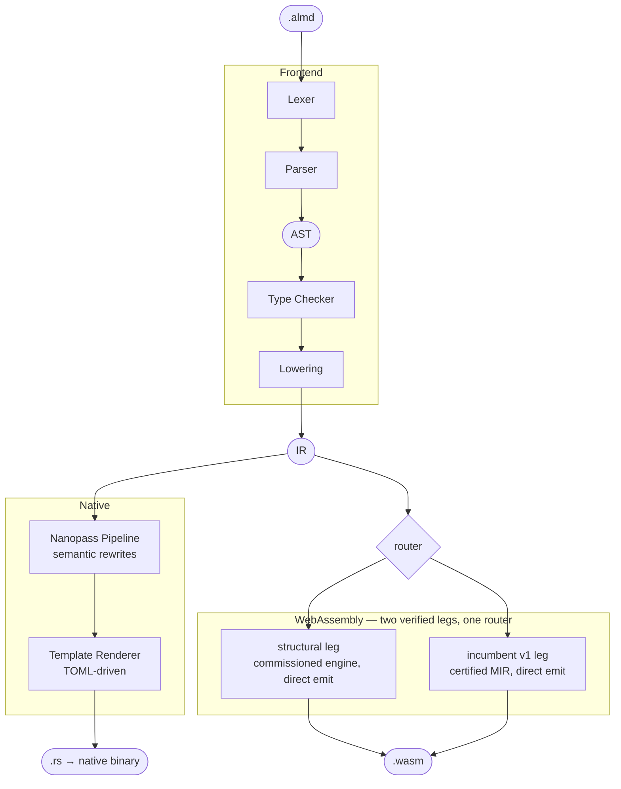

<p align="center">
  
</p>

<p align="center"><strong>The language where LLM edits survive.</strong></p>

<p align="center">
  <a href="https://almide.github.io/playground/">Playground</a> ·
  <a href="./docs/SPEC.md">Specification</a> ·
  <a href="./docs/GRAMMAR.md">Grammar</a> ·
  <a href="./docs/CHEATSHEET.md">Cheatsheet</a> ·
  <a href="./docs/design/DESIGN.md">Design Philosophy</a>
</p>

<p align="center">
  <a href="https://github.com/almide/almide/actions/workflows/ci.yml"></a>
  <a href="./LICENSE"></a>
  <a href="https://deepwiki.com/almide/almide"></a>
</p>

<p align="center">
  <a href="#why-almide">Why?</a> |
  <a href="#quick-start">Quick start</a> |
  <a href="#how-it-works">How it works</a> |
  <a href="#the-equivalence-claim--byte-identical-across-targets">Equivalence</a> |
  <a href="#memory-safety--what-is-proven-what-is-trusted">Memory safety</a> |
  <a href="#project-status">Status</a> |
  <a href="#documentation">Docs</a>
</p>

## What is Almide?

Almide is a statically-typed language optimized for AI-generated code. It compiles to native binaries (via Rust) and WebAssembly.

The core metric is **modification survival rate** — how often code still compiles and passes tests after a series of AI-driven modifications. The language achieves this through unambiguous syntax, actionable compiler diagnostics, and a standard library that covers common patterns out of the box.

The flywheel: LLMs write Almide reliably → more code is produced → training data grows → LLMs write it better → the ecosystem expands.

## Why Almide?

- **Predictable** — One canonical way to express each concept, reducing token branching for LLMs
- **Local** — Understanding any piece of code requires only nearby context
- **Repairable** — Compiler diagnostics guide toward a specific fix, not multiple possibilities
- **Compact** — High semantic density, low syntactic noise

For the full design rationale, see [Design Philosophy](./docs/design/DESIGN.md).

### MSR Scorecard

Measured by [almide-dojo](https://github.com/almide/almide-dojo) across 30 tasks (basic / intermediate / advanced) on 2026-04-12; later runs are on the [live dashboard](https://almide.github.io/almide-dojo/):

| Model | Pass Rate | 1-Shot Rate |
|---|---|---|
| Claude Sonnet 4.6 | **100%** (30/30) | 47% |
| Llama 3.3 70B | 61% (17/28) | 33% |

## Quick Start

**[Try it in your browser →](https://almide.github.io/playground/)** — No installation required.

### Install (macOS / Linux)

```bash
curl -fsSL https://raw.githubusercontent.com/almide/almide/main/tools/install.sh | sh
```

### Install (Windows)

```powershell
irm https://raw.githubusercontent.com/almide/almide/main/tools/install.ps1 | iex
```

### Install from source

Requires [Rust](https://rustup.rs/) (stable, 1.94+ — the binary embeds the wasmtime host):

```bash
git clone https://github.com/almide/almide.git
cd almide
cargo build --release
cp target/release/almide ~/.local/bin/
```

### Hello World

```almd
fn main() -> Unit = {
  println("Hello, world!")
}
```

```bash
almide run hello.almd
```

## Features

- **Multi-target** — Same source compiles to native binary (via Rust) or WebAssembly (direct emit)
- **Generics** — Functions (`fn id[T](x: T) -> T`), records, variant types, recursive variants with auto Box wrapping
- **Pattern matching** — Exhaustive match with variant destructuring
- **Effect functions** — `effect fn` for explicit error propagation (`Result` auto-wrapping)
- **Bidirectional type inference** — Type annotations flow into expressions (`let xs: List[Int] = []`)
- **Codec system** — `Type.decode(value)` / `Type.encode(value)` convention with auto-derive
- **Map literals** — `["key": value]` syntax with `m[key]` access and `for (k, v) in m` iteration
- **Fan** — structured concurrency surface: `fan { a(); b() }` and `fan.settle` run on real threads natively (sequential on wasm); `fan.map` / `fan.any` are deterministic by list order on both targets
- **Top-level constants** — `let PI = 3.14` at module scope, compile-time evaluated
- **Pipeline operator** — `data |> transform |> output`
- **Module system** — Packages, sub-namespaces, visibility control, diamond dependency resolution
- **Standard library** — self-hosted `.almd` modules: string, list, map, json, http, fs, and more ([reference](./docs/stdlib/); the count is derived under [Project Status](#project-status))
- **Built-in testing** — `test "name" { assert_eq(a, b) }` with `almide test`
- **Actionable diagnostics** — Every error includes file:line, context, and a concrete fix suggestion

## The Equivalence Claim — Byte-Identical Across Targets

**Every program that compiles for both targets produces byte-identical observable output — stdout, stderr, exit code — whether it runs as a native binary or as WebAssembly.** Native is the oracle; `native == wasm` is a hard invariant, not a "target difference" to be documented around.

The guarantee is **continuous, with an explicit, ledger-managed scope**: "byte-identical" means the execution output, not the compiled artifacts; inherently nondeterministic sources certify deterministic *invariants* instead of exact bytes; APIs not yet implemented on wasm are compile- or run-time *refusals* — never wrong bytes; and exactly two fns are exempt because their job is to report the host — `env.os()` and `env.temp_dir()`, bounded by C-189, since making them agree across targets would be the defect rather than the guarantee.

This claim is not prose. Every observable promise is a named contract in the [behavior-contract ledger](docs/contracts/), each traceable to executable evidence, and the numbers below are regenerated from the ledger (`scripts/gen-claims.sh`, enforced by `scripts/check-contracts.sh` in CI) so this section cannot drift from what the gates actually verify:

<!-- claims:generated:start — derived from docs/contracts/contracts.toml by scripts/gen-claims.sh; DO NOT EDIT between the markers -->
> **Ledger: 311 contracts — 311 active, 0 flagged-for-revision.**
>
> **Divergences awaiting a fix: none.** Every contract in the ledger is
> `active`, carrying executable evidence of class >= `fixture`. The one
> by-design carve-out in the law — the platform-reporting fns `env.os`
> and `env.temp_dir` — is bounded by C-189.
<!-- claims:generated:end -->

Full scope, ledger mechanics, and the evidence stack (contract ledger, cross-target fixture gate, differential fuzz, emit-time Σ-probes, Lean belt, org-wide byte-verify sweep): **[docs/design/EQUIVALENCE.md](./docs/design/EQUIVALENCE.md)**.

## Memory Safety — What Is Proven, What Is Trusted

You write no ownership annotations, no lifetimes, no `free` — memory management is decided by [Perceus](https://www.microsoft.com/en-us/research/publication/perceus-garbage-free-reference-counting-with-reuse/)-style ownership inference in the compiler: garbage-collector-free, pause-free. The inference computes where every heap value is introduced, duplicated, and consumed; what differs per target is only the *execution mechanism* for those decisions. A compiler that ships proofs owes you the boundary, so here it is:

- **WebAssembly, incumbent v1 leg — proven, per build.** The decisions execute as compiler-placed reference counting, and every build emits an ownership certificate that a **kernel-proven checker re-verifies** (Rocq/Coq spine, 96 audited theorems and lemmas, axiom-clean and independently re-checked by `coqchk`; the count is asserted by `proofs/check.sh`): the witnessed MIR is RC-balanced — no double-free, no leak in the modeled fragment — name-total, and capability-bounded. The proof is about the *IR-level Inc/Dec balance of the artifact in front of you*, not about the compiler's internals; a certified function can still compute the wrong value, which is what the separate [cross-target contract ledger](docs/contracts/README.md) and differential gates exist to catch. The exact boundary — which pipeline stages are proven, which are trusted, and what each gate does and does not claim — is the map in **[proven-vs-trusted.md](docs/contracts/proven-vs-trusted.md)**.
- **WebAssembly, structural leg — trusted, gated.** The commissioned engine (the default since #1599 for programs with a `main` and no external packages — see [How It Works](#how-it-works)) decides ownership the same way, with reference counting and copy-on-write placed by the compiler, but it emits no certificate yet. Its evidence is differential: accepted at 610/610 byte-identical to native on the `wasm_cross` corpus, held by a grow-only floor and a semantic-mutation net in `crates/almide-wasm`, both CI-gated. The `Built …` line names the leg that produced your bytes, so you always know which column you are reading.
- **Native (Rust) — trusted, not proven.** The same decisions are realized by Rust's own ownership machinery: the compiler emits ownership-idiomatic Rust, and every heap value is freed by Rust's scope-end drops. No proof covers this leg today; its evidence is differential (byte-identical output against the wasm legs, on the contract corpus). Sharing one certified Perceus MIR across both renderers is the [native trust-spine ladder](docs/roadmap/active/native-trust-spine.md) ([#764](https://github.com/almide/almide/issues/764)); shared scalar and list ops already render on both targets from the same MIR.

Where Rust gives you *zero-cost* abstraction (paid for in ownership annotations), Almide gives you **zero-annotation** abstraction: you write none, and the frees are decided by the compiler and — on the incumbent wasm leg — re-checked by the proven checker.

The design that started this is the Lean 4 **Perceus belt** ([`crates/almide-perceus-belt/`](./crates/almide-perceus-belt/), 41 theorems as of 2026-08-27, 0 sorry, CI-gated): a model of the ownership pass over a small IR fragment, proving among else that the transform emits a release for every allocation it sees (`allHeapFreed` — at least one `Dec` per heap binding in the modeled fragment; the stronger exact-balance predicate is what the per-build certificate checks on real programs). It is a proof about the *design*, mechanically checked; the per-build certificate above is what covers the *shipping artifact*. [Specification](./docs/specs/perceus.md)

The frozen language surface, the conformance clause, and the breaking-change policy are **[docs/STABILITY.md](docs/STABILITY.md)** (declared 2026-08-20); the measurable stability criterion is [proofs/stability-closure.toml](proofs/stability-closure.toml), reported on every push.

## What's Next — v1: The Trust Spine

> In active development on the `develop` branch. A ground-up redesign of the compiler's *trust model*, not a feature on top of v0.

The Perceus proof above proves one compiler pass, once. v1 generalizes that principle to the **whole pipeline** — but instead of proving the 100k-line compiler, it proves a tiny *checker* and has the compiler emit a certificate on every build that the checker re-verifies. If the checker accepts, the artifact has the property — a theorem that never mentions the compiler's internals. That single move collapses the trusted base from ~100,000 lines to the extracted checker (~1,400 lines of OCaml, machine-derived from the proofs), and asks a harder question than testing ever can: **not "do the tests pass?" but "can a machine prove the output is correct?"**

The full architecture — the untrusted/trusted split, the ALS normative semantics in Coq, the verify-it-yourself receipts (C-SAFE / C-REPRO / C-FAITHFUL / C-PROVEN), and why builds are slower on purpose: **[docs/TRUST-SPINE.md](./docs/TRUST-SPINE.md)**.

## Example

```almd
let PI = 3.14159265358979323846
let SOLAR_MASS = 4.0 * PI * PI

type Tree[T] =
  | Leaf(T)
  | Node(Tree[T], Tree[T])

fn tree_sum(t: Tree[Int]) -> Int =
  match t {
    Leaf(v) => v
    Node(left, right) => tree_sum(left) + tree_sum(right)
  }

effect fn greet(name: String) -> Result[Unit, String] = {
  guard string.len(name) > 0 else err("empty name")
  println("Hello, ${name}!")
  ok(())
}

effect fn main() -> Result[Unit, String] = {
  greet("world")
}

test "greet succeeds" {
  assert_eq("hello".len(), 5)
}
```

## How It Works

Almide source (`.almd`) is compiled by a pure-Rust compiler: one frontend, one IR, and three renderers behind two targets.


```mermaid
flowchart TB
    SRC([".almd"])

    subgraph FE["Frontend"]
        direction LR
        LEX["Lexer"] --> PAR["Parser"] --> AST(["AST"]) --> CHK["Type Checker"] --> LOW["Lowering"]
    end

    subgraph RS["Native"]
        direction LR
        NANO["Nanopass Pipeline<br/>semantic rewrites"] --> TMPL["Template Renderer<br/>TOML-driven"]
    end

    subgraph WASM["WebAssembly — two verified legs, one router"]
        direction LR
        STRUCT["structural leg<br/>commissioned engine, direct emit"]
        INCUMB["incumbent v1 leg<br/>certified MIR, direct emit"]
    end

    SRC --> LEX
    LOW --> IR(["IR"])
    IR --> NANO
    IR --> ROUTER{"router"}
    ROUTER --> STRUCT
    ROUTER --> INCUMB
    TMPL --> RSOUT([".rs → native binary"])
    STRUCT --> WOUT([".wasm"])
    INCUMB --> WOUT
```

**Native.** The Nanopass pipeline applies target-specific transformations — `ResultPropagation` (Rust `?`), `CloneInsertion` (Rust borrow analysis), `LICM` (loop-invariant code motion). The Template Renderer is purely syntactic: every semantic decision is already encoded in the IR.

**WebAssembly.** Since commissioning ([#1599](https://github.com/almide/almide/pull/1599)) two verified renderers sit behind one router (`render_wasm_module_routed` in `src/cli/build.rs`). The **structural leg** — the commissioned engine, `almide::wasm_leg` front + `crates/almide-wasm` emitter — takes every program with a `main`, no external packages, and no host-variant I/O on the build path; it was accepted at 610/610 byte-identical to native on the `wasm_cross` corpus, and its build artifacts ship in the WASI form ([#1588](https://github.com/almide/almide/issues/1588)) so they run on stock runtimes. The **incumbent v1 leg** — the certified MIR trust spine in `crates/almide-mir` — takes main-less library modules, dependency-bearing projects, host-variant programs, and any shape the structural leg walls on: a verified-to-verified handover, never the retired unverified emitter, and a program neither leg lowers is an honest error. The `Built …` line every wasm build prints names the leg that produced the bytes; `ALMIDE_WASM_INCUMBENT=1` forces the incumbent and `ALMIDE_VERIFIED_DEBUG=1` narrates the routing.

```bash
almide run app.almd                  # Compile + execute (native)
almide build app.almd --target wasm  # Build WebAssembly (WASI)
almide test                          # Find and run all test blocks (recursive)
almide check app.almd                # Type check only
almide fmt app.almd                  # Format source code
```

Run `almide --help` for the full command list (compile, add, deps, clean, …).

## Performance

No runtime, no GC, no interpreter — native compiles through Rust to machine code, and WASM is emitted directly (no LLVM, no Cranelift) as self-contained binaries.

<!-- wasm-size:generated:start — rendered from docs/benchmarks/wasm-size.txt by scripts/gen-readme-stats.sh; DO NOT EDIT between the markers -->
| Program (`almide build --target wasm`, verified, as shipped) | incumbent v1 leg | structural leg |
|---|---:|---:|
| Hello, world | **1,096 B** | **4,361 B** |

Measured on almide 0.59.1, 2026-08-27, from `docs/benchmarks/wasm-size.txt`; no post-hoc optimizer touches the shipped bytes (`--wasm-opt` is opt-in and its output is not the verified module).
<!-- wasm-size:generated:end -->

Rust on the same wasm target is 40 KB+ for Hello, world even fully size-tuned; the native minigit CLI binary is 418 KB stripped with 0 dependencies. What's inside a module, why the incumbent leg's is smaller today, and how to reproduce every number: **[docs/wasm/WASM-OUTPUT.md](./docs/wasm/WASM-OUTPUT.md)** (dissection measured 2026-07-23 on the incumbent leg).

### Build speed

<!-- build-speed:generated:start — derived from docs/benchmarks/build-speed.txt by the almide-gates `bench` subcommand; DO NOT EDIT between the markers -->
Measured on almide 0.59.1, arm64 Darwin, `examples/lisp.almd` (268 lines), 2026-08-27. Every row is an N-run MEAN —
a single run of a 30ms process is scheduler noise. Cold clears BOTH `$TMPDIR/almide-run`
and the dependency cache before each repetition; clearing only the latter measures a warm
build. Regenerate with `almide run tools/almide-gates/src/main.almd -- bench`; the ratchet
(`-- bench --check`) fails CI at 1.5x.

| scenario | time | runs |
|---|---|---|
| `almide check` | **15.2 ms** | 20 |
| build, warm (content-cache hit) | **237.2 ms** | 5 |
| build, cold | **635.3 ms** | 3 |
| build, cold, `--target wasm` | **61.7 ms** | 3 |
<!-- build-speed:generated:end -->

#### …and at 10,000 lines (#1334)

The row above is measured on a 268-line file, which does not establish that the edit
loop is *scale-independent* — a fast check on a small file is also exactly what a
quadratic compiler produces. So the same command is measured over a ladder of nested
prefixes of this repo's own stdlib (303 hand-written modules, 30,624 lines; nothing
synthesized), 40 interleaved runs per rung:

| project size | `almide check` p50 | p95 | µs/line |
|---:|---:|---:|---:|
| 2,047 lines | 18.4 ms | 19.5 ms | 2.87 |
| 5,456 lines | 31.2 ms | 32.3 ms | 3.29 |
| **10,151 lines** | **52.1 ms** | **53.3 ms** | 3.78 |
| 20,378 lines | 97.4 ms | 99.5 ms | 4.06 |
| 30,624 lines | 141.5 ms | 145.1 ms | 4.06 |

arm64 Darwin, almide 0.57.0, 2026-08-13, load average 6.7. **The p95 column is an
observation, not a promise**: the same commit on the same box at load average 42 read
p95 332 ms at the 10,151-line rung — 6× — so the CI ratchet
(`scripts/check-edit-loop-scale.sh`) anchors two dimensionless same-run ratios instead:
the log-log slope of marginal check time against project lines (**1.13**, where 1.0 is
linear and 2.0 quadratic; it moved 0.6% across that 7× load swing) and the cost of the
10k-line rung in units of the empty-project floor (**4.4×**). Reproduce with
`python3 research/benchmark/editloop/scale.py`.

### Runtime

| Native runtime vs handwritten Rust | **1.00×** on n-body and spectral-norm (same rustc flags, byte-identical output), 1.16–1.18× on fasta and FFT; ~1.6× where the workload is list materialization rather than arithmetic (#1004) — CI-gated ratio ratchet ([scoreboard](./docs/project/BENCHMARKS.md)) |
|---|---|

Wasm runtime numbers are deliberately absent here rather than estimated: a figure measured with `time -p` on a sub-10ms program is noise. Full tables, methodology, and charts: **[docs/project/BENCHMARKS.md](./docs/project/BENCHMARKS.md)**.

## Project Status

| Category | Status |
|----------|--------|
| Maturity | Pre-1.0, under active development. The LLM-facing surface is frozen by [STABILITY.md](docs/STABILITY.md) (declared 2026-08-20): anything in the Cheatsheet or `llms.txt` keeps meaning what it means, with a breaking-change policy behind it |
| Compiler | Pure Rust, single binary, 0 ICE |
| Targets | Rust (native), WASM (direct emit — two verified legs behind one router, see [How It Works](#how-it-works)) |
| Verified codegen | Incumbent v1 leg: PCC certificates re-verified on every build since 0.29.0 (`--no-verified` opts out). Structural leg: byte-exact corpus and mutation gates, no certificate yet |
| Codegen | Rust: Nanopass + TOML templates; wasm: structural engine or certified MIR → direct emit (the unverified v0 emitter is retired — a wall is an error, never a fallback) |
| MSR | 100% (30/30 tasks, Sonnet 4.6, 2026-04-12) — see the [scorecard](#msr-scorecard) above, measured by [almide-dojo](https://github.com/almide/almide-dojo) |
| MiniGit Bench | 100% pass, Sonnet 5 × 20 trials (2026-07-15), most concise of 5 languages (233 LOC); fastest agent completion wall-clock vs Gleam/MoonBit — an LLM-writability number (measured under 6–9× self-parallelism), **not** generated-code speed ([chart](docs/figures/lang-bench-snapshot-2026-07.png) · [method](research/benchmark/lang-bench/README.md) · [upstream](https://github.com/mame/ai-coding-lang-bench)) |
| Artifacts | `.almdi` module interface files via `almide compile` |
| Playground | [Live](https://almide.github.io/playground/) — compiler runs as WASM in browser |

<!-- stats:generated:start — derived from docs/stdlib/*.md, spec/, and docs/contracts/contracts.toml by scripts/gen-readme-stats.sh; DO NOT EDIT between the markers -->
| Derived count | Value |
|---|---|
| Stdlib | 969 functions across 43 modules — self-hosted `.almd`, signature indexes regenerated from the compiler by `tools/gen-stdlib-doc-index.py` |
| Tests | 421 `.almd` test files under `spec/` (`almide test spec/`) + the 311-contract cross-target ledger |
<!-- stats:generated:end -->

Every count above is either derived by a script or carries the date it was measured — `scripts/check-readme-numbers.sh` refuses a bare one in CI.

## Ecosystem

### Grammar — [almide-grammar](https://github.com/almide/almide-grammar)

Single source of truth for Almide syntax — keywords, operators, precedence, and TextMate scopes, written in Almide itself. All tooling imports it instead of maintaining its own keyword lists, and the compiler generates its lexer keyword table from the same TOML files at build time — so the compiler and tooling cannot drift.

### Editor Support

- **VS Code** — [vscode-almide](https://github.com/almide/vscode-almide) — Syntax highlighting, bracket matching, comment toggling, code folding
- **Tree-sitter** — [tree-sitter-almide](https://github.com/almide/tree-sitter-almide) — Tree-sitter grammar for editors that support it (Neovim, Helix, Zed)

### Playground — [playground](https://github.com/almide/playground)

Browser-based compiler and runner. The Almide compiler runs as WASM — no server, no installation. Try it at [almide.github.io/playground](https://almide.github.io/playground/).

## Documentation

- [docs/ARCHITECTURE.md](./docs/ARCHITECTURE.md) — Compiler pipeline, module map, design decisions
- [docs/SPEC.md](./docs/SPEC.md) — Full language specification
- [docs/GRAMMAR.md](./docs/GRAMMAR.md) — EBNF grammar + stdlib reference
- [docs/CHEATSHEET.md](./docs/CHEATSHEET.md) — Quick reference for AI code generation
- [docs/design/DESIGN.md](./docs/design/DESIGN.md) — Design philosophy and trade-offs
- [docs/design/EQUIVALENCE.md](./docs/design/EQUIVALENCE.md) — The byte-identity claim: scope, ledger mechanics, evidence layers
- [docs/TRUST-SPINE.md](./docs/TRUST-SPINE.md) — v1 proof-carrying compilation architecture
- [docs/wasm/](./docs/wasm/README.md) — The two wasm legs, the router, and what ships in a module
- [docs/project/BENCHMARKS.md](./docs/project/BENCHMARKS.md) — Binary sizes, native performance, AI coding benchmark
- [docs/contracts/](./docs/contracts/) — Behavior-contract ledger (cross-target equivalence)
- [docs/stdlib/](./docs/stdlib/) — Standard library reference, per module
- [docs/roadmap/](./docs/roadmap/README.md) — Language evolution plans

## Contributing

Contributions are welcome! Please open an issue or pull request on [GitHub](https://github.com/almide/almide).

After cloning, install the git hooks:

```bash
brew install lefthook  # macOS; see https://github.com/evilmartians/lefthook for other platforms
lefthook install
```

All commits must be in English (enforced by the commit-msg hook). See [CLAUDE.md](./CLAUDE.md) for project conventions.

## License

Licensed under either of [MIT](./LICENSE-MIT) or [Apache 2.0](./LICENSE-APACHE) at your option.
