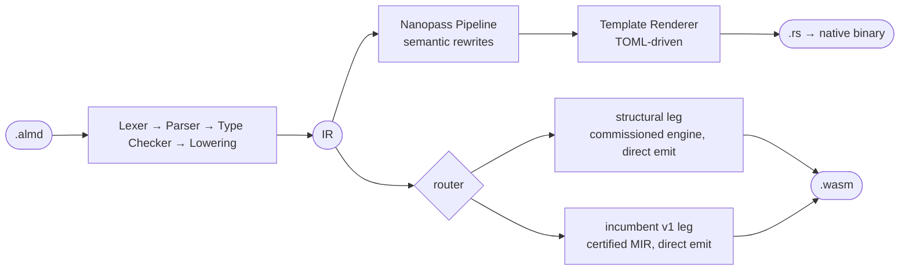

<p align="center">
  
</p>

<p align="center"><strong>The language where LLM edits survive.</strong></p>

<p align="center">
  <a href="https://github.com/almide/almide/actions/workflows/ci.yml"></a>
  <a href="./LICENSE"></a>
  <a href="https://deepwiki.com/almide/almide"></a>
</p>

<p align="center">
  <a href="https://almide.github.io/playground/">Playground</a> ·
  <a href="./docs/CHEATSHEET.md">Cheatsheet</a> ·
  <a href="./docs/SPEC.md">Specification</a> ·
  <a href="#why-almide">Why</a> ·
  <a href="#quick-start">Quick start</a> ·
  <a href="#what-is-measured">Evidence</a> ·
  <a href="#how-it-works">How it works</a> ·
  <a href="#project-status">Status</a>
</p>

## An edit that survives

Almide is a statically-typed language built for one metric: **modification survival rate** — how often code still compiles and passes its tests after a series of AI-driven edits. It compiles to native binaries (via Rust) and to WebAssembly, and the two produce byte-identical output.

The metric in one screen. A model adds a case to a type and, as models do, touches nothing else:

```almd
type Shape =
  | Circle(Float)
  | Square(Float)
  | Triangle(Float, Float)   // the edit

fn area(s: Shape) -> Float =
  match s {
    Circle(r) => 3.14159 * r * r
    Square(w) => w * w
  }
```

```text
error[E010]: non-exhaustive match: missing Triangle(_, _)
  --> shape.almd:7:9
  in match
  here: match s {
  hint: add arms for Triangle(_, _):
  Triangle(arg1, arg2) => _
Or use `_ => todo()` to compile incrementally.
```

The compiler names the missing case at the site, spells out the arm to add, and offers a way to keep compiling while the rest is written. The model's next turn is `Triangle(b, h) => 0.5 * b * h`; the program then runs natively and on wasm and prints the same bytes. That loop — an edit, a diagnostic that is itself the fix, a passing build — is what every decision below serves.

## Why Almide?

- **Predictable** — One canonical way to express each concept, reducing token branching for LLMs
- **Local** — Understanding any piece of code requires only nearby context
- **Repairable** — Compiler diagnostics guide toward a specific fix, not multiple possibilities (as above)
- **Compact** — High semantic density, low syntactic noise

The full rationale: [Design Philosophy](./docs/design/DESIGN.md). The frozen surface and the breaking-change policy: [STABILITY.md](./docs/STABILITY.md) (declared 2026-08-20) — anything in the Cheatsheet or `llms.txt` keeps meaning what it means.

## Quick Start

**[Try it in your browser →](https://almide.github.io/playground/)** — no installation.

```bash
curl -fsSL https://raw.githubusercontent.com/almide/almide/main/tools/install.sh | sh   # macOS / Linux
irm https://raw.githubusercontent.com/almide/almide/main/tools/install.ps1 | iex        # Windows (PowerShell)
```

From source, with [Rust](https://rustup.rs/) 1.94+ (the binary embeds the wasmtime host): `cargo build --release && cp target/release/almide ~/.local/bin/`.

```almd
fn main() -> Unit = {
  println("Hello, world!")
}
```

```bash
almide run hello.almd                 # native
almide run hello.almd --target wasm   # same bytes, on wasmtime
```

## Features

- **Multi-target** — Same source compiles to a native binary (via Rust) or WebAssembly (direct emit, no LLVM)
- **Generics** — Functions (`fn id[T](x: T) -> T`), records, variant types, recursive variants with auto Box wrapping
- **Pattern matching** — Exhaustive `match` with variant destructuring
- **Effect functions** — `effect fn` for explicit error propagation: `expr!` propagates, a bare fallible call is an error, never silent
- **Bidirectional type inference** — Annotations flow into expressions (`let xs: List[Int] = []`)
- **Codec system** — `Type.decode(value)` / `Type.encode(value)` with auto-derive
- **Map literals** — `["key": value]`, `m[key]`, `for (k, v) in m`
- **Fan** — structured concurrency: `fan { a(); b() }` on real threads natively, sequential on wasm; `fan.map` / `fan.any` deterministic by list order on both
- **Pipeline operator** — `data |> transform |> output`
- **Module system** — Packages, sub-namespaces, visibility control, diamond dependency resolution
- **Standard library** — self-hosted `.almd` modules: string, list, map, json, http, fs, and more ([reference](./docs/stdlib/); the count is derived under [Project Status](#project-status))
- **Built-in testing** — `test "name" { assert_eq(a, b) }` with `almide test`

## What is measured

Every claim in this section is either derived by a script or carries the date it was measured; `scripts/check-readme-numbers.sh` refuses a bare number in CI.

### LLM writability

Measured by [almide-dojo](https://github.com/almide/almide-dojo) across 30 tasks (basic / intermediate / advanced) on 2026-04-12; later runs are on the [live dashboard](https://almide.github.io/almide-dojo/):

| Model | Pass Rate | 1-Shot Rate |
|---|---|---|
| Claude Sonnet 4.6 | **100%** (30/30) | 47% |
| Llama 3.3 70B | 61% (17/28) | 33% |

The most recent same-model comparison is the MiniGit bench: Sonnet 5 × 20 trials on 2026-07-15, 100% pass, the most concise of 5 languages (233 LOC), and the fastest agent wall-clock against Gleam and MoonBit — an LLM-writability number, measured under 6–9× self-parallelism, **not** generated-code speed ([chart](docs/figures/lang-bench-snapshot-2026-07.png) · [method](research/benchmark/lang-bench/README.md) · [upstream](https://github.com/mame/ai-coding-lang-bench)).

### Byte-identical across targets

**Every program that compiles for both targets produces byte-identical observable output — stdout, stderr, exit code — whether it runs as a native binary or as WebAssembly.** Native is the oracle; `native == wasm` is a hard invariant, not a "target difference" to be documented around.

The guarantee is **continuous, with an explicit, ledger-managed scope**: "byte-identical" means the execution output, not the compiled artifacts; inherently nondeterministic sources certify deterministic *invariants* instead of exact bytes; APIs not yet implemented on wasm are compile- or run-time *refusals* — never wrong bytes; and exactly two fns are exempt because their job is to report the host — `env.os()` and `env.temp_dir()`, bounded by C-189, since making them agree across targets would be the defect rather than the guarantee.

This claim is not prose. Every observable promise is a named contract in the [behavior-contract ledger](docs/contracts/), each traceable to executable evidence, and the numbers below are regenerated from the ledger (`scripts/gen-claims.sh`, enforced by `scripts/check-contracts.sh` in CI):

<!-- claims:generated:start — derived from docs/contracts/contracts.toml by scripts/gen-claims.sh; DO NOT EDIT between the markers -->
> **Ledger: 328 contracts — 328 active, 0 flagged-for-revision.**
>
> **Divergences awaiting a fix: none.** Every contract in the ledger is
> `active`, carrying executable evidence of class >= `fixture`. The one
> by-design carve-out in the law — the platform-reporting fns `env.os`
> and `env.temp_dir` — is bounded by C-189.
<!-- claims:generated:end -->

Scope, ledger mechanics, and the evidence stack (contract ledger, cross-target fixture gate, differential fuzz, emit-time Σ-probes, Lean belt, org-wide byte-verify sweep): **[docs/design/EQUIVALENCE.md](./docs/design/EQUIVALENCE.md)**.

### Memory safety — proven where it is proven, trusted where it is trusted

You write no ownership annotations, no lifetimes, no `free`: [Perceus](https://www.microsoft.com/en-us/research/publication/perceus-garbage-free-reference-counting-with-reuse/)-style ownership inference in the compiler decides where every heap value is introduced, duplicated, and consumed — garbage-collector-free, pause-free. On the **incumbent wasm leg** that decision ships with a per-build ownership certificate a **kernel-proven checker re-verifies** (Rocq/Coq spine, 96 audited theorems and lemmas, axiom-clean, independently re-checked by `coqchk`; the count is asserted by `proofs/check.sh`). The **structural wasm leg** (the default since #1599) and the **native leg** are trusted, not proven: their evidence is differential — byte-identical output against the certified leg on the contract corpus, held by a grow-only floor and a semantic-mutation net. The `Built …` line names the leg that produced your bytes. The boundary, stage by stage: **[proven-vs-trusted.md](docs/contracts/proven-vs-trusted.md)**; the full account, including the Lean 4 Perceus belt the design started from: **[docs/design/MEMORY-SAFETY.md](./docs/design/MEMORY-SAFETY.md)**.

### Performance

No runtime, no GC, no interpreter — native compiles through Rust to machine code, and WASM is emitted directly as self-contained modules.

<!-- wasm-size:generated:start — rendered from docs/benchmarks/wasm-size.txt by scripts/gen-readme-stats.sh; DO NOT EDIT between the markers -->
| Program (`almide build --target wasm`, verified, as shipped) | incumbent v1 leg | structural leg |
|---|---:|---:|
| Hello, world | **1,096 B** | **2,225 B** |

Measured on almide 0.61.0, 2026-08-31, from `docs/benchmarks/wasm-size.txt`; no post-hoc optimizer touches the shipped bytes (`--wasm-opt` is opt-in and its output is not the verified module).
<!-- wasm-size:generated:end -->

Rust on the same wasm target is 40 KB+ for Hello, world even fully size-tuned; the native minigit CLI binary is 418 KB stripped with 0 dependencies. The byte-by-byte dissection, measured 2026-07-23 on the incumbent leg: **[docs/wasm/WASM-OUTPUT.md](./docs/wasm/WASM-OUTPUT.md)**.

<!-- build-speed:generated:start — derived from docs/benchmarks/build-speed.txt by the almide-gates `bench` subcommand; DO NOT EDIT between the markers -->
Measured on almide 0.59.1, arm64 Darwin, `examples/lisp.almd` (268 lines), 2026-08-27. Every row is an N-run MEAN —
a single run of a 30ms process is scheduler noise. Cold clears BOTH `$TMPDIR/almide-run`
and the dependency cache before each repetition; clearing only the latter measures a warm
build. Regenerate with `almide run tools/almide-gates/src/main.almd -- bench`; the ratchet
(`-- bench --check`) fails CI at 1.5x.

| scenario | time | runs |
|---|---|---|
| `almide check` | **15.2 ms** | 20 |
| build, warm (content-cache hit) | **237.2 ms** | 5 |
| build, cold | **635.3 ms** | 3 |
| build, cold, `--target wasm` | **61.7 ms** | 3 |
<!-- build-speed:generated:end -->

`almide check` scales linearly: over a 2k → 30k-line ladder of this repo's own stdlib the log-log slope of check time against project lines is **1.13** (1.0 is linear, 2.0 quadratic) and the 10k-line rung costs **4.4×** the empty-project floor — measured 2026-08-13, held by `scripts/check-edit-loop-scale.sh`, table in [BENCHMARKS.md](./docs/project/BENCHMARKS.md#edit-loop-scale-1334). Native runtime against handwritten Rust: **1.00×** on n-body and spectral-norm, 1.16–1.18× on fasta and FFT, ~1.6× where the workload is list materialization (#1004), CI-gated ratio ratchet ([scoreboard](./docs/project/BENCHMARKS.md)). Wasm runtime, measured and gated (#1701):

<!-- wasm-runtime:generated:start — rendered from docs/benchmarks/wasm-runtime.txt by scripts/gen-readme-stats.sh; DO NOT EDIT between the markers -->
| Benchmark (`almide bench`, verify-then-time, median of 5) | wasm/native ratio |
|---|---:|
| nbody | **2.19×** |
| spectralnorm | **2.19×** |
| binarytrees | **0.84×** |

Embedded wasm host (Perceus RC in linear memory) against the native binary, same machine, same run. Cross-engine ratios do NOT cancel hardware (a 2-core CI runner measures nbody ~10x worse), so the ratio verdict runs on the stamping machine class and CI gates the STATUS taxonomy below (`scripts/check-wasm-runtime-ratio.sh`). binarytrees runs its fan arms on the embedded host's thread pool, which is why wasm WINS there. The unmeasured corpus cells stay honest instead of estimated: 3 route to the incumbent artifact, 1 wall on the wasm build path, 5 exhaust the embedded heap (#1729) — each re-measured every gate run, so a cell that starts benching fails the gate until its row is promoted. Ledger: `docs/benchmarks/wasm-runtime.txt` (almide 0.61.0, 2026-08-31).
<!-- wasm-runtime:generated:end -->

## How It Works

One frontend, one IR, three renderers behind two targets:


```mermaid
flowchart LR
    SRC([".almd"]) --> FE["Lexer → Parser → Type Checker → Lowering"] --> IR(["IR"])
    IR --> NANO["Nanopass Pipeline<br/>semantic rewrites"] --> TMPL["Template Renderer<br/>TOML-driven"] --> RS([".rs → native binary"])
    IR --> ROUTER{"router"}
    ROUTER --> STRUCT["structural leg<br/>commissioned engine, direct emit"] --> WASM([".wasm"])
    ROUTER --> INCUMB["incumbent v1 leg<br/>certified MIR, direct emit"] --> WASM
```

**Native.** The Nanopass pipeline applies target-specific transformations — `ResultPropagation` (Rust `?`), `CloneInsertion` (Rust borrow analysis), `LICM` (loop-invariant code motion). The Template Renderer is purely syntactic: every semantic decision is already encoded in the IR.

**WebAssembly.** Since commissioning ([#1599](https://github.com/almide/almide/pull/1599)) two verified renderers sit behind one router (`render_wasm_module_routed` in `src/cli/build.rs`). The **structural leg** — the commissioned engine, `almide::wasm_leg` front + `crates/almide-wasm` emitter — takes every program with a `main`, no external packages, and no host-variant I/O on the build path; it was accepted at 610/610 byte-identical to native on the `wasm_cross` corpus, and its build artifacts ship in the WASI form ([#1588](https://github.com/almide/almide/issues/1588)) so they run on stock runtimes. The **incumbent v1 leg** — the certified MIR trust spine in `crates/almide-mir` — takes main-less library modules, dependency-bearing projects, host-variant programs, and any shape the structural leg walls on: a verified-to-verified handover, never the retired unverified emitter, and a program neither leg lowers is an honest error. `ALMIDE_WASM_INCUMBENT=1` forces the incumbent; `ALMIDE_VERIFIED_DEBUG=1` narrates the routing.

```bash
almide run app.almd                  # Compile + execute (native)
almide build app.almd --target wasm  # Build WebAssembly (WASI)
almide test                          # Find and run all test blocks (recursive)
almide check app.almd                # Type check only
almide fmt app.almd                  # Format source code
```

Run `almide --help` for the full command list (compile, add, deps, clean, …). Pipeline and module map: [docs/ARCHITECTURE.md](./docs/ARCHITECTURE.md); the two wasm legs in detail: [docs/wasm/](./docs/wasm/README.md).

### What's next — v1, the Trust Spine

The Perceus proof above proves one compiler pass, once. v1 generalizes that principle to the **whole pipeline** — instead of proving the 100k-line compiler, it proves a tiny *checker* and has the compiler emit a certificate on every build that the checker re-verifies. If the checker accepts, the artifact has the property — a theorem that never mentions the compiler's internals. That collapses the trusted base from ~100,000 lines to the extracted checker (~1,400 lines of OCaml, machine-derived from the proofs), and asks a harder question than testing ever can: **not "do the tests pass?" but "can a machine prove the output is correct?"** The architecture, the receipts (C-SAFE / C-REPRO / C-FAITHFUL / C-PROVEN), and why builds are slower on purpose: **[docs/TRUST-SPINE.md](./docs/TRUST-SPINE.md)**.

## Project Status

| Category | Status |
|----------|--------|
| Maturity | Pre-1.0, under active development on `develop`; the LLM-facing surface is frozen by [STABILITY.md](docs/STABILITY.md) (declared 2026-08-20) |
| Support | Latest release line only, pre-1.0 — policy and versioning guarantees: [SUPPORT.md](./SUPPORT.md) · vulnerabilities: [SECURITY.md](./SECURITY.md) |
| Compiler | Pure Rust, single binary, 0 ICE |
| Targets | Rust (native), WASM (direct emit — two verified legs behind one router, see [How It Works](#how-it-works)) |
| Verified codegen | Incumbent v1 leg: PCC certificates re-verified on every build since 0.29.0 (`--no-verified` opts out). Structural leg: byte-exact corpus and mutation gates, no certificate yet |
| Codegen | Rust: Nanopass + TOML templates; wasm: structural engine or certified MIR → direct emit (the unverified v0 emitter is retired — a wall is an error, never a fallback) |
| Artifacts | `.almdi` module interface files via `almide compile` |
| Playground | [Live](https://almide.github.io/playground/) — the compiler runs as WASM in the browser |

<!-- stats:generated:start — derived from docs/stdlib/*.md, spec/, and docs/contracts/contracts.toml by scripts/gen-readme-stats.sh; DO NOT EDIT between the markers -->
| Derived count | Value |
|---|---|
| Stdlib | 971 functions across 43 modules — self-hosted `.almd`, signature indexes regenerated from the compiler by `tools/gen-stdlib-doc-index.py` |
| Tests | 427 `.almd` test files under `spec/` (`almide test spec/`) + the 328-contract cross-target ledger |
<!-- stats:generated:end -->

## Ecosystem and documentation

- [almide-grammar](https://github.com/almide/almide-grammar) — the single source of truth for syntax (keywords, operators, precedence, TextMate scopes), written in Almide; the compiler generates its lexer keyword table from it at build time, so compiler and tooling cannot drift
- [vscode-almide](https://github.com/almide/vscode-almide) · [tree-sitter-almide](https://github.com/almide/tree-sitter-almide) (Neovim, Helix, Zed) · [playground](https://github.com/almide/playground)
- [docs/CHEATSHEET.md](./docs/CHEATSHEET.md) — quick reference for AI code generation · [docs/SPEC.md](./docs/SPEC.md) — the language specification · [docs/GRAMMAR.md](./docs/GRAMMAR.md) — EBNF grammar + stdlib reference
- [docs/design/DESIGN.md](./docs/design/DESIGN.md) — design philosophy · [docs/design/EQUIVALENCE.md](./docs/design/EQUIVALENCE.md) — the byte-identity claim · [docs/design/MEMORY-SAFETY.md](./docs/design/MEMORY-SAFETY.md) — the proven/trusted account · [docs/TRUST-SPINE.md](./docs/TRUST-SPINE.md) — v1
- [docs/contracts/](./docs/contracts/) — behavior-contract ledger · [docs/stdlib/](./docs/stdlib/) — standard library, per module · [docs/project/BENCHMARKS.md](./docs/project/BENCHMARKS.md) — sizes, runtime, edit-loop scale · [docs/roadmap/](./docs/roadmap/README.md) — evolution plans

## Contributing

Issues and pull requests are welcome on [GitHub](https://github.com/almide/almide). After cloning, install the git hooks (`brew install lefthook && lefthook install`); commits must be in English (enforced by the commit-msg hook). Project conventions: [CLAUDE.md](./CLAUDE.md).

## License

Licensed under either of [MIT](./LICENSE-MIT) or [Apache 2.0](./LICENSE-APACHE) at your option.
