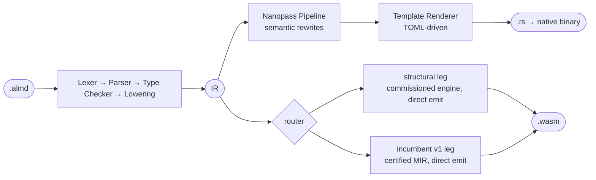

<p align="center">
  
</p>

<p align="center"><strong>当模型出错时，编译器会点名该怎么改。</strong></p>

<p align="center">
  <a href="https://github.com/almide/almide/actions/workflows/ci.yml"></a>
  <a href="./LICENSE"></a>
  <a href="https://deepwiki.com/almide/almide"></a>
</p>

<p align="center">
  <a href="https://almide.github.io/playground/">Playground</a> ·
  <a href="./docs/CHEATSHEET.md">速查表</a> ·
  <a href="./docs/SPEC.md">规范</a> ·
  <a href="#为什么选-almide">为什么</a> ·
  <a href="#快速开始">快速开始</a> ·
  <a href="#测量了什么">证据</a> ·
  <a href="#工作原理">工作原理</a> ·
  <a href="#项目状态">状态</a>
</p>

<p align="center">
  <a href="README.md"></a>
  <a href="README.ja.md"></a>
  <a href="README.zh-CN.md"></a>
</p>

---

## 活下来的一次修改

Almide 是一门面向「由 AI 编写、由 AI 修改的代码」的静态类型语言。它的主张不是「模型能写对」，而是：**当模型写错时，编译器在编写阶段就指出来，并点名该怎么改；当模型写对时，构建会附带一份证明该产物安全的证书。** 它同时编译为原生二进制（经由 Rust）和 WebAssembly，两者产生逐字节相同的输出。

一屏之内看懂前半句。模型给一个类型加了一个分支，并且像模型常做的那样，没有动别的地方：

```almd
type Shape =
  | Circle(Float)
  | Square(Float)
  | Triangle(Float, Float)   // 这次修改

fn area(s: Shape) -> Float =
  match s {
    Circle(r) => 3.14159 * r * r
    Square(w) => w * w
  }
```

```text
error[E010]: non-exhaustive match: missing Triangle(_, _)
  --> shape.almd:7:9
  in match
  here: match s {
  hint: add arms for Triangle(_, _):
  Triangle(arg1, arg2) => _
Or use `_ => todo()` to compile incrementally.
```

编译器在出问题的位置点名缺失的分支，写出该补的 arm，并给出一条在其余部分尚未写完时继续编译的路。模型的下一步就是 `Triangle(b, h) => 0.5 * b * h`；程序随后在原生和 wasm 上都能运行，并打印相同的字节。一次修改、一条本身即是修复的诊断、一次通过的构建 —— 下面每一个决定都在为这个循环服务。把同一个问题拿去问 Python，用八处注入的修改错误：[demo/make-verify](./demo/make-verify/)。

## 为什么选 Almide

- **可预测** —— 每个概念只有一种规范写法，减少 LLM 的 token 分支
- **局部** —— 读懂任何一段代码，只需要它附近的上下文
- **可修复** —— 诊断指向一个具体的修法，而不是若干种可能（如上例）
- **紧凑** —— 语义密度高，语法噪声低

完整理据见 [Design Philosophy](./docs/design/DESIGN.md)。冻结的表面与破坏性变更策略见 [STABILITY.md](./docs/STABILITY.md)（2026-08-20 宣布）—— 速查表和 `llms.txt` 里写着的东西，含义不会改变。

## 快速开始

**[在浏览器里试 →](https://almide.github.io/playground/)** —— 无需安装。

```bash
curl -fsSL https://raw.githubusercontent.com/almide/almide/main/tools/install.sh | sh   # macOS / Linux
irm https://raw.githubusercontent.com/almide/almide/main/tools/install.ps1 | iex        # Windows (PowerShell)
```

安装脚本在解包前会用该版本的 `almide-checksums.sha256` 校验压缩包。若要自己验证下载的产物 —— 包括校验和文件在内的每一个发布产物，都由发布工作流用 Sigstore 做了证明（见 [SECURITY.md](./SECURITY.md)）：

```bash
gh attestation verify almide-macos-aarch64.tar.gz -R almide/almide   # 来源: 由 almide/almide 的发布工作流构建
sha256sum -c --ignore-missing almide-checksums.sha256                # 摘要与已发布的校验和一致
```

每个压缩包还带有 `almide-verify`，一个独立版本化的证书检查器：`almide verify app.almd` 会输出该程序的所有权 / 名称 / 能力 / 调用模式见证，并交给它（它必须与 `almide` 相邻或位于 `PATH` 上 —— 没有内置回退）。

从源码构建需要 [Rust](https://rustup.rs/) 1.94+（二进制内嵌 wasmtime 宿主）：`cargo build --release && cp target/release/almide target/release/almide-verify ~/.local/bin/`（或 `make install`）。

```almd
fn main() -> Unit = {
  println("Hello, world!")
}
```

```bash
almide run hello.almd                 # 原生
almide run hello.almd --target wasm   # 相同字节，跑在 wasmtime 上
```

## 特性

- **多目标** —— 同一份源码编译为原生二进制（经由 Rust）或 WebAssembly（直接产出，不经 LLVM）
- **泛型** —— 函数（`fn id[T](x: T) -> T`）、记录、variant 类型、自动 Box 包装的递归 variant
- **模式匹配** —— 带 variant 解构的穷尽 `match`
- **effect 函数** —— 用 `effect fn` 做显式错误传播：`expr!` 传播，裸的可失败调用是错误，绝不静默
- **双向类型推导** —— 注解流入表达式（`let xs: List[Int] = []`）
- **Codec** —— `Type.decode(value)` / `Type.encode(value)`，自动派生
- **Map 字面量** —— `["key": value]`、`m[key]`、`for (k, v) in m`
- **Fan** —— 结构化并发：`fan { a(); b() }` 在原生上是真线程，在 wasm 上顺序执行；`fan.map` / `fan.any` 在两端都按列表顺序确定
- **管道运算符** —— `data |> transform |> output`
- **模块系统** —— 包、子命名空间、可见性控制、菱形依赖解析
- **标准库** —— 自举的 `.almd` 模块：string、list、map、json、http、fs 等（[参考](./docs/stdlib/)；数量在[项目状态](#项目状态)中导出）
- **内建测试** —— `test "name" { assert_eq(a, b) }`，用 `almide test` 运行

## 测量了什么

本节的每一条主张，要么由脚本导出，要么带着测量日期。`scripts/check-readme-numbers.sh` 会在 CI 中拒绝裸的数字，也会拒绝超过 90 天、或者没有点名其来源 almide-dojo run 的 LLM 可写性记分卡。

### LLM 可写性

由 [almide-dojo](https://github.com/almide/almide-dojo) 于 2026-09-22 测得，覆盖其 38 个任务（basic / intermediate / advanced）的题库，固定编译器版本 `almide 0.62.0`，由该仓库的 CI 通道执行。两次 run 都被 harness 标记为 **`comparable`** —— 计划中的每个任务都送达了模型，所以每个比率是一个点而不是区间 —— 并且都在固定种子（`20260922`）和温度 0 下采样，按提供方实际发出的参数记录在 run 的 manifest 里。这些 run 已提交（[`almide-dojo@8af34bc`](https://github.com/almide/almide-dojo/commit/8af34bc3)），因此下表可以从它们的 `summary.md` 重新算出，而不必相信。后续 run 见[实时看板](https://almide.github.io/almide-dojo/)。出于决定，CI 中不放 Anthropic 或 OpenAI 的密钥，所以这里列出的是该通道无需密钥即可访问的模型：

| Model | Pass Rate | 1-Shot Rate |
|---|---|---|
| Llama 3.3 70B (fp8-fast) | 65% (25/38) | 39% (15/38) |
| Llama 3.1 8B | 44% (17/38) | 34% (13/38) |

最近一次同模型对比是 MiniGit 基准：2026-07-15，Sonnet 5 × 20 次试验，100% 通过，在 5 门语言中最简洁（233 行），相对 Gleam 和 MoonBit 的 agent 墙钟时间最快 —— 这是在 6–9 倍自并行下测得的 **LLM 可写性**数字，**不是**生成代码的速度（[图](docs/figures/lang-bench-snapshot-2026-07.png) · [方法](research/benchmark/lang-bench/README.md) · [上游](https://github.com/mame/ai-coding-lang-bench)）。

### 跨目标逐字节相同

**每一个能为两个目标编译的程序，无论作为原生二进制还是 WebAssembly 运行，其可观测输出 —— stdout、stderr、退出码 —— 都逐字节相同。** 原生是基准；`native == wasm` 是硬不变量，而不是一处需要在文档里绕开的"目标差异"。

这个保证是**持续的，并且范围由台账明确管理**："逐字节相同"指的是执行输出，不是编译产物；本质不确定的来源改为证明确定性的*不变量*而非精确字节；尚未在 wasm 上实现的 API 是编译期或运行期的*拒绝* —— 绝不会是错误的字节；恰好两个 fn 因其职责就是报告宿主而被豁免 —— `env.os()` 和 `env.temp_dir()`，由 C-189 圈定，因为让它们跨目标一致才是缺陷而非保证。

这条主张不是散文。每一个可观测的承诺都是[行为契约台账](docs/contracts/)中一条具名契约，各自可追溯到可执行的证据，下面的数字由台账再生成（`scripts/gen-claims.sh`，CI 中由 `scripts/check-contracts.sh` 强制）：

<!-- claims:generated:start — derived from docs/contracts/contracts.toml by scripts/gen-claims.sh; DO NOT EDIT between the markers -->
> <!-- counts:generated:start (as of 2026-09-29) — stamped totals from proofs/ledger-counts.toml; refreshed only by scripts/gen-ledger-counts.sh, never by a fixture/contract PR; DO NOT EDIT between the markers -->
> **Ledger: 370 contracts — 370 active, 0 flagged-for-revision.**
> <!-- counts:generated:end -->
>
> **Divergences awaiting a fix: none.** Every contract in the ledger is
> `active`, carrying executable evidence of class >= `fixture`. The one
> by-design carve-out in the law — the platform-reporting fns `env.os`
> and `env.temp_dir` — is bounded by C-189.
<!-- claims:generated:end -->

范围、台账机制与证据栈（契约台账、跨目标 fixture 门、差分模糊测试、产出期 Σ 探针、Lean 带、组织级逐字节校验扫描）：**[docs/design/EQUIVALENCE.md](./docs/design/EQUIVALENCE.md)**。

### 内存安全 —— 证明之处以证明，信任之处以信任

你不写所有权注解、不写生命周期、不写 `free`：编译器里 [Perceus](https://www.microsoft.com/en-us/research/publication/perceus-garbage-free-reference-counting-with-reuse/) 式的所有权推导决定每个堆值在何处产生、复制与消费 —— 无垃圾回收，无停顿。在 **incumbent wasm leg** 上，这个决定会随每次构建附带一份所有权证书，由**内核级证明过的检查器重新验证**（Rocq/Coq 主干，96 条经审计的定理与引理，公理干净，由 `coqchk` 独立复检；数量由 `proofs/check.sh` 断言）。**structural wasm leg**（#1599 起为默认）与**原生 leg** 是被信任而非被证明的：它们的证据是差分的 —— 在契约语料上与已认证 leg 逐字节相同的输出，由只增不减的下界和语义变异网维持。`Built …` 那一行会点名产出你字节的是哪条 leg。逐阶段的边界见 **[proven-vs-trusted.md](docs/contracts/proven-vs-trusted.md)**；包含设计起点 Lean 4 Perceus 带在内的完整说明见 **[docs/design/MEMORY-SAFETY.md](./docs/design/MEMORY-SAFETY.md)**。

### 性能

没有运行时、没有 GC、没有解释器 —— 原生经 Rust 编译为机器码，WASM 作为自包含模块直接产出。

<!-- wasm-size:generated:start — rendered from docs/benchmarks/wasm-size.txt by scripts/gen-readme-stats.sh; DO NOT EDIT between the markers -->
| Program (`almide build --target wasm`, verified, as shipped) | incumbent v1 leg | structural leg |
|---|---:|---:|
| Hello, world | **1,096 B** | **1,330 B** |

Measured on almide 0.62.0, 2026-09-12, from `docs/benchmarks/wasm-size.txt`; no post-hoc optimizer touches the shipped bytes (`--wasm-opt` is opt-in and its output is not the verified module).
<!-- wasm-size:generated:end -->

同一 wasm 目标下的 Rust，即便把体积调到极致，Hello, world 也要 40 KB 以上；原生 minigit CLI 二进制 strip 后 418 KB，0 依赖。逐字节的解剖（2026-07-23 在 incumbent leg 上测得）：**[docs/wasm/WASM-OUTPUT.md](./docs/wasm/WASM-OUTPUT.md)**。

对比手写 Rust，算术内核持平（n-body、spectral-norm 均为 1.00×；ratchet 的锚定行）。当 Almide 掌握 Rust 所没有的信息时 —— 一棵树的整个生命周期就是一个 `check(make(depth))` 表达式，这一点由 effect system 证明 —— 它比同一程序的普通 Rust 更快：

<!-- native-victory:generated:start — rendered from docs/benchmarks/native-victory.txt by scripts/gen-readme-stats.sh; DO NOT EDIT between the markers -->
| Workload (`bench.py`, median of 9, interleaved) | optimization | Almide / ordinary Rust | without it (`ALMIDE_REGION_OFF=1` / `ALMIDE_FAN_SEQUENTIAL=1`) | CI runner |
|---|---|---:|---:|---:|
| binarytrees | region window (#1991) | **0.35 (d17)** / **0.32 (d19)** | 1.25 | 0.61 |
| treealloc | region window (#1991) | **0.30 (d20)** / **0.30 (d21)** | 1.10 | 0.61 (est.) |
| fannkuchredux | parallel fan (#2044) | **0.21 (n10)** / **0.12 (n11)** | 1.06 | 0.60 (est.) |

Two ratios per row are the two input sizes (the win holds at both); the Rust side is the ordinary program a person writes for it — a `Box` per node, one thread, no arena, no `unsafe`, no SIMD — compiled with the same `rustc` flags, and the "without it" column is the same Almide source with the region window turned off, so the whole gap is that one optimization. The absolute ratio is allocator-dependent (the CI runner frees a `Box` cheaper), the direction is not: the `perf-ratchet` job fails if either row reaches 1.0 or the ablation stops paying. Declaration and methodology: [docs/project/BENCHMARKS.md](./docs/project/BENCHMARKS.md#faster-than-ordinary-rust-1330). Ledger: `docs/benchmarks/native-victory.txt` (almide 0.62.0, 2026-09-08).
<!-- native-victory:generated:end -->

<!-- build-speed:generated:start — derived from docs/benchmarks/build-speed.txt by the almide-gates `bench` subcommand; DO NOT EDIT between the markers -->
Measured on almide 0.59.1, arm64 Darwin, `examples/lisp.almd` (268 lines), 2026-08-27. Every row is an N-run MEAN —
a single run of a 30ms process is scheduler noise. Cold clears BOTH `$TMPDIR/almide-run`
and the dependency cache before each repetition; clearing only the latter measures a warm
build. Regenerate with `almide run tools/almide-gates/src/main.almd -- bench`; the ratchet
(`-- bench --check`) fails CI at 1.5x.

| scenario | time | runs |
|---|---|---|
| `almide check` | **15.2 ms** | 20 |
| build, warm (content-cache hit) | **237.2 ms** | 5 |
| build, cold | **635.3 ms** | 3 |
| build, cold, `--target wasm` | **61.7 ms** | 3 |
<!-- build-speed:generated:end -->

`almide check` 线性扩展：在本仓库自身 stdlib 构成的 2k → 30k 行阶梯上，检查时间对项目行数的双对数斜率为 **1.13**（1.0 为线性，2.0 为二次），10k 行那一级是空项目下界的 **4.4 倍** —— 2026-08-13 测得，由 `scripts/check-edit-loop-scale.sh` 保持，表见 [BENCHMARKS.md](./docs/project/BENCHMARKS.md#edit-loop-scale-1334)。相对手写 Rust 的原生运行时间：n-body 与 spectral-norm 为 **1.00×**，fasta 与 FFT 为 1.16–1.18×，以列表实体化为主的负载约 1.6×（#1004），由 CI 的比率 ratchet 把关（[记分板](./docs/project/BENCHMARKS.md)）。wasm 运行时间亦已测量并设门（#1701）：

<!-- wasm-runtime:generated:start — rendered from docs/benchmarks/wasm-runtime.txt by scripts/gen-readme-stats.sh; DO NOT EDIT between the markers -->
| Benchmark (`almide bench`, verify-then-time, median of 5) | wasm/native ratio |
|---|---:|
| nbody | **2.19×** |
| spectralnorm | **1.73×** |
| binarytrees | **1.36×** |
| treealloc | **1.04×** |
| fasta | **1.69×** |
| mandelbrot | **1.29×** |
| fft | **2.85×** |
| strchurn | **0.87×** |
| listbuild_append | **3.04×** |
| listbuild_combinator | **3.13×** |
| listbuild_prealloc | **2.85×** |
| mapbuild | **0.86×** |

Embedded wasm host (Perceus RC in linear memory) against the native binary, same machine, same run. Cross-engine ratios do NOT cancel hardware (a 2-core CI runner measures nbody ~10x worse), so the stamped ratio verdict runs on the stamping machine class; CI gates the STATUS taxonomy below and judges the wasm leg by a same-runner A/B against the latest release binary (interleaved, min-of-runs, `ab_band` in the ledger — #2143) (`scripts/check-wasm-runtime-ratio.sh`). binarytrees runs its fan arms on the embedded host's thread pool, which is why wasm WINS there. The unmeasured corpus cells stay honest instead of estimated: 1 route to the incumbent artifact, 1 wall on the wasm build path, 0 exhaust the embedded heap (#1729) — each re-measured every gate run, so a cell that starts benching fails the gate until its row is promoted. Ledger: `docs/benchmarks/wasm-runtime.txt` (almide 0.63.0 (dev), 2026-09-24).
<!-- wasm-runtime:generated:end -->

## 工作原理

一个前端、一个 IR、两个目标背后的三个渲染器：



**原生。** Nanopass 流水线施加目标相关的变换 —— `ResultPropagation`（Rust 的 `?`）、`CloneInsertion`（Rust 借用分析）、`LICM`（循环不变量外提）。Template Renderer 纯粹是语法性的：所有语义决定在 IR 阶段已经确定。

**WebAssembly。** 自 commissioning（[#1599](https://github.com/almide/almide/pull/1599)）起，两个已验证的渲染器位于一个路由器之后（`src/cli/build.rs` 中的 `render_wasm_module_routed`）。**structural leg** —— commissioned 引擎，`almide::wasm_leg` 前端 + `crates/almide-wasm` 产出器 —— 接收所有带 `main`、无外部包、构建路径上无宿主相关 I/O 的程序；它在 `wasm_cross` 语料上以 610/610 与原生逐字节相同被接受，其构建产物以 WASI 形式（[#1588](https://github.com/almide/almide/issues/1588)）发布，因此可在标准运行时上运行。**incumbent v1 leg** —— `crates/almide-mir` 中已认证的 MIR 信任主干 —— 接收无 `main` 的库模块、带依赖的项目、宿主相关的程序，以及 structural leg 拒绝的任何形态：这是已验证到已验证的交接，绝不退回已退役的未验证产出器；两条 leg 都无法下降的程序，会是一个诚实的错误。`ALMIDE_WASM_INCUMBENT=1` 强制走 incumbent；`ALMIDE_VERIFIED_DEBUG=1` 会实况播报路由。

```bash
almide run app.almd                  # 编译 + 执行（原生）
almide build app.almd --target wasm  # 构建 WebAssembly（WASI）
almide test                          # 递归查找并运行所有 test 块
almide check app.almd                # 仅类型检查
almide check app.almd --target wasm  # + wasm 构建路径：检查期给出 E081/E082（#1922）
almide fmt app.almd                  # 格式化源码
```

完整命令列表见 `almide --help`（compile、add、deps、clean 等）。流水线与模块地图见 [docs/ARCHITECTURE.md](./docs/ARCHITECTURE.md)；两条 wasm leg 的细节见 [docs/wasm/](./docs/wasm/README.md)。

### 接下来 —— v1，信任主干

上面的 Perceus 证明只证明了编译器的一趟，一次。v1 把这个原理推广到**整条流水线** —— 不去证明十万行的编译器，而是证明一个极小的*检查器*，并让编译器在每次构建时产出一份证书由检查器复验。若检查器接受，产物就具备该性质 —— 这是一条从不提及编译器内部的定理。它把可信基从约 10 万行收缩到被抽取出的检查器（约 1,400 行 OCaml，由证明机械导出），并提出一个比测试更难的问题：**不是"测试通过了吗"，而是"机器能证明输出正确吗"。** 架构、收据（C-SAFE / C-REPRO / C-FAITHFUL / C-PROVEN），以及构建为何被刻意放慢，见 **[docs/TRUST-SPINE.md](./docs/TRUST-SPINE.md)**。

## 项目状态

| 类别 | 状态 |
|----------|--------|
| 成熟度 | 1.0 之前，在 `develop` 上活跃开发；面向 LLM 的表面由 [STABILITY.md](docs/STABILITY.md) 冻结（2026-08-20 宣布） |
| 支持 | 仅最新发布线，1.0 之前 —— 策略与版本保证见 [SUPPORT.md](./SUPPORT.md) · 漏洞见 [SECURITY.md](./SECURITY.md) |
| 编译器 | 纯 Rust，单一二进制，0 次 ICE |
| 目标 | Rust（原生）、WASM（直接产出 —— 一个路由器背后两条已验证 leg，见[工作原理](#工作原理)） |
| 已验证代码生成 | incumbent v1 leg：自 0.29.0 起每次构建复验 PCC 证书（`--no-verified` 可退出）。structural leg：逐字节语料与变异门，尚无证书 |
| 代码生成 | Rust：Nanopass + TOML 模板；wasm：structural 引擎或已认证 MIR → 直接产出（未验证的 v0 产出器已退役 —— 拒绝是错误，绝非回退） |
| 产物 | 经 `almide compile` 产生的 `.almdi` 模块接口文件 |
| Playground | [在线](https://almide.github.io/playground/) —— 编译器以 WASM 形式跑在浏览器里 |

<!-- stats:generated:start — derived from docs/stdlib/*.md, spec/, and docs/contracts/contracts.toml by scripts/gen-readme-stats.sh; DO NOT EDIT between the markers -->
<!-- counts:generated:start (as of 2026-09-28) — stamped totals from proofs/ledger-counts.toml; refreshed only by scripts/gen-ledger-counts.sh, never by a fixture/contract PR; DO NOT EDIT between the markers -->
| Derived count | Value |
|---|---|
| Stdlib | 1015 functions across 45 modules — self-hosted `.almd`, signature indexes regenerated from the compiler by `tools/gen-stdlib-doc-index.py` |
| Tests | 468 `.almd` test files under `spec/` (`almide test spec/`) + the 370-contract cross-target ledger |
<!-- counts:generated:end -->
<!-- stats:generated:end -->

<!-- mutation-score:generated:start (as of 2026-09-22) — stamped from proofs/mutation-score.toml by scripts/gen-mutation-score.sh; re-measured by every mutation-sweep run, refreshed only by `--from-run`; DO NOT EDIT between the markers -->
**Mutation score** — 41/41 mutants caught (100.0 %), 0 survived, 0 stale: the full release-shape net sweep of `ci/mutations/` ([`scripts/check-mutation-gate.sh`](./scripts/check-mutation-gate.sh)), stamped 2026-09-22 from mutation-sweep run [35650396971](https://github.com/almide/almide/actions/runs/35650396971) at `3b02f7dc4`.
<!-- mutation-score:generated:end -->

## 用 Almide 写成的

本仓库中最大的 Almide 程序是标准库。下面这些是在别处用 Almide 写的，也是那些表面主张与"并非为了让语言好看而写的代码"相遇的地方。

- **编码智能体** —— [comide](https://github.com/O6lvl4/comide)，一个目录里的对话 · [golemide](https://github.com/O6lvl4/golemide)，单一静态二进制，先观察后编辑，每次写入都过语法门 · [homullus](https://github.com/almide-ai/homullus)，模块化智能体运行时 · [manus](https://github.com/almide-ai/manus)，macOS 上的计算机操作
- **智能体基础设施** —— [porta](https://github.com/almide/porta)，WASM 隔离加 OS 沙箱，无需 Docker · [ctxgate](https://github.com/O6lvl4/ctxgate)，驻留在工具钩子里的上下文防火墙 · [hew](https://github.com/O6lvl4/hew)，面向智能体的结构感知 `cat`/`grep`/`sed` · [almai](https://github.com/almide-ai/almai)，覆盖所有提供方的统一 LLM 接口
- **语法分析** —— [gramide](https://github.com/O6lvl4/gramide)，给编码智能体用的语法树，附 [TypeScript](https://github.com/O6lvl4/gramide-typescript)、[Python](https://github.com/O6lvl4/gramide-python)、[Rust](https://github.com/O6lvl4/gramide-rust)、[Go](https://github.com/O6lvl4/gramide-go)、[JavaScript](https://github.com/O6lvl4/gramide-javascript)、[Almide](https://github.com/O6lvl4/gramide-almide) 的文法包，每个都与该语言自身的 parser 对照检查 · [parsegen](https://github.com/almide/parsegen)，无 C、无动态加载的 tree-sitter 兼容 parser 生成器
- **图形** —— [snaidhm](https://github.com/almide-graphics/snaidhm)，计算着色器优先的 2D/3D 渲染器 · [ceangal](https://github.com/almide-graphics/ceangal)，其上的布局与控件 · [obsid](https://github.com/almide-graphics/obsid)，经 WASM 的 Canvas 2D / WebGL / 3D · [nn](https://github.com/almide-graphics/nn) 与 [slabhra](https://github.com/almide-graphics/slabhra)，神经网络原语与反向模式自动微分 · [cruth](https://github.com/almide-graphics/cruth)，VRM/glTF 角色 · [lumen](https://github.com/almide-graphics/lumen)，无需 `@extern` 的图形数学
- **桌面** —— [almide-shell](https://github.com/almide-graphics/almide-shell)，Hyprland 的 shell：状态栏、启动器、通知、屏幕显示 · [sprid](https://github.com/almide-graphics/sprid)，在严格内存预算下带回滚缓冲的终端模拟器
- **绑定与分发** —— [almide-bindgen](https://github.com/almide/almide-bindgen)，面向 20 个语言目标的 FFI · [almide-wasm-bindgen](https://github.com/almide/almide-wasm-bindgen) · [almide-lander](https://github.com/almide/almide-lander)，把 Almide 作为原生共享库 · [almide-web](https://github.com/almide/almide-web)，浏览器 API
- **库** —— [toml](https://github.com/almide/toml) · [yaml](https://github.com/almide/yaml) · [csv](https://github.com/almide/csv) · [svg](https://github.com/almide/svg) · [dfa](https://github.com/almide/dfa) · [bigint](https://github.com/almide/bigint) · [aes](https://github.com/almide/aes) · [rsa](https://github.com/almide/rsa) · [sha1](https://github.com/almide/sha1) · [base64](https://github.com/almide/base64) · [almide-sqlite](https://github.com/almide/almide-sqlite)
- **一致性与测量** —— [als](https://github.com/almide/als)，带自有裁判的规范性规范，可对任意 `almide` 二进制运行 · [almide-dojo](https://github.com/almide/almide-dojo)，LLM 可写性的测量场，harness 本身用 Almide 写成 · [bonsai-almide](https://github.com/almide/bonsai-almide)，跑在浏览器里的 1-bit LLM

2026-09-30 测得：本仓库之外有 144 个公开仓库包含 Almide 源码。剔除生成产物后的手写行数：[nn](https://github.com/almide-graphics/nn) 21,815 行，[gramide](https://github.com/O6lvl4/gramide) 家族在 8 个仓库中共 19,780 行，[almide-shell](https://github.com/almide-graphics/almide-shell) 8,502 行，[snaidhm](https://github.com/almide-graphics/snaidhm) 6,800 行，[almide-bindgen](https://github.com/almide/almide-bindgen) 5,871 行，[ceangal](https://github.com/almide-graphics/ceangal) 5,099 行，[sprid](https://github.com/almide-graphics/sprid) 4,565 行，[porta](https://github.com/almide/porta) 4,419 行。

## 生态与文档

- [almide-grammar](https://github.com/almide/almide-grammar) —— 语法（关键字、运算符、优先级、TextMate scope）的唯一真源，用 Almide 写成；编译器在构建时据此生成词法关键字表，因此编译器与工具不会漂移
- [vscode-almide](https://github.com/almide/vscode-almide) · [tree-sitter-almide](https://github.com/almide/tree-sitter-almide)（Neovim、Helix、Zed） · [playground](https://github.com/almide/playground)
- [docs/CHEATSHEET.md](./docs/CHEATSHEET.md) —— 面向 AI 代码生成的速查表 · [docs/SPEC.md](./docs/SPEC.md) —— 语言规范 · [docs/GRAMMAR.md](./docs/GRAMMAR.md) —— EBNF 文法 + stdlib 参考
- [docs/design/DESIGN.md](./docs/design/DESIGN.md) —— 设计哲学 · [docs/design/EQUIVALENCE.md](./docs/design/EQUIVALENCE.md) —— 逐字节相同的主张 · [docs/design/MEMORY-SAFETY.md](./docs/design/MEMORY-SAFETY.md) —— 证明与信任的划分 · [docs/TRUST-SPINE.md](./docs/TRUST-SPINE.md) —— v1
- [docs/contracts/](./docs/contracts/) —— 行为契约台账 · [docs/stdlib/](./docs/stdlib/) —— 按模块的标准库 · [docs/project/BENCHMARKS.md](./docs/project/BENCHMARKS.md) —— 体积、运行时间、编辑循环扩展性 · [docs/roadmap/](./docs/roadmap/README.md) —— 演进计划

## 参与贡献

欢迎在 [GitHub](https://github.com/almide/almide) 提 Issue 和 Pull Request。克隆后请安装 git 钩子（`brew install lefthook && lefthook install`）；提交信息必须为英文（由 commit-msg 钩子强制）。项目约定见 [CLAUDE.md](./CLAUDE.md)。

## 许可证

可任选 [MIT](./LICENSE-MIT) 或 [Apache 2.0](./LICENSE-APACHE)。
