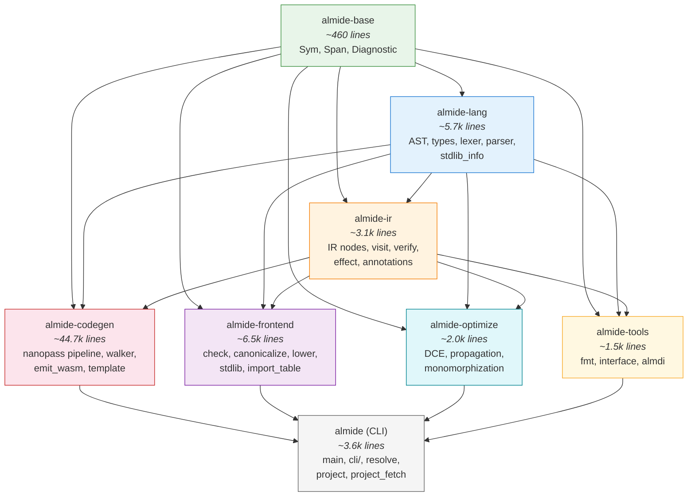

# Almide Workspace Crates

The Almide compiler is split into a Cargo workspace with focused crates for build parallelism, clear API boundaries, and independent development.

## Architecture



**Arrows indicate dependency direction** (A → B means A depends on B).

## Crate Summary

| Crate | Role | Key Modules |
|-------|------|-------------|
| **almide-base** | Shared primitives | `Sym` (interned strings), `Span` (source locations), `Diagnostic` (error reporting) |
| **almide-lang** | Language definition | AST nodes, type system (`Ty`, `unify`, `constructor`), lexer, parser, stdlib module registry |
| **almide-ir** | Intermediate representation | Typed IR nodes (`IrExpr`, `IrStmt`, `IrProgram`), visitor pattern, verification, effect system |
| **almide-codegen** | Code generation | 20 nanopass passes, TOML-driven template walker (Rust), direct WASM binary emit |
| **almide-frontend** | Analysis pipeline | Type checker, name canonicalization, IR lowering, stdlib signatures (build.rs generated) |
| **almide-optimize** | IR optimization | Dead code elimination, constant propagation, generic monomorphization |
| **almide-tools** | Developer tools | Source formatter, module interface serialization, `.almdi` binary format |
| **almide** | CLI entry point | Command dispatch, project resolution, dependency fetching. Re-exports all crates. |

## Compilation Pipeline

```
Source (.almd)
    │
    ▼
┌─────────┐   almide-lang
│  Parse   │   lexer → parser → AST
└────┬─────┘
     │
     ▼
┌──────────────┐   almide-frontend
│ Canonicalize  │   name resolution, protocol registration
│    Check      │   type inference, constraint solving
│    Lower      │   AST → typed IR
└────┬─────────┘
     │
     ▼
┌──────────┐   almide-optimize
│ Optimize  │   DCE, constant propagation
│   Mono    │   generic monomorphization
└────┬─────┘
     │
     ▼
┌──────────┐   almide-codegen
│ Nanopass  │   20 semantic rewrite passes
│  Emit     │   Rust (template) or WASM (direct binary)
└──────────┘
```

## Build Parallelism

Once `almide-base` and `almide-lang` are built, the following compile **in parallel**:

```
             ┌─ almide-codegen
almide-ir ───┼─ almide-frontend
             ├─ almide-optimize
             └─ almide-tools
```

Changing a file in `check/` does **not** recompile codegen (~44k lines), and vice versa.

## Build Scripts

Two crates have `build.rs` for code generation from `stdlib/defs/*.toml`:

| Crate | Generates | From |
|-------|-----------|------|
| **almide-codegen** | `arg_transforms.rs`, `rust_runtime.rs` | `stdlib/defs/*.toml`, `runtime/rs/src/*.rs` |
| **almide-frontend** | `stdlib_sigs.rs` | `stdlib/defs/*.toml` |

## Re-export Pattern

The main `almide` crate contains thin re-export stubs (e.g., `src/codegen.rs` = `pub use almide_codegen::*;`) so that all existing `crate::module::*` paths continue to work without mass-rewriting CLI and test code.

## Future Work

**Breaking the ast↔types cycle** (tracked separately): Currently `almide-lang` contains both AST and type system because `Expr.ty: Option<Ty>` creates a bidirectional dependency. Removing this field and using an external `HashMap<ExprId, Ty>` would enable:
- `almide-syntax` (AST + lexer + parser) — no type system dependency
- `almide-types` (Ty, TypeEnv, unify) — no AST dependency
