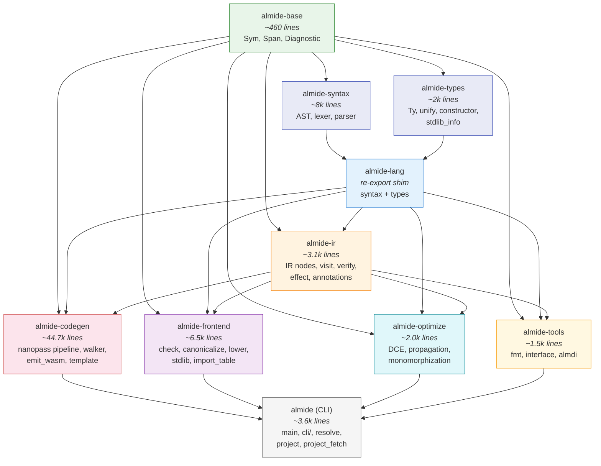

# Almide Workspace Crates

The Almide compiler is split into a Cargo workspace with focused crates for build parallelism, clear API boundaries, and independent development.

## Architecture



**Arrows indicate dependency direction** (A → B means A depends on B).

## Crate Summary

| Crate | Role | Key Modules |
|-------|------|-------------|
| **almide-base** | Shared primitives | `Sym` (interned strings), `Span` (source locations), `Diagnostic` (error reporting) |
| **almide-syntax** | Syntax layer | AST node definitions, lexer (tokenizer), parser |
| **almide-types** | Type system | `Ty`, `unify`, `constructor` (type constructors), stdlib module registry |
| **almide-lang** | Re-export shim | Combines almide-syntax + almide-types for backward compatibility |
| **almide-ir** | Intermediate representation | Typed IR nodes (`IrExpr`, `IrStmt`, `IrProgram`), visitor pattern, verification, effect system |
| **almide-codegen** | Code generation | 20 nanopass passes, TOML-driven template walker (Rust), direct WASM binary emit |
| **almide-frontend** | Analysis pipeline | Type checker, name canonicalization, IR lowering, stdlib signatures (build.rs generated) |
| **almide-optimize** | IR optimization | Dead code elimination, constant propagation, generic monomorphization |
| **almide-tools** | Developer tools | Source formatter, module interface serialization, `.almdi` binary format |
| **almide** | CLI entry point | Command dispatch, project resolution, dependency fetching. Re-exports all crates. |

## Compilation Pipeline

```
Source (.almd)
    │
    ▼
┌─────────┐   almide-syntax
│  Parse   │   lexer → parser → AST
└────┬─────┘
     │
     ▼
┌──────────────┐   almide-frontend (+ almide-types for TypeMap)
│ Canonicalize  │   name resolution, protocol registration
│    Check      │   type inference → TypeMap (ExprId→Ty)
│    Lower      │   AST + TypeMap → typed IR
└────┬─────────┘
     │
     ▼
┌──────────┐   almide-optimize
│ Optimize  │   DCE, constant propagation
│   Mono    │   generic monomorphization
└────┬─────┘
     │
     ▼
┌──────────┐   almide-codegen
│ Nanopass  │   20 semantic rewrite passes
│  Emit     │   Rust (template) or WASM (direct binary)
└──────────┘
```

## Build Parallelism

Once `almide-base` is built, `almide-syntax` and `almide-types` compile **in parallel** (no dependency between them). After those complete, the downstream crates also compile in parallel:

```
              ┌─ almide-syntax ─┐
almide-base ──┤                 ├─ almide-lang ─┐
              └─ almide-types ──┘                │
                                                 ├─ almide-ir ───┬─ almide-codegen
                                                 │               ├─ almide-frontend
                                                 │               ├─ almide-optimize
                                                 │               └─ almide-tools
                                                 └───────────────┘
```

Changing a file in `check/` does **not** recompile codegen (~44k lines), and vice versa. Changing a type definition does **not** recompile the parser.

## Build Scripts

Two crates have `build.rs` for code generation from `stdlib/defs/*.toml`:

| Crate | Generates | From |
|-------|-----------|------|
| **almide-codegen** | `arg_transforms.rs`, `rust_runtime.rs` | `stdlib/defs/*.toml`, `runtime/rs/src/*.rs` |
| **almide-frontend** | `stdlib_sigs.rs` | `stdlib/defs/*.toml` |

## Re-export Pattern

The main `almide` crate re-exports all sub-crates via `pub use` in `lib.rs`, so all existing `almide::module::*` paths continue to work. Similarly, `almide-lang` re-exports `almide-syntax` and `almide-types` for backward compatibility.
