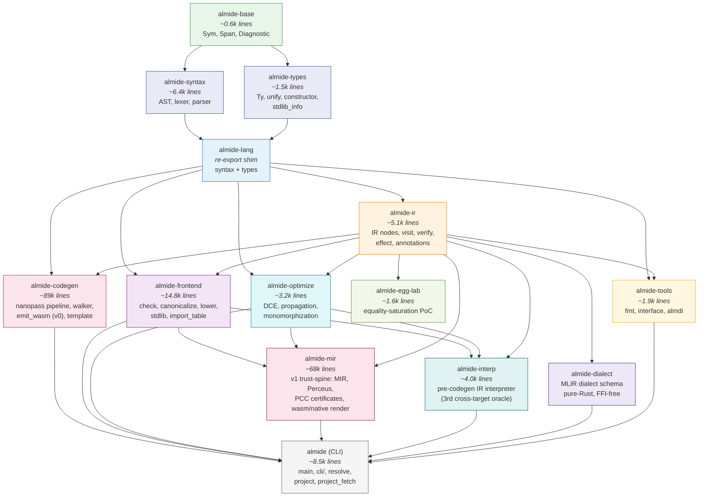
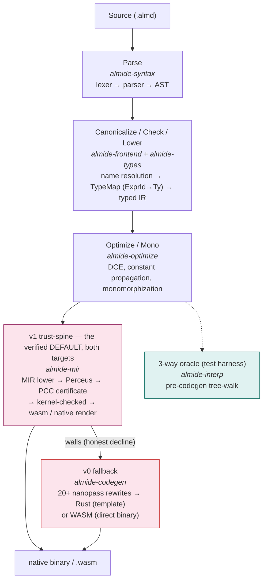
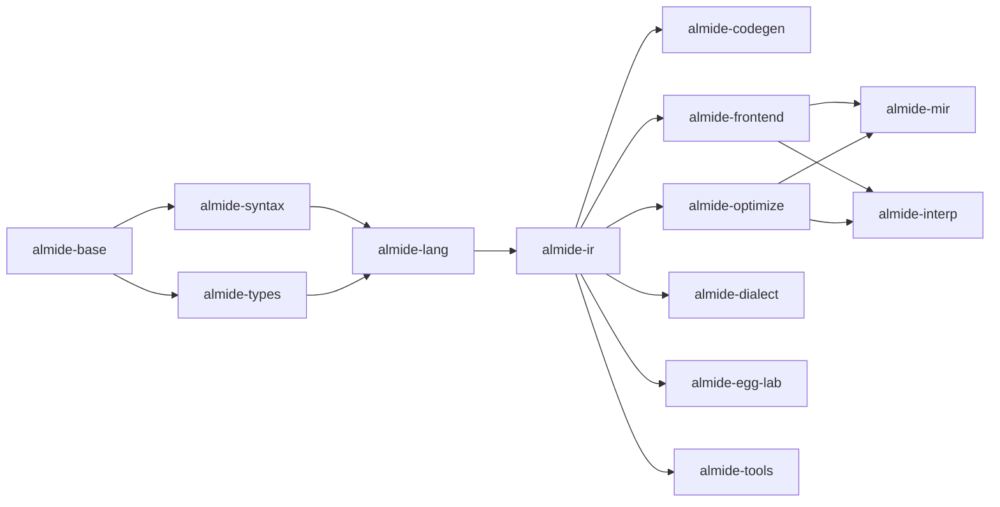

# Almide Workspace Crates

The Almide compiler is split into a Cargo workspace with focused crates for build parallelism, clear API boundaries, and independent development.

## Architecture

**Arrows point from dependency to dependent** (A → B means B depends on A). `almide-base` edges beyond the first tier are elided for readability — every crate depends on it.

## Crate Summary

| Crate | Role | Key Modules |
|-------|------|-------------|
| **almide-base** | Shared primitives | `Sym` (interned strings), `Span` (source locations), `Diagnostic` (error reporting) |
| **almide-syntax** | Syntax layer | AST node definitions, lexer (tokenizer), parser |
| **almide-types** | Type system | `Ty`, `unify`, `constructor` (type constructors), stdlib module registry |
| **almide-lang** | Re-export shim | Combines almide-syntax + almide-types for backward compatibility |
| **almide-ir** | Intermediate representation | Typed IR nodes (`IrExpr`, `IrStmt`, `IrProgram`), visitor pattern, verification, effect system |
| **almide-frontend** | Analysis pipeline | Type checker, name canonicalization, IR lowering, stdlib signatures (build.rs generated) |
| **almide-optimize** | IR optimization | Dead code elimination, constant propagation, generic monomorphization |
| **almide-codegen** | v0 code generation | 20+ nanopass passes, TOML-driven template walker (Rust), direct WASM binary emit (`emit_wasm/`) |
| **almide-mir** | v1 trust-spine (the DEFAULT renderer) | Middle IR with ownership as the single source of truth: Perceus RC insertion, per-function PCC certificates re-verified by the Rocq-kernel-extracted checker, self-hosted stdlib registry, wasm + native render. Falls back to v0 where it walls — a v1-rendered program is never wrong |
| **almide-interp** | Executable spec / 3rd oracle | Tree-walks the pre-codegen `IrProgram` — shares no target-lowering pass with either backend, so the 3-way gate catches both-backends-wrong-the-same-way bugs. Abstentions are ledgered (`interp-abstain-ledger.txt`) |
| **almide-dialect** | MLIR dialect schema | Models MLIR's Region/Block/Operation hierarchy as pure-Rust types (FFI-free) |
| **almide-egg-lab** | Experiment | Equality-saturation (egg) feasibility PoC on a minimal IR subset |
| **almide-tools** | Developer tools | Source formatter, module interface serialization, `.almdi` binary format |
| **almide** (CLI) | Entry point | Command dispatch, project resolution, dependency fetching, content-addressed native build cache. Re-exports all crates. |

Outside the workspace: **almide-kernel** (verified SIMD numeric kernels, its own workspace) and **AlmidePerceusBelt** (`crates/almide-perceus-belt/`, the Lean proofs for the Perceus discipline).

## Compilation Pipeline

## Build Parallelism

Once `almide-base` is built, `almide-syntax` and `almide-types` compile **in parallel** (no dependency between them). After those complete, the downstream crates fan out in parallel too:

Changing a file in `check/` does **not** recompile codegen (~89k lines), and vice versa. Changing a type definition does **not** recompile the parser.

## Build Scripts

Two crates have `build.rs` for code generation from `stdlib/defs/*.toml`:

| Crate | Generates | From |
|-------|-----------|------|
| **almide-codegen** | `arg_transforms.rs`, `rust_runtime.rs` | `stdlib/defs/*.toml`, `runtime/rs/src/*.rs` |
| **almide-frontend** | `stdlib_sigs.rs` | `stdlib/defs/*.toml` |

## Re-export Pattern

The main `almide` crate re-exports all sub-crates via `pub use` in `lib.rs`, so all existing `almide::module::*` paths continue to work. Similarly, `almide-lang` re-exports `almide-syntax` and `almide-types` for backward compatibility.
