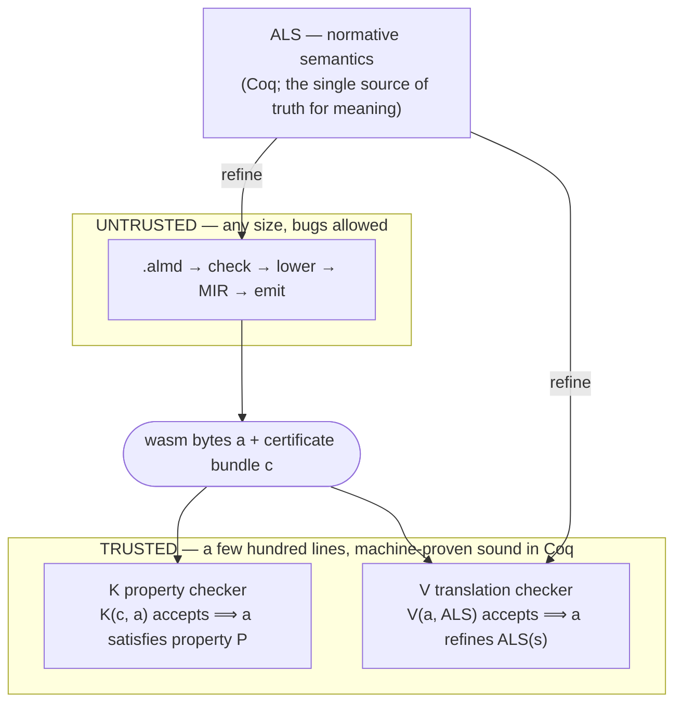

# v1: The Trust Spine — Proof-Carrying Compilation

> In active development on the `develop` branch (the **v1** line). This is a ground-up redesign of the compiler's *trust model*, not a feature on top of v0.

The [Perceus proof](../crates/almide-perceus-belt/) proves one compiler pass, once. v1 generalizes that principle to the **whole pipeline** — but instead of proving every pass, it proves a tiny *checker* and makes the compiler re-verify itself on every build.

The v0 compiler takes the shortest path: `AST → IR → codegen`. It's fast, and it's correct *as far as the tests can tell*. v1 asks a harder question: **not "do the tests pass?" but "can a machine prove the output is correct?"**

## The idea

You don't make a compiler trustworthy by making it perfect — a correct 100k-line compiler is a proof obligation no one can discharge. Instead:

> **Don't prove the compiler. Prove a tiny checker — and have the compiler emit a certificate on every build that the checker re-verifies.**

This rests on an asymmetry the whole field stands on: **building is hard, checking is cheap.** Solving a sudoku is work; verifying a solved one is a glance. So the compiler is *allowed* to have bugs — if it emits a wrong artifact, the attached certificate won't check out and the checker rejects it. The only thing that must be proven correct is the checker, and the only theorem is:

> *If the checker accepts, the artifact has the property* — and this theorem never mentions the compiler's internals.

That single move collapses the **trusted base from ~100,000 lines to a few hundred.** The big compiler becomes *untrusted* — free to be as large and buggy as it likes, because nothing trusts it.

## The pipeline (proof-carrying code)

- **K (property checker)** verifies the certificate: memory safety, name totality, capability upper bound, stack balance, termination behavior.
- **V (translation checker)** verifies — *on every build* — that the emitted wasm actually refines the language semantics. This is the answer to the reviewer's killer question: *"You proved a model — but does the thing that actually runs match it?"*
- **ALS** (Almide Language Specification) is the normative semantics, in Coq. The compiler and both backends don't define meaning; they *refine* ALS. So byte-for-byte agreement between targets isn't an afterthought — it falls out of the design.

The **trusted base is a single Coq kernel** (plus CompCert/CertiCoq, the hardware, and the assumption that ALS says what we intend). Everything else is either proven against it or untrusted. There is no third category.

## Receipts — verify it yourself

Each build folds its certificates into claims, each with a published refutation procedure:

| Receipt | Claim |
|---|---|
| **C-SAFE** | Capability-bounded, no undefined behavior — checkable from the artifact alone |
| **C-REPRO** | Same source → byte-identical output on any host |
| **C-FAITHFUL** | Observable behavior refines the language semantics |
| **C-PROVEN** | Kernel-checked universal properties (RC balance, stack balance, …) |

Run `make verify` and you re-derive every claim **on your own machine.** CI is a courtesy pre-run, deliberately *outside* the trusted base — you never have to trust our infrastructure to trust the artifact.

## Why it's slower — on purpose

v0 is fast because it stops at "the tests pass." v1 is slower because every unit of work runs the full verification gauntlet: the property checker (the *corpus-wall*) re-verifies ownership / name / capability certificates for every function; an output-parity gate byte-compares against v0 as an oracle; and where needed `coqc` plus an independent `coqchk` kernel re-check confirm the proofs introduce no stray axioms (`Print Assumptions ⊆ standard`). A single change can trigger minutes of checking.

That cost isn't inefficiency. It's the price of replacing **"it should be correct" (trust the tests) with "a machine has verified that it is" (trust the proof).** v0 is quick but hopeful; v1 is slow but ships only what the checker has accepted.

## Where it stands

The architecture is proven on a language subset, and the current work is taking it end-to-end over real `.almd` programs, on the road to byte-reproducibility and qualification-grade hardening. See [`roadmap/active/v1-proof-architecture.md`](./roadmap/active/v1-proof-architecture.md) and [`v1-system-map.md`](./roadmap/active/v1-system-map.md).
