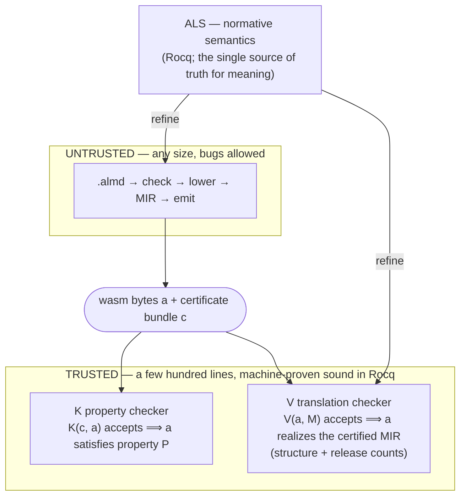

# v1: The Trust Spine — Proof-Carrying Compilation

> **Shipped.** v1 is the default and — since the v0 wasm emitter was retired (#782, 2026-07-20) — the *only* wasm compilation path. This was a ground-up redesign of the compiler's *trust model*, not a feature on top of v0.

The [Perceus proof](../crates/almide-perceus-belt/) proves one compiler pass, once. v1 generalizes that principle to the **whole pipeline** — but instead of proving every pass, it proves a tiny *checker* and makes the compiler re-verify itself on every build.

The retired v0 compiler took the shortest path: `AST → IR → codegen`. It was fast, and correct *as far as the tests could tell*. v1 asks a harder question: **not "do the tests pass?" but "can a machine prove the output is correct?"**

## The idea

You don't make a compiler trustworthy by making it perfect — a correct 100k-line compiler is a proof obligation no one can discharge. Instead:

> **Don't prove the compiler. Prove a tiny checker — and have the compiler emit a certificate on every build that the checker re-verifies.**

This rests on an asymmetry the whole field stands on: **building is hard, checking is cheap.** Solving a sudoku is work; verifying a solved one is a glance. So the compiler is *allowed* to have bugs — if it emits a wrong artifact, the attached certificate won't check out and the checker rejects it. The only thing that must be proven correct is the checker, and the only theorem is:

> *If the checker accepts, the artifact has the property* — and this theorem never mentions the compiler's internals.

That single move collapses the **trusted base from ~100,000 lines to the extracted checker** — ~1,400 lines of OCaml, machine-derived from the proofs (the exact, regenerated number is below). The big compiler becomes *untrusted* — free to be as large and buggy as it likes, because nothing trusts it.

## The pipeline (proof-carrying code)

```mermaid
flowchart TB
    ALS["ALS — normative semantics<br/>(Rocq; the single source of truth for meaning)"]

    subgraph U["UNTRUSTED — any size, bugs allowed"]
        P[".almd → check → lower → MIR → emit"]
    end

    A(["wasm bytes a + certificate bundle c"])

    subgraph T["TRUSTED — a few hundred lines, machine-proven sound in Rocq"]
        K["K property checker<br/>K(c, a) accepts ⟹ a satisfies property P"]
        V["V translation checker<br/>V(a, M) accepts ⟹ a realizes the certified MIR<br/>(structure + release counts)"]
    end

    ALS -->|refine| P
    P --> A
    A --> K
    A --> V
    ALS -->|refine| V
```

- **K (property checker)** — the extracted, kernel-proven checker — re-verifies the certificate on every build: memory safety (RC balance), name totality, and the capability upper bound. (Stack balance and termination are *proven in the Rocq spine* but not yet extracted into K or witnessed per build — [`Extract.v`](../proofs/Extract.v) is the extraction boundary.)
- **V (translation checker)** checks — *on every build* — that the emitted wasm **realizes** the certified MIR: every op's required instruction pattern is present in the emitted module, and the release count matches the certificate's drops (leak-freedom — an under-freeing renderer fails; see `translation_validation.rs`'s own contract). It is a structural realization check, **not** a semantic refinement proof: the answer to *"does the running thing match the model?"* is V's structure check **plus** the differential evidence below.
- **ALS** (Almide Language Specification) names the normative semantics. What exists in Rocq today is the RC-discipline model ([`proofs/ALS.v`](../proofs/ALS.v)) — there is no mechanized evaluation relation for Almide source yet, and no theorem of the shape `⟦s⟧ ≈ ⟦compile(s)⟧`. **Byte-for-byte agreement between targets is established empirically**, and heavily: the [contract ledger](contracts/README.md)'s cross-target fixture gate, `proofs/output-parity.sh`, the nightly differential fuzz, and the 3-way `almide-interp` oracle. The design *aims* the pipeline at a single semantics; the agreement itself is measured, not derived.

The **trusted base is the Rocq kernel plus the extracted checker** (~1,400 lines of OCaml derived from the proofs — the exact number is in the block below), plus the hardware and the assumption that the spec says what we intend. Verified extraction (CertiRocq) is a *future ratchet*, not a present fact — see [`proofs/TRUSTED_BASE.md`](../proofs/TRUSTED_BASE.md) for the full ledger. Everything else is either proven against the kernel or untrusted. The stage-by-stage boundary — which rows are proven, which are trusted, and what every gate does and does not claim — is **[proven-vs-trusted.md](contracts/proven-vs-trusted.md)**.

<!-- tcb:generated:start — derived by scripts/gen-claims.sh; DO NOT EDIT between the markers -->
> **Measured, regenerated:** extracted checker `proofs/checker.ml` = **1348 lines** (+ 331
> `.mli`); Rocq spine = **188 theorems+lemmas** (axiom-clean, asserted by `proofs/check.sh`);
> Lean Perceus belt = **41 theorems**, 0 sorry (CI-gated).
<!-- tcb:generated:end -->

## Receipts — verify it yourself

Each build folds its certificates into claims, each with a published refutation procedure:

| Receipt | Claim |
|---|---|
| **C-SAFE** | Capability-bounded, no undefined behavior — checkable from the artifact alone |
| **C-REPRO** | Same source → byte-identical output on any host |
| **C-FAITHFUL** | Observable behavior refines the language semantics |
| **C-PROVEN** | Kernel-checked universal properties (RC balance, stack balance, …) |

Run `make verify-trust` **on your own machine** and you re-derive the proof spine (kernel + `coqchk` + the asserted axiom audit), the PCC gate (the extracted checker re-verifying real witnesses), and the corpus wall. The remaining receipts (cross-target parity, the differential fuzz, the contract gate) have their own commands, listed per claim in [`proofs/TRUSTED_BASE.md`](../proofs/TRUSTED_BASE.md). CI is a courtesy pre-run, deliberately *outside* the trusted base — you never have to trust our infrastructure to trust the artifact.

## Why it's slower — on purpose

v0 was fast because it stopped at "the tests pass." v1 is slower because every unit of work runs the full verification gauntlet: the property checker (the *corpus-wall*) re-verifies ownership / name / capability certificates for every function; the 3-way oracle (native / wasm / `almide-interp`) and the `spec/wasm_cross` fixture gate hold observable behavior byte-identical across targets; and where needed the Rocq kernel plus an independent `coqchk` re-check confirm the proofs introduce no stray axioms (`Print Assumptions ⊆ standard`). A single change can trigger minutes of checking.

That cost isn't inefficiency. It's the price of replacing **"it should be correct" (trust the tests) with "a machine has verified that it is" (trust the proof).** v0 was quick but hopeful; v1 ships only what the checker has accepted.

## Where it stands

Shipped end-to-end. v1 carried the full byte-gate corpus before v0 was deleted (57.5k lines of unverified emitter removed in #782), walls are honest hard errors, and the verified output now *outperforms* the rustc-compiled Rust backend on the benchmark suite while being several times smaller — see [project/BENCHMARKS.md](project/BENCHMARKS.md) and [wasm/WASM-OUTPUT.md](wasm/WASM-OUTPUT.md). Remaining hardening work is tracked in [`roadmap/active/v1-proof-architecture.md`](./roadmap/active/v1-proof-architecture.md) and [`v1-system-map.md`](./roadmap/active/v1-system-map.md).
