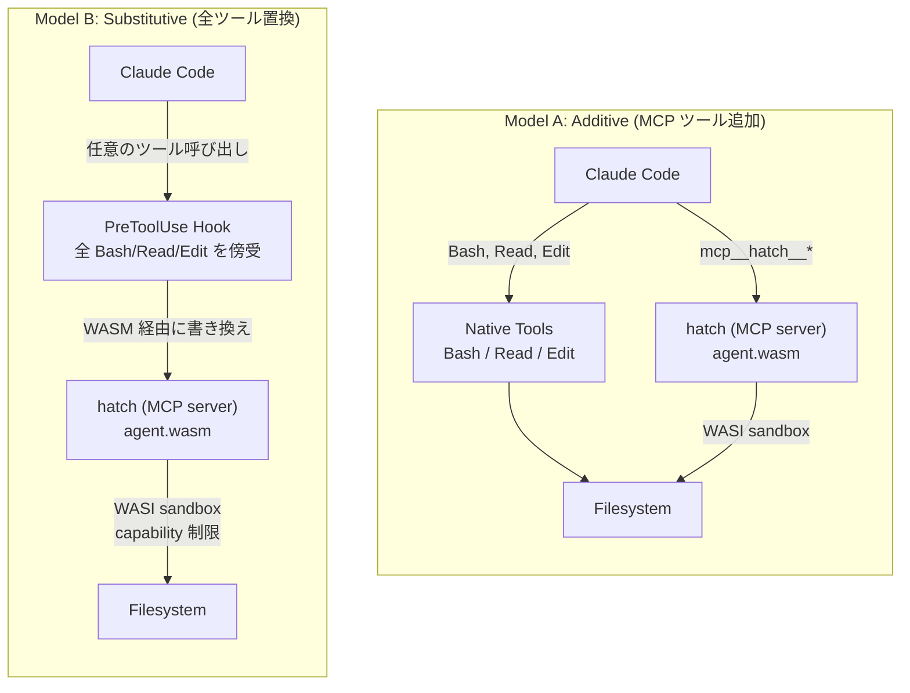
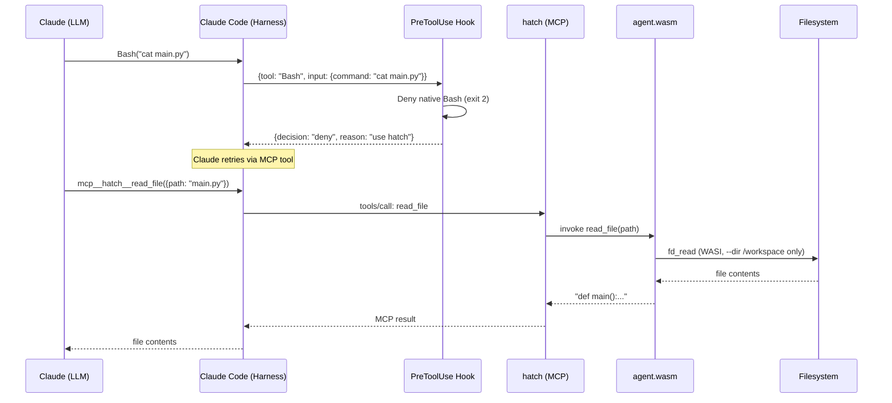
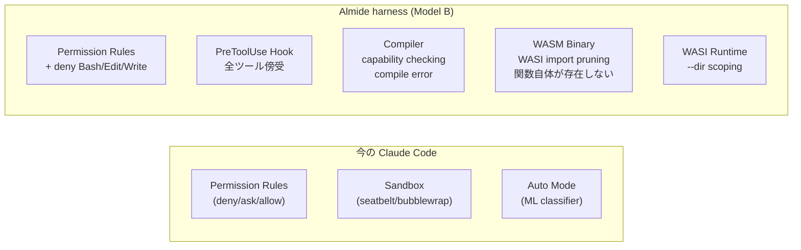
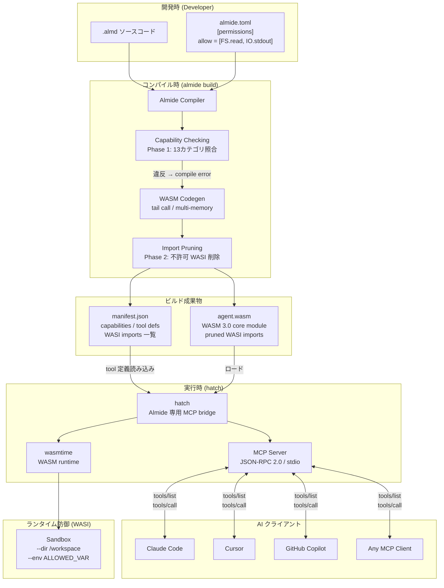
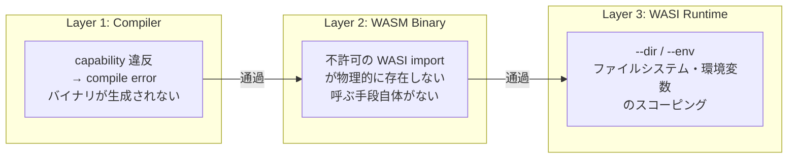
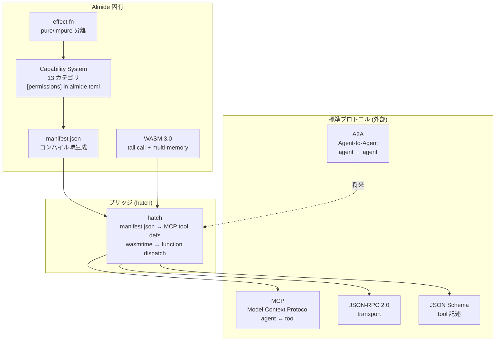
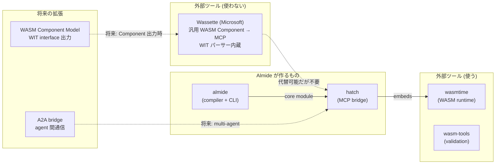
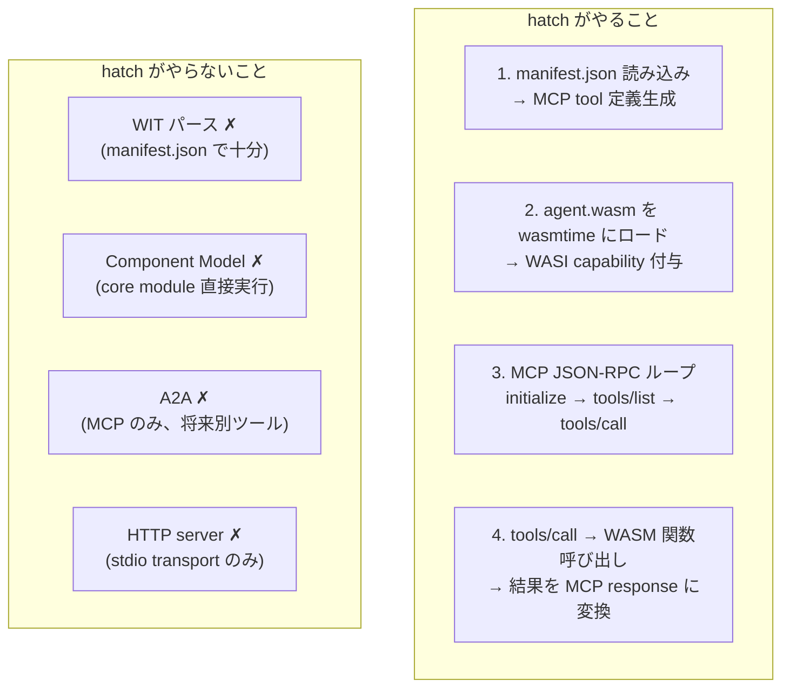

# Almide Agent Container Architecture

## Claude Code ハーネス統合

### 2つのモデル



**Model A** — hatch を MCP server として追加。Claude は native ツール (Bash/Read/Edit) も使えるし、hatch 経由の sandboxed ツールも使える。開発者向け。既存のワークフローを壊さない。

**Model B** — Claude の全ツール呼び出しを hatch 経由に強制。PreToolUse hook で Bash/Read/Edit を傍受し、hatch の WASM agent にルーティング。Claude は直接ファイルシステムに触れない。本番環境/医療/金融向け。

### Model B: 完全ハーネス詳細



### 設定例

```json
// .claude/settings.json — Model B: 全ツール hatch 経由
{
  "permissions": {
    "deny": ["Bash", "Edit", "Write"],
    "allow": ["Read", "Glob", "Grep", "mcp__hatch__*"]
  },
  "hooks": {
    "PreToolUse": [{
      "matcher": "Bash|Edit|Write",
      "hooks": [{
        "type": "command",
        "command": "echo '{\"decision\":\"deny\",\"reason\":\"Use hatch MCP tools instead\"}'"
      }]
    }]
  }
}
```

```json
// .claude/.mcp.json — hatch を MCP server として登録
{
  "mcpServers": {
    "hatch": {
      "type": "stdio",
      "command": "hatch",
      "args": ["serve", "agent.wasm", "--dir", "/workspace"]
    }
  }
}
```

### 防御レイヤーの比較



| レイヤー | 今の Claude Code | + Almide harness |
|---|---|---|
| 宣言的ルール | permission deny/ask/allow | 同じ + deny native tools |
| 手続き的制御 | PreToolUse hooks | hook → hatch ルーティング |
| コンパイル時証明 | **なし** | **capability checking** |
| バイナリレベル | **なし** | **WASI import pruning** |
| OS sandbox | seatbelt/bubblewrap | WASI capability sandbox |
| ML 分類 | Auto mode classifier | 不要（静的に証明済み） |

**Almide harness が追加するのは「コンパイル時証明」と「バイナリレベル制限」の2層。** これは Claude Code 単体では不可能。

### なぜ Model B が重要か

Claude Code の既存防御は全て**ランタイム**。hook も permission rule も ML classifier も「実行時に判断する」。判断を間違えれば素通りする。

Almide harness は **ビルド時に証明** する。agent.wasm が `FS.write` の capability を持っていなければ:
1. コンパイルが通らない（Layer 1）
2. WASM binary に `path_open(write)` import が存在しない（Layer 2）
3. 実行時に書き込み関数を呼ぶ手段自体がない

**ランタイム判断のミスを補完する静的証明。** これが Almide の価値。

## 概念マッピング



## 三層防御



## プロトコルスタック



## 既存エコシステムとの関係



## hatch の責務


