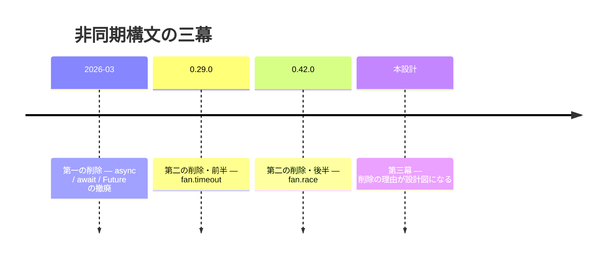
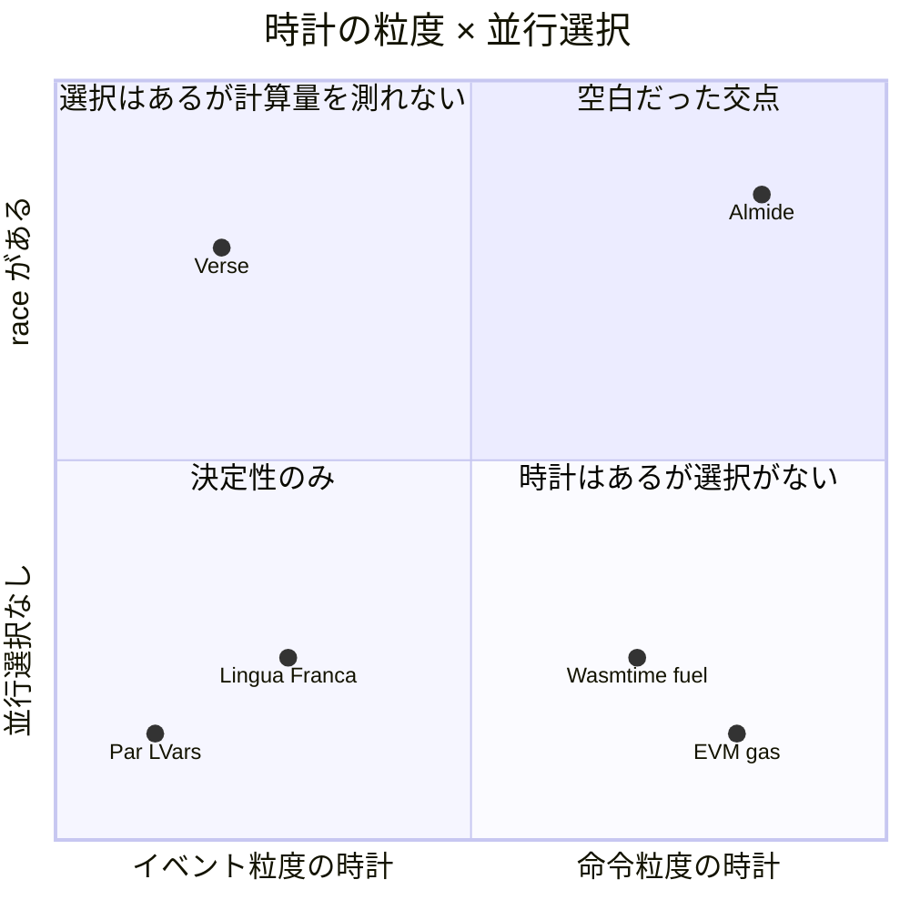
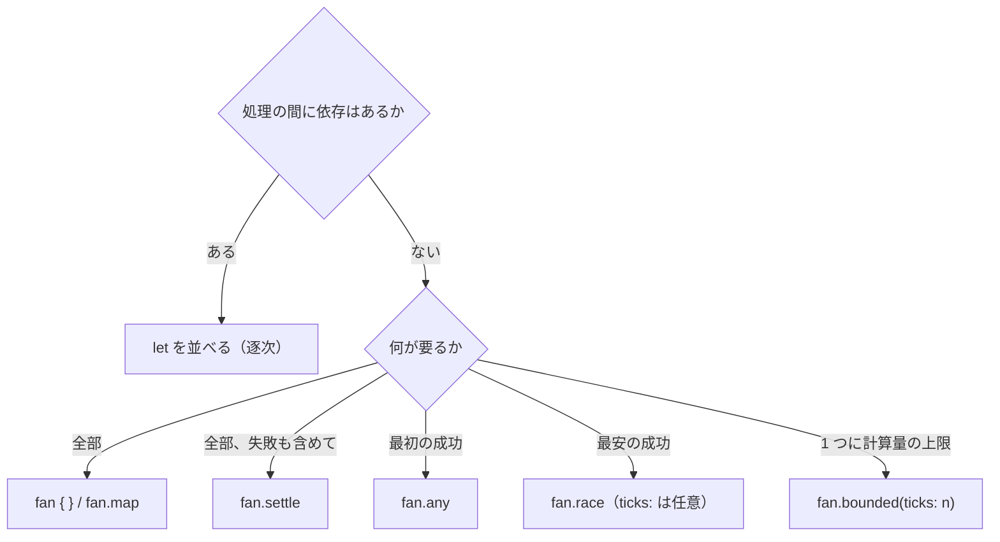
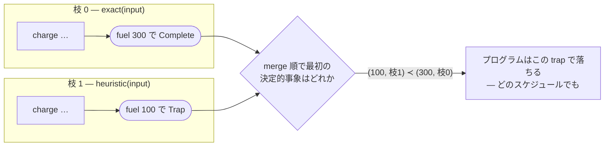
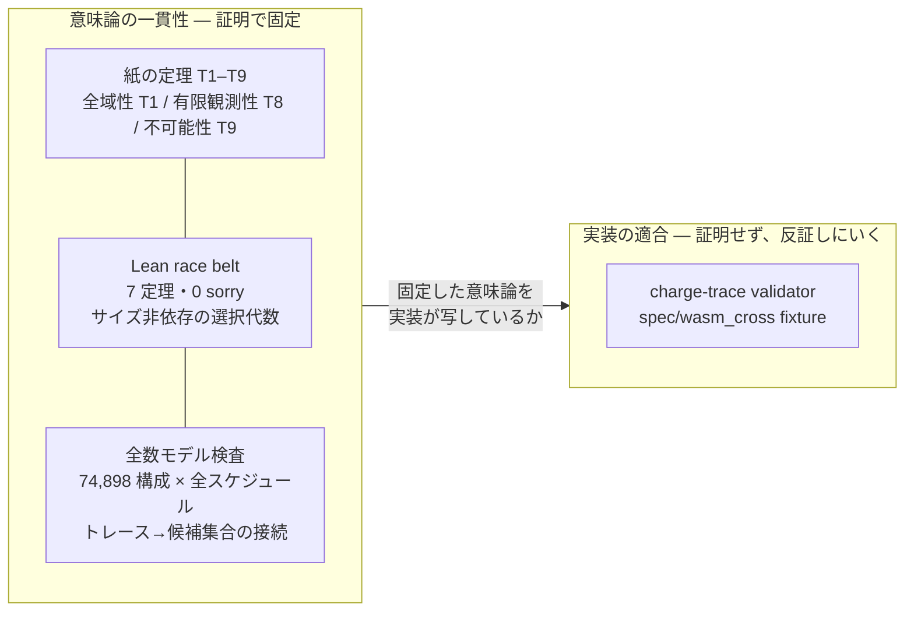
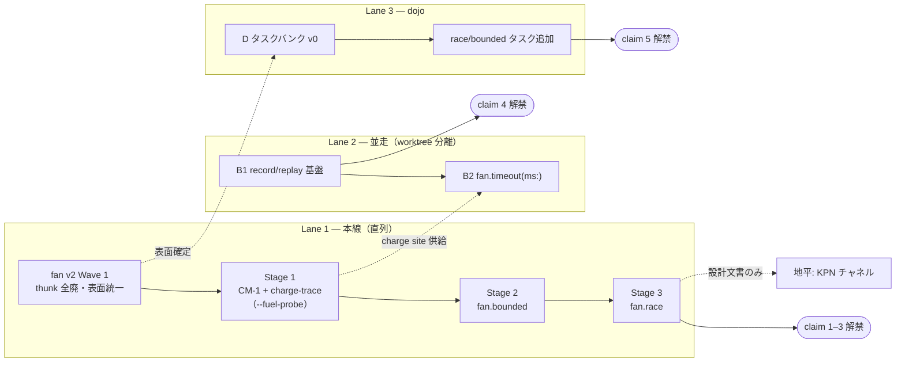

<!-- description: The async inception: thesis, grammar, semantics, proofs, claim and plan in one charter -->
# Async Inception — logical time as the language's time base

> 非同期設計の憲章。この一枚で全体が読める。深掘りは末尾の文書地図から。

## 0. 一文

**壁時計は観測を決めない。言語の時間基底は論理時間（fuel）であり、環境の時間は宣言された入力としてのみ入る。**

ここへたどり着くまでに、Almide は非同期の構文を二度削除している。足し算ではなく引き算でできた歴史であり、三度目にあたる本設計は、二度の削除が何を診断していたのかという問いへの答えでもある。

## 1. 物語 — 二度削除した言語だけが、三度目に正しく作れる

かつて SPEC.md には、同じ機能について正反対の約束が並んでいた。§13.1 は「native でも wasm でも結果は同一」と言い、§13.2 は「最速の枝が勝つ」と言う。どちらも、単体ではもっともらしい。だが前者はタイミングからの独立を要求し、後者はタイミングそのものを結果にする。同じ文書の 2 つの節が、両立しない約束を売っていた。

どちらを捨てるか。迷う余地は、実はなかった。native ⇄ wasm の観測等価は契約台帳の存在理由そのものであり、そこに積まれた契約はすべてこの等価性の上に立つ。捨てられるのは「速い方が勝つ」の側だけである（#1000、決定的データ並列の stance）。

削除は一度では済まなかった。

**第一の削除（2026-03）** — `async` / `await` / `Future`。他言語なら標準装備のこの三点を、Almide は自分の文法にしないと決めた。`effect fn` が非同期境界になり、待つことは書くものではなくコンパイラが挿すものになった。以来、**Almide のソースに async や await が現れることはない** — 書こうにも、lexer にそのトークンが存在しない。忘れる・重ねる・置き場所を誤るという誤りのクラスは、直すものではなく、構文ごと存在しなくなった。この先の本文で async の語が指すのは分野としての非同期であって、Almide の構文ではない。

**第二の削除（0.29.0 / 0.42.0）** — `fan.timeout` と `fan.race`。壁時計のタイムアウトは「プログラムと入力の関数」になっていない唯一の表面だった。race は、決定的モデルの下で意味を与えられない名前だった。撤去時のヒントには「期限はホスト境界で」と書いた。つまり、言語には戻さないつもりだった。

この時点で非同期の表面に残ったのは `fan {}` / `fan.map` / `fan.any` / `fan.settle` — タイミングに依存しない四つだけである。



**第三幕（本設計）** — 戻さないつもりだった削除が、復活の設計図だったと後から分かる。race が死んだ理由を言い直すと、「速い方が勝つ」という発想が悪かったのではない。速さを比較する量が、言語のどこにもなかったのだ。物理時間は native と wasm で違う値を返す。ならば race に必要なのは撤回ではなく、両ターゲットで同じ値を取る「速さ」の定義である。

何を測れば、「速い方が勝つ」は逐次評価と厳密に同じ観測を持てるのか。

## 2. 鍵 — 時計を fuel に取り替える

「速い方が勝つ」を捨てたとき、本当に捨てたものは競争ではない。壁時計である。race という形は何も悪くなかった。悪かったのは、勝敗を測る時計が host の速度の関数だったことだ。だとすれば、問いは一つに絞られる。プログラム自身が決める量で、時間の代わりが務まるものはあるか。

ある。しかも産業界がすでに両側へ名前を付けている。Wasmtime は中断機構を二つ文書化していて、**fuel** は同じプログラム・同じ初期状態・同じ量なら同じ地点で止まり、**epoch** は壁時計由来で、止まる地点を保証しない。EVM の **gas** は同じ主張を合意形成のスケールで実証済みだ。全ノードが同じ状態遷移に同じコスト表を適用し、同じ out-of-gas 判定へ到達しなければ、チェーンが割れる。上限が決定的であることは、あれば嬉しい性質ではなく、正しさの議論そのものである。

では、この fuel を時計にして race を走らせた言語はどこにあるか。系譜を並べると、妙な空白が浮かぶ。

Verse には race がある。敗者は取り消され、同時に完了すればソース上で先に書かれた式が勝つ。理想にいちばん近い。ただし Verse の論理時間は event 粒度で、suspension を含まない式は同一 tick 内で完了する。すると純粋計算どうしの race は常に同着になり、常にソース順の先頭へ潰れるはずだ（ドキュメントからの推論であり、実機未検証）。「どちらの計算が安いか」を測る分解能が、時計の側にない。EVM はその分解能を持つのに、並行構文そのものを持たない。Lingua Franca と Esterel は論理時間の扱いが最も端正だが、時計はイベント由来で、計算量が乗らない。Haskell の Par や LVars は操作を制限して決定性を買う — fuel も、選択も、キャンセルも扱わずに。



部品はすべて、どこかで実証済みである。組み合わせだけが、どこにもない。

ならば fuel を fan に配れば終わりか。この設計の最初の草稿は、そう主張した。誤りだった — 訂正は消さずに残してある。予算 1000 を枝 A と B で共有すると、A を 900 進めてから B に切り替えるスケジュールと、B を先に走らせるスケジュールとで、どちらが枯れるかが変わる。同じ総量、同じプログラム、違う結末。決めているのは、またしてもスケジューラだ。fuel は必要条件であって、十分条件ではない。

足りないものの一つめは、予算を共有しないことで埋まる。各枝が自分の n を持てば、枝の運命 — 何歩で完了するか、どこで trap するか、n で枯れるか — はその枝のトレースだけの関数になり、隣に誰がいても変わらない。二つめは勝者の決め方で、全枝の事象を（累積 fuel, ソース位置）の辞書式で一列に並べてしまえば、物理時間の入り込む隙間が消える。ただし、この一列には裁くべきものが残っている。同着なら誰が勝つのか。敗者が途中で trap したら何が起こるのか。予算が入れ子になったら、内側の消費は誰の勘定か。そこまで答えて初めて、この並びは時計の名に値する。

そして、予算の配り方・勝者の決め方・敗者の見え方という三点を決められる場所は、言語の中に一箇所しかない。fan はライブラリ関数ではなく、コンパイラ既知の構文である。だからコンパイラがこの三点を所有できる。並行性がライブラリである言語では、同じ決定がユーザーコードとスケジューラに散らばり、誰も保証を出せない。fuel は部品にすぎない。fan が構文であることが、部品を言語の性質に変える。

## 3. 文法 — 書く側から見た fan v2

fuel が手に入った今、設計の到達点は 1 行で示せる。

```almide
let plan = fan.bounded(ticks: 100_000) { optimal_plan(g) } ?? greedy_plan(g)
```

10 万 tick 以内に厳密解が出ればそれを使い、出なければ貪欲解に落ちる。計算量の上限とフォールバックが、新しいキーワードなしに 1 行へ畳まれた。race も同じ調子で書ける。

```almide
let ans = fan.race {
  exact_solve(input)
  heuristic_solve(input)
} ?? default_answer
```

2 本の枝を走らせ、より少ない tick で成功した方を採る。予算は書いていない — race の
選択は予算を要さず、`ticks: n` は発散が心配な枝構成に付ける任意のガードである
（数字の出どころ問題ごと精査した記録は [ticks-interface-audit.md](./ticks-interface-audit.md)）。
await はどこにもない。Future も task handle もない。書くのは「何を並べるか」と
「どう選ぶか」だけである。

その「どう選ぶか」= head、「どう並べるか」= form の直積 1 枚が、fan v2 の表面のすべてになる。

| head | 選択規則 | block form（静的 arm） | mapper form（動的） | arm 効果上限 |
|---|---|---|---|---|
| （無印）all | 全部。リスト順先頭 Err | `fan { a; b }` → `(A, B)` | `fan.map(xs, f)` → `List[B]` | effect 可 |
| settle | 全収集 | `fan.settle { a; b }` → `(Result[A], Result[B])` | `fan.settle(xs, f)` → `List[Result[B]]` | effect 可 |
| any | index 最小の成功（逐次フォールバック） | `fan.any { a; b }` → `T` | `fan.any(xs, f)` → `T` | effect 可 |
| race | (spend, index) 最小の成功 | `fan.race { a; b }` → `T`（`ticks:` は任意ガード） | `fan.race(xs, f)` → `T` | **pure**（Rung 0） |
| bounded | 単一 body の計量 | `fan.bounded(ticks: n) { body }` → `T` | —（map と合成） | **pure** |
| timeout | 環境が切る | `fan.timeout(ms: n) { body }` → `T` | — | oracle 可（Stage 4） |

六つの head を並べると、軸は一本しかない。any は index を最小化し、race は fuel を最小化する。all と settle は選択しない。「何を最小化するか」だけが head の違いであり、head を足すときはこの表に行を足して全列を埋めることが受理条件になる（matrix gate）。

v1 の fan.any は、こう書かせていた。

```almide
fan.any([() => http_fetch(a), () => http_fetch(b)])
fan.any(mirrors |> list.map((m) => () => fetch(m)))
```

thunk（`() =>`）で包むのは、fan.any が関数であり引数が先行評価されてしまうからだった。v2 では全 head が構文なので、評価のタイミングはコンパイラが握る。包む理由が消える。

```almide
fan.any { http_fetch(a); http_fetch(b) }
fan.any(mirrors, (m) => fetch(m))
```

動的な場合も「thunk リストを組み立ててから渡す」2 段が「リスト + mapper」の 1 段になり、コードは厳密に短くなる。おまけも付く。動的 thunk リストは wasm 側で `List[funcref]` が表現できず wall に落ちていたが、mapper form は fan.map と同じ「データ + 閉包 1 個」の形なので、この wall クラスは構文の変更だけで消滅する。契約も form 単位に揃う — block の arm は `fan {}` と同じ auto-unwrap、mapper は `fan.map` と同じ Result 必須。head ごとの auto-wrap 例外はゼロになる。

`ticks:` のラベルは飾りではない。`timeout(1000)` の 1000 をミリ秒と読まない人間はいない — それが 0.29.0 で fan.timeout を撤去した教訓の半分だった。ラベルを必須にすれば全呼び出しサイトに単位名が現れ、誤読は構文レベルで死ぬ。名前そのものも単位名から採った — tick は lockstep 意味論の単位であり（1 tick に 1 消費、同着はソース順）、`fan.race(ticks: n)` は「最大 n tick 走る」という仕様文の直写しになる。環境時間の `ms:` と対をなす。初案の `fuel:` は機構のメタファーが表面へ漏れるため却下し、fuel の語は機構側（内部カウンタ、`--fuel-probe`、Wasmtime の系譜）に限定する。ならば言語にラベル引数機構を足したのか、と思うだろう。足していない。fan の head は関数呼び出しではなく構文なので、`ticks:` と `ms:` は fan 文法自身の要素として供給される。汎用ラベル引数という言語全体の問いを、fan 経由で密輸しない。

何を入れないかも、この文法の一部である。

| 候補 | 判定 | 理由 |
|---|---|---|
| `fan.rush`（最速を返し敗者は走り続ける） | **恒久却下** | 採用後も敗者の効果が漏れ続け、決定的モデルで意味を与えられない |
| `fan.spawn` / `fan.link` | 地平送り | 決定的チャネルの土台（論理時計）が先 |
| trailing lambda / `fan.all` 別名 | 導入しない | 同じ意味の 2 綴りは共存負債 |
| `fan.map(xs, limit: n, f)` | 入れない | 実装されていなかった（status 表が stale）。必要が実証されてから |

書く側の決定木は 2 問で閉じる。



形はもう 1 問で決まる — 枝を静的に並べるなら block、データから量産するなら mapper。await の置き場所を誤るというクラスの間違いは、選択肢ごと存在しない。lexer に async / await のトークンはなく、AST に残った死んだ variant（`ExprKind::Await`、`r#async` フィールド）も Wave 1 で撤去される。「文法から書けない」は「表現できない」へ格上げされる。

ただし、冒頭の 1 行にはまだ答えていない問いが埋まっている。`optimal_plan(g)` が途中でゼロ除算を踏んだら、どうなるのか。race の枝の途中で 10 万 tick が尽きたら、「途中」とはどの時点のことなのか。表のどの列にもその答えはない。文法は時計を持たないからだ。答えるには、何 tick 目に何が起きたかを言い切れる装置 — 文法の一段下で回っている論理時計 — が要る。

## 4. 意味論 — 五本の柱

`fan.race(ticks: 1000) { exact(input); heuristic(input) }` と書いたとする。heuristic が途中でゼロ除算を踏んだら、プログラムは落ちるのか。exact の予算が尽きたら、それを誰がどう知るのか。文法の表はこの問いに答えない。答えは五本の柱でできた意味論の側にある。

### 柱 1 — 論理時計：fuel は機械のコストではなく、ソースのコストを数える

fuel と聞けば、実行された機械命令の数を思い浮かべるだろう。自然な定義に見える。だがその定義だと、最適化レベルを変えただけで exhaust するプログラムが変わる。「`-O` を付けたらテストが落ちる」——排除したかった非決定性が、時計の定義から逆流してくる。

だから charge は最適化**前**の MIR に付与し、以後の全パスがその注釈を保存する。renderer の peephole が op を融合しても charge は合算されて残る。この一手で「`-O` 不変」は検査項目ではなく構成的に成立し、RC・MakeUnique・move は自動的に無料になる——それらはソース意味論のコストではなく、実装の都合だからだ。EVM の gas が JIT の速さと無関係に定義されるのと同型である。

コスト表は `CM-1` という versioned な意味論的オブジェクトとして契約台帳に載る。定数をひとつ変えれば、どの枝が勝つかが変わりうる。だから定数変更は semantic change である。実装に課される条件は二つだけ——W1: すべてのサイクルと再帰は charge site を最低ひとつ通る。W2: site 間の仕事は有限。この二つが、あとで見る「予算内の実行は必ず有限時間で答えに着く」の土台になる。

もうひとつ、地味だが後で効く決定がある。**charge site は言語の唯一の中断点**である。fuel 系の構文はそこでカウンタを読み、oracle 系の構文は同じ場所で環境を読む。中断点の位置そのものは、どちらの層でも共有される。

### 柱 2 — 決定的事象規則：勝敗も死も、merge 順が決める

冒頭の問いに戻る。各枝は決定的な charge トレースであり、終端（Complete か Trap）は事象 `(累積 fuel, 枝 index)` になる。規則はひとつしかない。

> Complete / Trap の終端事象を merge 順（(累積 fuel, 枝 index) の辞書式）に並べ、**最初の決定的事象が唯一の裁定者**である。Complete ならその枝が勝者、Trap ならプログラムがその trap で落ちる、決定的事象が存在しなければ `Err(exhausted)`。

exact（枝 0）が fuel 300 で完了し、heuristic（枝 1）が fuel 100 でゼロ除算を踏むとしよう。物理的にどちらのスレッドが先に走るかは、わからないし、どうでもいい。



trap のほうが論理時間で先にあるから、プログラムは落ちる。逆の配置——heuristic が 100 で完了し、exact が 300 で trap する——なら、決定的事象は (100, 枝 1) の完了であり、枝 0 の trap は**起こらなかったことになる**。投機の失敗は静かに消え、勝敗が着く前のバグは必ず殺す。境界のどちら側かを決めるのは、壁時計ではなく merge 順である。予算が尽きた場合の答えもこの規則の中にある。決定的事象が現れなければ結果は `Err(exhausted)`——例外ではなく、`??` で受けられるただの値だ。

この規則にはもうひとつの顔がある。「全枝が 1 tick に 1 fuel 進み、同時ならソース順」という lockstep の絵を描くと、その最初の完了は (spend, index) の辞書式最小と正確に一致する。絵は Verse と同じ UX を与え、式はスケジューラを定義から消す。同じものの二つの読み方である。

### 柱 3 — 敗者の非観測性：キャンセルは意味論ではなく最適化

素朴な設計は、予算をひとつのカウンタで枝が共有する形を選ぶ。どの枝が先にカウンタを減らすかはスケジューラが決める。つまり誰が exhaust するかをスケジューラが決めてしまう——fuel を入れさえすれば決定的になる、という初期の見立てが自己訂正で潰された罠がこれだ。予算を per-branch にすると、この依存が根元から消える。ついでにもうひとつ消える。枝を 1 本足しても、既存の枝の意味が変わらない。LLM が 3 本目の候補を書き足した瞬間に 1 本目が exhaust し始める、という編集の壊れ方が構造的に起きない。

観測できるのは三つだけである。採用された値、trap の可視窓、そして入れ子のときの消費量。それ以外——native がいつ敗者スレッドを止めたか、fuel 検査が何ステップ遅延したか——は観測に写らない。枝刈りには十分条件があり、記録済み候補 d に対して枝 k は `d.time − (k > d.idx ? 1 : 0)` まで走れば足りる。この cap が決定的事象とその可視窓を絶対に隠せないことは、あとで述べる機械証明の対象そのものである。

### 柱 4 — 入れ子：予算は streaming で流れ落ちる

`fan.bounded` の中に race を置いたら、内側は外側の予算をどう食うのか。実効予算は `min(自身の fuel, 外側の残量)`——EIP-150 がサブコールの gas に課すのと同じ構図で、region タグも伝播機構も要らず、すべてが算術に落ちる。

race が外側に見せる消費は **occurred stream**——決定的事象に merge 順で先行する charge 列——として定義され、外側はこれを merge 順に streaming で観測する。stream の途中で外側の残量が尽きれば、その点で外側が Exhausted になり、race は放棄される。ここで外側から引かれるのは、実装が実際に費やした仕事ではなく意味論的な消費量である。RC を無料にしたのと同じ原理が、もう一度だけ働いている。

### 柱 5 — 効果の三層と、不可能性の定理

race の枝はなぜ pure でなければならないのか。負けた枝の `print` が画面に残るなら、「敗者は観測されない」は最初から嘘になるからだ。都合のいいことに、Almide の効果規律（`var` キャプチャ禁止、mut 引数検査、単一エラーチャネル）は、効果を最初から {pure | 出力 | oracle} に三分している。v1 の枝は pure（Rung 0）。出力だけの枝は、勝者の分を決着後に flush し敗者の分を捨てる transactional な段（Rung 1）として後続する。

では oracle——http や fs——を race の枝に書ける日は来るのか。来ない。これは実装の都合ではなく定理である（T9）。環境の壁時計で勝者を選ぶ構文は、「観測が (プログラム, 入力) の関数である」という決定層の定義そのものと矛盾する。I/O レースとタイムアウトが oracle 層——環境の応答列 ω を宣言された入力として扱う契約クラス——に属するのは、選好ではなく必然だ。`fan.timeout` が tombstone に留まり続けているのは、この定理の系である。

五本の柱は独立の工夫ではなく、ひとつの主張を分担して支えている——逐次でも、並列でも、枝刈りしても、fuel 検査を怠けても、観測は変わらない、と。ただし「変わらない」と設計者が信じていることと、変わらないことが示されていることは、別の話である。


## 5. 証明 — 定理が通る前に、定義が壊れた

五本の柱は、どれも断定の形で書いてある。断定は設計文書の権利だが、保証ではない。
言い切った文のどこかが矛盾していても文書は平然と読めてしまう — §13.1 と §13.2 が
正反対のことを言ったまま何ヶ月も同居できたのは、この repo 自身が払った授業料だった。

だから証明を書いた。すると最初に起きたのは、定理が通ることではなく、**定義が
書けない**ことだった。

trap の可視窓を定理にしようとすると、主語が消えるケースがある。勝者がいれば
「勝者確定 tick より前の trap は観測される」と言える。では、どの枝も完了せず trap
だけが起きたら？ 初稿の窓規則はこのケースに何も言っていなかった。修正は規則を
ひとつに畳むことだった — Complete と Trap の終端事象を merge 順に並べ、**最初の
決定的事象が唯一の裁定者**。勝者存在時の窓規則は、この単一規則の系に降格した。

二つめは消費量の式で起きた。race が外側予算に課す量を Σ min(end_j, s\*) と書いて
いたが、証明しようとすると境界でちょうど 1 ずれる。勝者より後の index の枝が時刻
s\* に踏む charge は、merge 順で勝者の完了に後行するから発生しない。ほぼ正しい式
だった。だが、ほぼ正しい式は契約台帳には書けない。occurred stream — 決定的事象に
merge 順で先行する charge 列 — の総和に置き換えた。

三つめは入れ子で起きた。race の消費を「site での原子的 charge」として外側から引く
設計は、race の**途中で**外側が尽きるケースの裁定点を持たない。原子的な引き落とし
には「途中」がないからだ。外側が occurred stream を merge 順にそのまま観測し、
尽きた点で race を放棄する streaming に直した。

三件とも、実装前に見つかった。実装後なら、それぞれがクロスターゲットの出力乖離と
して fuzz か実地で発覚し、根因を逆向きに掘り直す羽目になっていた類のバグである。

いま保証は三層で立っている。

- **Lean kernel-check** — `crates/almide-race-belt/`、7 定理・0 sorry。決定的事象の
  一意性（`decisive_unique`）、部分集合安定性（`decisive_subset`）、枝刈り cap が
  決定的事象と可視窓を隠せないこと（`cap_admits_decisive` / `cap_admits_window`）、
  合流（`decide_stable`）。CI の `lean-proofs` job が sorry の混入ごと監視する。
- **全数モデル検査** — `research/spike/logical-time-race/`。74,898 構成 × 全物理
  スケジュール（fuel 検査を遅らせて cap を走り過ぎる overrun 込み）で、参照意味論・
  逐次 scan・敵対的並列・入れ子 streaming が、勝者だけでなく消費 fuel と occurred
  stream まで一致した。`run-gate.sh` 一発で再実行できる。
- **紙の定理 T1–T9** — 全域性（T1）から、有限観測性（T8、2-safety の成立条件を
  閉じる）、そして T9: 環境の壁時計で勝者を選ぶ構文は決定層に存在できない。

Lean はサイズに依存しない選択代数を、モデルは「トレースから候補集合へ」の接続を
小スコープ全数で、紙はその外周を受け持つ。



証明しないものも決めてある。両 renderer がこの意味論を正しく写すかどうかは、設計
段階では証明できない。そこは charge-trace validator と `spec/wasm_cross` fixture が
反証しにいく領分で、proven-vs-trusted の境界に明記した。定理は意味論に矛盾がない
ことを固定し、ゲートは実装がそこから出た瞬間を捕まえる。役割は交わらない。

ただし、三層が固定したのはすべて**内側の**一貫性である。この race が Verse より、
この時計が Lingua Franca より優れているかどうかについて、7 つの定理と 74,898 構成は
一語も語らない。では、これで世界一と言えるのか。

## 6. 主張 — 言える 5 文と、負けている軸

Lean の 7 定理、74,898 構成の全数検査、T1 から T9 までの台帳。ここまで積めば、「世界最高の非同期文法」と名乗ってよさそうに思える。

名乗りたい、とは思う。だが今日は言えない。理由は二つある。ひとつは、race も bounded もまだ設計と証明の段階で、出荷済みの表面は `fan {}` から `fan.settle` までだということ。紙は競合しない。もうひとつは、実運用の軸ではっきり負けているということだ。

| 相手 | 勝っている点 | Almide の現状 |
|---|---|---|
| Erlang/OTP | 耐障害性（supervision、let-it-crash）、30 年の実運用 | 構造的リカバリなし。trap は決定的に死ぬだけ |
| Go | 実運用 async の成熟度、goroutine の使い勝手 | oracle 層が未実装で、本物の並行 I/O レースが書けない |
| Verse | transactional effects が出荷済み、Fortnite で実運用 | 効果隔離は Rung 0（pure）の設計のみ |
| Lingua Franca | 分散（federated）決定性、学術的蓄積 | 分散は視野外 |
| Temporal 等 durable execution | replay による永続実行が商用で実在 | 言語側は未着手。ただし相手は言語ではなくランタイムである |

五つの負けは、性格が揃っていない。Erlang の負けは追わないと決めた負けで、耐障害サーバはこの言語とは別の製品である。Go と Verse の負けは時間の問題に見える — oracle 層と Rung 1 がそのまま充当されるからだ。Lingua Franca の負け（分散決定性）は地平の負けで、KPN チャネルと同じ棚に置く。分散の決定的調整は論理時計の上にしか建たず、その日が来れば LF は競合ではなく借用元である。逆向きの借用は起きない — LF は多言語の調整層で、reaction の中身を所有しないから、計算を可搬に計量できない。計量は codegen の所有を要求する。Temporal の行だけ毛色が違う。相手は言語ではなくランタイムなのだから、同じ能力を言語が構造で持てば、この負けは奪い返せる。

負けの表は、同時に戦場を教えてくれる。耐障害サーバを人間のエンジニアが運用する世界では戦わない。Almide が勝負するのは、**コードの大半を LLM が書く時代の並行性** — エージェントが書いた並行コードが走るたび同じ結果を返し、壊れたら必ず再現できる、という性質が資産になる場所だ。この戦場は今日はまだ小さい。だが flaky テストに CI を焼かれているのは、もう人間だけではない。

この戦場での本当の対抗馬は、表の五人の誰でもなく「ランタイムで足りる」という論である。Temporal は replay の需要を商用で実証したが、workflow コードの決定性は規約で要求され、違反は実行時に発覚する。規約は LLM が破る。構造は破れない — この言語の存在理由と同じ論理が、ここでもそのまま武器になる。

では今日、何も名乗れないのかといえば、そうでもない。「世界最高」という語は使わない。使うのは evidence と 1:1 で対応する 5 つの文で、それぞれに解禁の条件がつく。

1. 「並行構文はどのスケジュールでも観測が変わらないことが **Lean で機械証明**されている」— 今日から可
2. 「async の意味論は **native と wasm で観測等価**、契約台帳が常時検査」— Stage 3 後
3. 「**計算コストで勝者が決まる race** を持つ言語は他にない」— Stage 3 後（反例が出たら取り下げると添える）
4. 「async のバグは record/replay で**必ず再現できる**」— B1 後
5. 「LLM が最も正確に async を書ける言語である」— dojo 実測後のみ

今日すでに真なのは 1 番だけである。残る 4 文は、解禁条件がそのまま作業の名前になっている — Stage 3、B1、dojo 実測。そして 5 文が揃った状態は、「世界最高」の一語より強い。語は審査できないが、文は一つずつ反証できる。

五つの文は、戦場の中でそれぞれ持ち場が違う。1〜3 は「検証可能」の武器（証明・観測等価・決定的 race）、4 は「再現可能」の武器、5 はスコアボードそのものである。勝算も均一ではない — 1 は勝ち済み、2 はリスクが Stage 1 の一点に特定済み、3 は誰も作っていないゆえのデフォルト勝ち（ただし学術的な旗であって日常の需要は薄い）、4 が最大の勝ち筋（需要は実証済み、moat は構造的）、5 は lang-bench の先行データが追い風だが、LLM が Go/TS の async を大量に訓練されているという本物の不利を、誤りクラスの構造的消去で上回れるかの勝負になる。

負けの表を伏せてこの 5 文だけを並べれば、audit で最初に落ちるのはこちらである。残っている問いは順番だ — 奪い返せる負けから埋めるのか、時間の問題の負けから埋めるのか。

## 7. 計画 — 二レーン並列と、一本の地平

五文のうち、今日署名できるのは機械証明の一文だけである。では残り四文をどの順で解禁するか。A から E まで番号が振ってあるのだから上から順に、と読みたくなる。ところが依存を解くと、この計画は直列にならない。record/replay（B1）は決定層の完成を待つはずだ、と当初は考えていた。違った。oracle 効果以外のすべてが決定的である今日の言語には、テープを貼る場所がもう存在している。fuel を待つのは B2 だけだ。



Lane 1 は直列で、順番が仕事をしている。Wave 1 が先なのは、race を最初から v2 の形で迎えるための小工事だからだ（any/settle の block/mapper 化と thunk tombstone、移行は spec 8 ファイルで済む）。Stage 1 では region 特殊化をまだ作らない — 隠しフラグ `--fuel-probe` で全体計測ビルドを立て、三点比較 fixture（result / consumed / trace）と validator だけを先に走らせる。特殊化という重機は、表面が来る Stage 2 まで寝かせる。Stage 3 で race が枝刈り・trap 遅延判定・入れ子 streaming ごと着地し、E027 が改訂され、ここで claim 1–3 が解禁される。

Lane 2 が決定打である理由は、性能ではなく構造にある。Go は goroutine スケジューリング自体が非決定なので、rr は syscall とスケジューリングの全採録を強いられる。Temporal は決定性を規約で要求し、違反は実行時に発覚する。Almide の非決定性は registered surface — fs / http / process / random / env — の一箇所しか通らない。だから record/replay は、Almide には配線工事で、競合にはアーキテクチャ変更である。native で採録して wasm で replay する、が定義から成立し、それ自体が R_Ω 契約の実行可能形になる。

C（KPN チャネル）には着手しない。Stage 3 のあとに設計文書だけを起こす。#1000 が structured concurrency の再訪に付けた条件 — 構文ごとの契約が先 — を満たすまで、実装に触る理由がない。

## 8. 反証条件 — 殺せるものから先に走らせる

順番にはもう一つの意図が埋まっている。Stage 1 を重い作業の先頭に置いたのは、それが全体を殺せる唯一の項目だからだ。renderer の peephole が charge 事象を一つ融合し損ねれば trace は乖離し、Stage 2 以降のすべてが無効になる。だから最初に走らせる。

| 反証 | 検出面 | 起きたら |
|---|---|---|
| charge trace が lowering で保存されない | Stage 1 の三点 fixture（最有力容疑は renderer peephole） | Stage 2 以降を停止 |
| W1/W2 を満たせない charge 配置が必要になる | CM-1 実装 | T1（全域性）ごと主張を取り下げ |
| 計測オーバーヘッドが region 限定でも許容外 | Stage 2 ベンチ | charge 粒度の粗化、または AARA 前倒し |
| pure 限定 race に実ユースが薄い | Stage 3 後の利用実態 | Rung 1（出力 transactional）前倒し、それでも薄ければ race の価値再査定 |
| 命令粒度 race の先行例が見つかる | D の比較作業と同時に探索 | claim 3 を取り下げ、競合表を訂正 |
| dojo 実測で async MSR が競合に勝てない | Lane 3 | measurement wins — 文法なら fan v2 再設計、診断なら診断レーンへ |

どの行にも退却先が書いてある。反証されたときに何を捨てるかを先に決めてあるものだけが、主張として外に出る。

## 9. 文書地図

| 文書 | 役割 |
|---|---|
| async-inception.md（本文書） | 憲章 — 全体の正 |
| concurrency-stance.md | 前提の決定: 決定的データ並列（#1000） |
| deterministic-bounds.md | 問題設定と正しさの議論（4 設問） |
| logical-time-async.md | 意味論の詳細（CM-1・決定的事象・入れ子・効果梯子） |
| fan-v2.md | 表面の詳細（head × form・移行・却下表・Wave） |
| logical-time-proofs.md | 証明台帳（T1–T9・訂正記録） |
| logical-time-implementation.md | 実装方式（Op::Charge・fuel ABI・metered 特殊化・ゲート配線） |
| fan-v2-examples.md + fan-v2-examples/*.almd | リファレンス例（コード原本は .almd、挙動注記が fixture の種） |
| ticks-interface-audit.md | ticks の対外監査（時間にしない理由、race の任意化、数字の供給者） |
| async-world-claim.md | 主張の監査（競合表・五手・実行順の原本） |
| `crates/almide-race-belt/` | Lean 機械証明（0 sorry、CI 常駐） |
| `research/spike/logical-time-race/` | 全数合流ゲート（`run-gate.sh`） |

個別文書と本文書が食い違ったら本文書が正であり、食い違いそのものが修正対象のバグである。

## 10. 結び — 削除された二行のところへ

この計画が完走した先を、いちばん短く言えるのは、皮肉にも 0.42.0 で削除された SPEC.md の二行である。§13.1「どちらで実行しても結果は同一」。§13.2「速い方が勝つ」。両立しないから後者を捨てた — それがこの設計の出発点だった。完走後の Almide は、両方を同時に真にする。速い方が勝つ。ただし速さは、壁時計ではなく論理時間で測る。

もっとも、この円環にはまだ署名がない。Lean の七定理も 74,898 構成の合流も、すべて「charge trace は lowering で保存される」という一枚の床の上に立っている。その床を最初に踏み抜きにいくのが Stage 1 の fixture であり、次に動くのは証明ではなく反証器である。

