# Codegen v3: 三層アーキテクチャ

**優先度:** High — 1.0 後の target 拡張（Go, Python）の前提条件
**ブランチ:** `codegen-v3-switch` (based on `develop`)
**テスト:** 71/77 (92%), spec/lang 45/45 (100%)

## 実装済みアーキテクチャ

```mermaid
flowchart TB
    subgraph BuildTime["Build Time (build.rs)"]
        TOML["stdlib/defs/*.toml"]
        BUILDRS["build.rs"]
        ARGTX["arg_transforms.rs\n282 functions × ArgTransform"]
        TOML --> BUILDRS --> ARGTX
    end

    subgraph Pipeline["Runtime Pipeline"]
        IR["IrProgram (typed IR)"]

        subgraph Passes["Layer 2: Nanopass Pipeline"]
            P1["BuiltinLoweringPass\nassert_eq→RustMacro\nprintln→RustMacro\nvalue_*→almide_rt_\nType.method→Type_method"]
            P2["StdlibLoweringPass\nModule→Named + Borrow/ToVec/Clone\nvia arg_transforms table"]
            P3["ResultPropagationPass\nauto-? for effect fn"]
            P4["MatchLoweringPass\nmatch→if/else (TS)"]
        end

        subgraph Annotations["Annotations (pass decisions as data)"]
            ANN["CodegenAnnotations\nclone_vars, deref_vars\nlazy_vars, ctor_to_enum\nanon_records, recursive_enums"]
        end

        subgraph Walker["Layer 3: Template Walker"]
            TMPL["TOML Templates\nrust.toml / typescript.toml"]
            WALK["walker.rs\nIR → template rendering"]
            TMPL --> WALK
        end
    end

    IR --> P1 --> P2 --> P3 --> P4
    ARGTX -.-> P2
    P4 --> ANN --> WALK
    WALK --> OUT["Rust / TypeScript source"]

    style Pipeline fill:#1a1a2e,stroke:#e94560,stroke-width:2px
    style Passes fill:#16213e,stroke:#0f3460
    style Walker fill:#16213e,stroke:#00ff00
```



## IR ノード（codegen 用に追加）

| ノード | レンダリング | 挿入する Pass |
|--------|------------|-------------|
| `Clone { expr }` | `expr.clone()` | ClonePass (annotation) |
| `Deref { expr }` | `(*expr)` | BoxDerefPass (annotation) |
| `Borrow { expr, as_str }` | `&expr` or `&*expr` | StdlibLoweringPass |
| `BoxNew { expr }` | `Box::new(expr)` | walker (recursive record) |
| `ToVec { expr }` | `(expr).to_vec()` | StdlibLoweringPass |
| `RustMacro { name, args }` | `name!(args)` | BuiltinLoweringPass |
| `RenderedCall { code }` | `code` (verbatim) | (reserved for fallback) |

## build.rs arg_transforms テーブル

TOML テンプレートの rust string からパラメータの借用パターンを自動抽出:

```rust
pub enum ArgTransform {
    Direct,      // pass as-is
    BorrowStr,   // &*expr
    BorrowRef,   // &expr
    ToVec,       // (expr).to_vec()
    LambdaClone, // lambda with clone bindings
}

pub fn lookup(module: &str, func: &str) -> Option<StdlibCallInfo> {
    match (module, func) {
        ("list", "find") => Some(StdlibCallInfo {
            args: &[ArgTransform::ToVec, ArgTransform::LambdaClone],
            effect: false,
            name: "almide_rt_list_find",
        }),
        ...
    }
}
```

## 進捗

### ✅ Phase 1: Template + Walker (完了)

- TOML テンプレートエンジン (type/attr guards, array rules)
- rust.toml / typescript.toml (60+ 構文)
- IR walker (全 IrExprKind + IrStmtKind カバー)
- CLI: `almide emit --target v3-rs / v3-ts`
- Runtime preamble (AlmideConcat, almide_eq!, stdlib runtime)

### ✅ Phase 2: Nanopass Pipeline (完了)

- BuiltinLoweringPass: assert_eq, println, value_*, Type.method, __encode/__decode
- StdlibLoweringPass: Module→Named + arg_transforms テーブル
- ResultPropagationPass: auto-? (match subject 除外)
- MatchLoweringPass: match→if/else (TS)
- BoxDerefPass: recursive pattern deref
- ClonePass: heap-type variable clone

### ✅ Phase 3: Annotations + gen_generated_call 排除 (完了)

- CodegenAnnotations: clone_vars, deref_vars, lazy_vars, ctor_to_enum, etc.
- build.rs: arg_transforms.rs 自動生成 (282 functions)
- walker から gen_generated_call 依存を完全排除
- 71/77 tests pass

### 🔲 Phase 4: walker target-agnostic 化

walker の残り 31 個の `if ctx.is_rust()` を排除:

| カテゴリ | 件数 | 対応方針 |
|----------|------|---------|
| `;` 挿入 (Block/Stmt) | 3 | テンプレートに `stmt_wrapper` 追加 |
| 文字列エスケープ | 2 | EscapePass (IR レベルで文字列リテラルをエスケープ) |
| match .as_str() | 1 | StringMatchPass (match subject に as_str 挿入) |
| DoBlock → loop/while | 3 | テンプレート `do_block` + target 分岐 |
| MapLiteral/EmptyMap | 2 | テンプレート |
| SpreadRecord | 1 | テンプレート |
| Try/Await | 2 | テンプレート |
| Record Box::new | 2 | BoxInsertionPass |
| Enum recursive Box | 2 | テンプレート (annotation `recursive_enum`) |
| Type rendering | 4 | テンプレート `type_record`, `type_unknown` |
| Keyword escape (r#) | 1 | NameSanitizePass |
| Top-level let | 2 | テンプレート `top_let_const`, `top_let_lazy` |
| Rest pattern (..) | 2 | テンプレート `pattern_rest` |
| Struct pub | 2 | テンプレート `struct_decl` に `pub` 含める |

**成果:** walker が target 無関係の純粋レンダラーになる。新 target 追加時に walker を触る必要がなくなる。

### 🔲 Phase 5: 既存 codegen 完全置換 + 新 target

1. `v3-rs` を `rust` に、`v3-ts` を `ts` にリネーム
2. `emit_rust/` と `emit_ts/` を削除
3. `almide run` / `almide build` / `almide test` で v3 codegen を使用
4. 全 spec/lang + spec/stdlib + spec/integration テストが pass
5. Go target プロトタイプ: `go.toml` + Go-specific passes

## 先行研究

| システム | Almide v3 との対応 |
|----------|-------------------|
| **MLIR** progressive lowering | Nanopass pipeline = dialect conversion |
| **Haxe Reflaxe** plugin trait | NanoPass trait + target.rs |
| **NLLB-200** shared encoder + MoE | Core IR + target-specific passes |
| **Nanopass** framework | 6 小 passes (1 pass = 1 責務) |
| **Cranelift ISLE** rules-as-data | arg_transforms テーブル (build.rs 生成) |
| **CrossTL** universal IR | IR + annotations |
| **Amazon Oxidizer** rules + LLM hybrid | Templates (rules) + Passes (program) |

## 成功基準

- [x] spec/lang 45/45 pass (100%)
- [x] gen_generated_call 依存排除
- [x] build.rs arg_transforms テーブル生成
- [x] 6 Nanopass 実装
- [ ] walker `is_rust()` ゼロ
- [ ] 既存 codegen 完全置換
- [ ] Go target プロトタイプ
