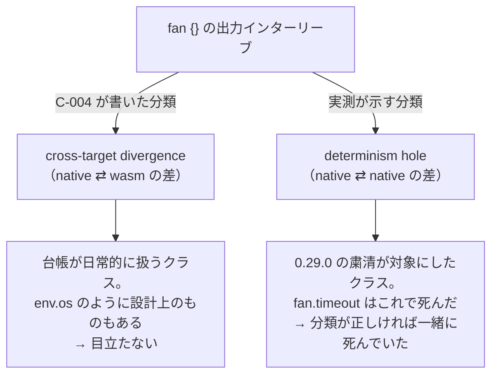
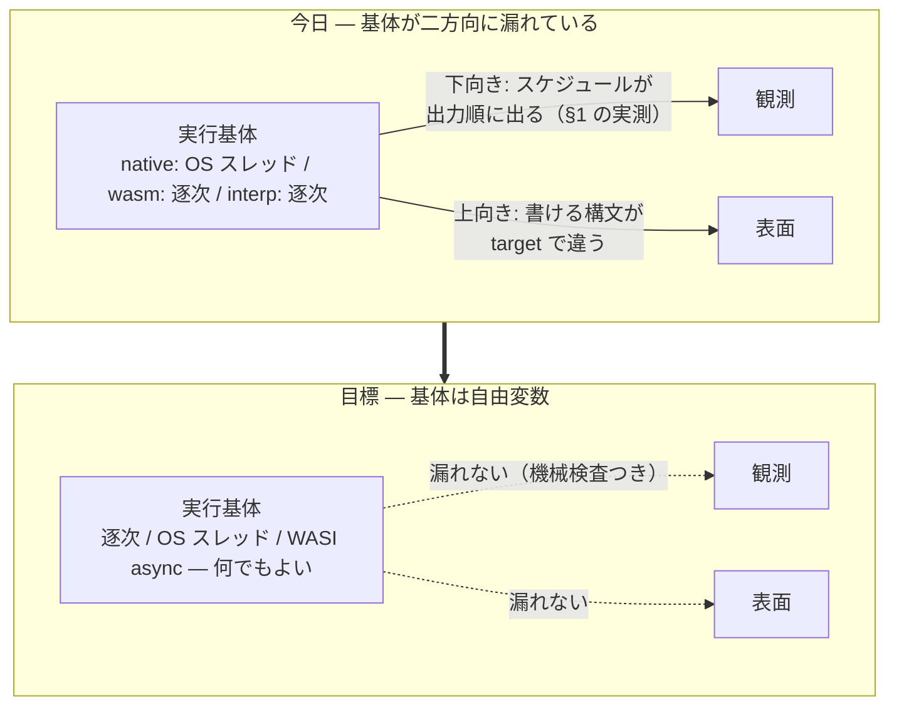
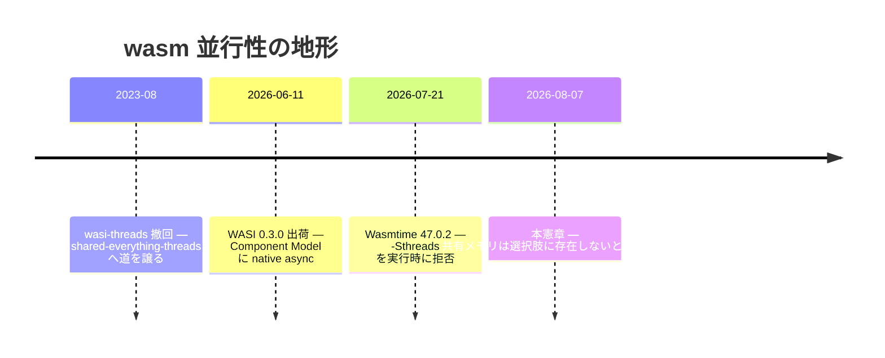
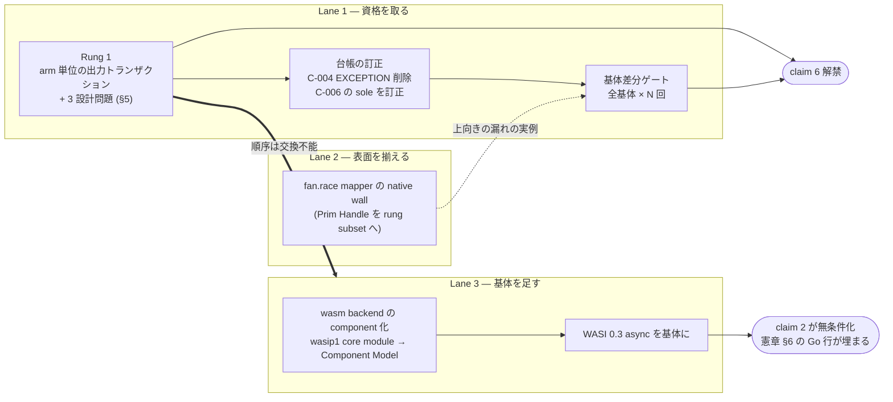

<!-- description: The execution inception: the as-if rule completed across concurrency and targets -->
# Execution Inception — as-if 規則を、並行と target の向こうまで完成させる

> 実行基体の憲章。[async-inception.md](./async-inception.md) が**観測**を固定したのに対し、
> 本文書は**何が実際に走るか**を決める。両者が食い違ったら、観測の側が正。

## 0. 一文

**最適化は観測を変えない。この 50 年の約束を、並行実行と target 差の向こうまで延ばしきったコンパイラが、2026 年の最高のコンパイラである。**

## 1. 実測 — 憲章の一文には、今日ひとつ反例がある

async-inception は非同期の**観測**を固定した。論理時間が勝敗を決め、環境の時間は
宣言された入力としてのみ入る。Lean の 7 定理、74,898 構成の全数合流、T1 から T9 の台帳。
意味論の内側は、これ以上ないほど締まっている。

その締まった意味論に対する反例を、4 行のプログラムで再現できる。

```almide
effect fn main() -> Unit = {
  let n = list.len(env.args()!)                  // 定数畳み込みを防ぐ runtime 値
  let (a, b, c, d) = fan { arm("A", n)  arm("B", n)  arm("C", n)  arm("D", n) }
  println("sum=${a + b + c + d}")
}
// arm(tag, extra) = 600 万回まわして println(tag)
```

2026-08-07、almide 0.56.0 / wasmtime 47.0.2 / 14 コア arm64 macOS で実測した。

```
native × 10 回:  ACDB ×2, DCAB, DBCA, CBAD, BDCA, BCAD, BACD, ADCB, ACBD
                 ── 10 回で 9 通り
wasm   ×  3 回:  ABCD, ABCD, ABCD
                 ── 常に arm 順
```

契約台帳 C-004 の EXCEPTION 節は、これを予告している。

> EXCEPTION: side-effect INTERLEAVING inside `fan { }` block arms and `fan.settle`
> thunks is wall-clock on native (both run on real threads) and sequential on wasm

条項どおり native ⇄ wasm は食い違った。**条項にない事実**が同時に出た —
**native は自分自身とも食い違う。** 同じバイナリ、同じ入力、10 回で 9 通り。

## 2. 分類が間違っていた

台帳はこの性質に名前を持っている。C-006 —— `fan.timeout` を 0.29.0 で撤去した理由：

> Worse than the cross-target divergence: whether the deadline fired depended on
> machine load, so the result was not a function of the program + its inputs
> **even between two native runs** — **the sole stdlib surface violating that property.**

`fan.timeout` は、この性質ゆえに殺された。そして C-006 は、それが**唯一の**表面だったと
書いている。§1 の実測は、その記述が今日不正確であることを示す。

見落としは「例外がある」ことではない。**例外の分類**である。



cross-target の乖離は、この repo が毎日扱っているクラスである。`env.os` のように
**設計上そうである**ものもある（C-189 の carve-out）。だから条項は目立たなかった。
実体は determinism hole で、0.24.0 から 2 年間、分類されないまま出荷されていた。

C-004 の EXCEPTION 節が過小評価されるのは、これで 2 度目でもある。条項の末尾：

> The block was an undercount here until #915's audit: it spawns per-arm scoped
> threads on native, the same interleaving class as settle.

#915 は**範囲**の過小評価を直した（`settle` だけでなく `fan {}` も該当する）。
残っていたのは**クラス**の過小評価である。

第 3 のオラクルは native の側にいない。`crates/almide-interp/src/eval.rs:148` —
参照インタプリタの fan は「SEQUENTIALLY in source order」。wasm と interp が逐次で
一致し、**native だけが外れている**。しかも「どちらが正しいか」の議論は要らない。
逐次側は #1000 が定義した観測そのものだからだ —— 「実行は並列でよいが、観測可能な
振る舞いは、リスト順に逐次評価した場合と厳密に同一」。

## 3. 原因 — 基体を、誰も決めていない

なぜこうなったか。**実行基体が設計の産物ではなく実装都合の残り物だから**である。

| target | 基体 | 出どころ |
|---|---|---|
| native | OS スレッド（`std::thread::scope`） | `codegen/templates/rust.toml` `[fan_expr]` |
| wasm | 完全逐次（arm を inline 展開） | `crates/almide-mir/src/lower/desugar_fan.rs` |
| interp | 完全逐次 | `crates/almide-interp/src/eval.rs` |

憲章のどこにも「native は OS スレッドで、wasm は逐次にする」とは書いていない。
native が `std::thread::scope` なのは Rust にそれがあったからで、wasm が逐次なのは
wasip1 にスレッドがなかったからだ。意味論は選ばれた。**基体は、余りものだった。**

余りものは 2 方向に漏れている。



上向きの漏れも実測されている。`spec/wasm_cross/fan_race_mapper.almd` は wasm で
正常終了し、**native は wall する**（`op "Prim Handle" in main — outside the rung
subset`、exit 1）。憲章 §3 の head × form マトリクスは全セル確定と宣言しているが、
native から見るとセルが空いている。基体が**どの構文が存在するか**まで決めている。

（`spec/wasm_cross/{fan_*,fuel_*}.almd` 全 23 本の両 target 比較では、この 1 本を除く
22 本が byte 一致。下向きの漏れは fixture 0 本 —— 印字 arm を 2 本置く構成を
避けて書かれているためで、避けていること自体が条項の告白である。）

## 4. 2026 の地形 — 倒す相手は、いなかった

wasm を本当に並列にするなら共有メモリと atomics が要り、それは C-210
（Wasm 3.0 deterministic profile 適合、`FORBIDDEN = ["relaxed", "atomic", "shared"]` を
機械検査）を倒すことを意味する —— 決定性と並列性のトレードオフだ、と見立てた。

**その二択は存在しなかった。**

```
$ wasmtime --version
wasmtime 47.0.2 (90fed3c6a 2026-07-21)

$ wasmtime run -S threads=y t.wasm
Error: the `-Sthreads` flag is no longer supported
```

ヘルプは今も `threads[=y|n] -- Enable support for WASI threading imports (experimental)`
と表示する。読んだだけなら「experimental だが使える」と結論する。実行すると拒否される。
wasi-threads は 2023-08 に撤回された legacy proposal で、preview1 しか支えられない
エンジンのために残置されているにすぎない。後継の shared-everything-threads は
どの WASI host runtime にも実装がない。

かわりに、待っていたものが 2 ヶ月前に着いていた。**WASI 0.3.0 — 2026-06-11 出荷、
Component Model への native async。** `async func` / `stream<T>` / `future<T>` が
Canonical ABI に入り、`wasi:io` は撤廃。0.2 の `start-foo` / `finish-foo` / `subscribe`
の三段舞踏は消えた。対応は Wasmtime 43+ で、手元は 47.0.2 —— **今日動く。**

決定的に重要なのは、これが命令セットの話ではないことだ。並行性は component 境界の
ABI にあり、線形メモリを共有しない。atomics も shared memory も emit しない。
**C-210 は 1 文字も触らずに済む。**



「決定性を売って並列性を買う」は、2026 の地形には対応する取引が存在しない。
売らずに買える。

## 5. 決定 — 基体は自由変数である

正式な決定は [ADR-0011](../../adr/0011-execution-substrate-is-a-free-variable.md)。

> **実行基体は観測から分離された自由変数である。基体は性能だけのノブであり、
> 観測を 1 ビットも変えてはならない。wasm 側の並行性は WASI 0.3 の native async から
> 取り、共有メモリと atomics は採らない。**

梯子は三段で、順番が仕事をしている。

| 段 | 内容 | 何が終わるか |
|---|---|---|
| **Rung 1** | arm 単位の出力トランザクション —— 各 arm の stdout/stderr をバッファし、join 時に arm 順で flush | **determinism hole が閉じる。** C-004 の EXCEPTION 消滅。基体が自由変数になる |
| **Gate** | 基体差分ゲート —— 全基体 × N 回で観測一致を機械検査 | 「基体は観測を変えない」が主張からゲートへ |
| **Async** | wasm backend の component 化 → WASI 0.3 async を基体に | 憲章 §6 の Go 敗北行（本物の並行 I/O）が埋まる |

順序は交換不能である。Rung 1 なしに基体を並列化すれば、今日「native だけが非決定」
である乖離が「全 target 非決定」へ悪化する。**Rung 1 は改善ではなく、
基体を語る資格そのものだ。**

Rung 1 が答えるべき設計問題は 3 つあり、すべて「逐次実行と一致する」の一本で決まる。

- **arm 内の stdout / stderr 相対順序** —— 2 本を独立にバッファすると
  `println` → `eprintln` の順が失われる。arm 内は 1 本のタイムラインとして記録し、
  flush 時に fd へ振り分ける
- **trap 時の flush** —— C-200（trap した sibling は統一 abort、in-flight は待たない）と
  整合させる。逐次実行なら trap より前の arm の出力は出ているので、
  完了済み arm を arm 順に flush してから abort する
- **バッファ上限** —— 先頭 arm は前に誰もいないので即時 flush してよい。
  最悪ケースは「先頭以外の arm の出力総量」に落ちる

## 6. 主張 — なぜこれが「2026 年最高のコンパイラ」なのか

「最高のコンパイラ」は測れる文にしなければ意味がない。まず軸を言う。

コンパイラの品質軸は、この数年で移動した。生成コードの速さ、型推論の賢さ、
診断の親切さ —— どれも重要だが、**コードの大半を LLM が書く世界では、先に来る問いが
別にある。** 同じソースが、走るたび同じ観測を返すか。返さないなら、生成された
コードを検証する手段そのものが壊れる。flaky なテストに焼かれているのは、もう
人間だけではない。

この軸には、コンパイラ業界が 50 年前から持っている名前がある。**as-if 規則**だ。
最適化は、抽象機械の観測可能な振る舞いを保存するかぎり何をしてもよい。C も C++ も
Rust も、この規則の上に立っている。

そして as-if 規則には、よく知られた境界がある。**それは逐次抽象機械に対して
定義されている。** 並行が始まると、規則は「並行プログラムの観測は、ある逐次実行の
観測と一致する」とは言わない。C++ は境界を「データ競合は未定義動作」と宣言して
処理した —— 塞ぐことを諦めた、と言い換えてもよい。OpenMP の `parallel for` は
依存がないことの証明をユーザーに課し、外れれば UB。Rayon の `par_iter` は
安全だが、arm の出力順は保証しない。

**Almide は境界の内側に並行構文を置いた言語である。** #1000 が
「`fan` はスケジューリングの構文であって、意味論の構文ではない」と決めたとき、
それは `fan` を **as-if 規則の管轄下に置く**という宣言だった。`fan` は最適化指示で
あって、意味論を変えない。

2 年かけてやってきたのは、この境界を押し広げる工事だった、と後から言える。観測を
論理時間に固定したからスケジュールは観測に入らない。native ⇄ wasm の byte 一致を
台帳で追い続けたから target 差も入らない。**残っていたのは実行基体という最後の穴で、
それが §1 の 10 回 9 通りである。**

> as-if 規則を、並行実行と target 差の向こうまで完成させる。
> 逐次でも、OS スレッドでも、WASI async でも、native でも wasm でも、観測は同一。
> しかもそれを、主張ではなく機械検査で示す。

憲章 §6 の 5 文に、6 文目が加わる。

6. 「**実行基体を切り替えても観測は変わらない** —— 逐次 / OS スレッド / WASI async、
   native / wasm / interp の全組み合わせで機械検査済み」
   —— **解禁条件: Rung 1 + 基体差分ゲート**

今日は言えない。§1 がその反例だからだ。この一文を買う工事が Rung 1 であり、
**5 文の中で最も安く、最も他社に真似できない一文**でもある。Go も Rust も
TypeScript も、並列度を変えれば出力の混ざり方が変わる。それは欠陥ではなく、
観測をスケジュールの関数だと定義した結果である。**定義を変えた言語だけが、
この文を書ける。**

## 7. 計画



**Lane 1 が本線。** Rung 1 は憲章 §4 柱 5 が設計済みの機構で、実装は runtime の
print 経路に arm 単位のバッファを通す変更に落ちる。判断が要るのは §5 の 3 点。
台帳の訂正を同じ PR に入れるのは、CLAUDE.md の「観測可能な振る舞いを変える =
同じ PR で契約台帳を更新」に従う。

**Lane 2 は独立。** `fan_race_mapper` の native wall は Lane 1 を待たない。ただし
これを個別に塞ぐことより、**基体差分ゲートがこの病を構造的に検出するようになること**が
本題なので、Lane 1 のゲートに合流させる。

**Lane 3 が重い。** 今日は `wasi_snapshot_preview1` の core module を出しており
（`render_wasm_p3.rs` の import 群）、WASI 0.3 async は Component Model の上にある。
ADR-0011 は D2 を**方向の決定**として採り、着手時期をここに委ねた。Rung 1 とゲートが
立つまで着手しない —— 基体を足す資格が先である。

## 8. 反証条件

| 反証 | 検出面 | 起きたら |
|---|---|---|
| 基体を切り替えると観測が変わり、Rung 1 で塞げない | 基体差分ゲート | その基体を撤去。守れないなら全 target 逐次へ倒す（観測を守るために基体の自由を捨てる。逆順にはしない） |
| WASI 0.3 async のオーバーヘッドが逐次を上回る | Lane 3 のベンチ | D2 のみ取り下げ、wasm 基体は逐次で据え置き。Rung 1 とゲートは残る |
| arm 単位バッファが長時間 arm の進捗表示を壊す | 実使用 | flush 境界の粒度を再設計。**opt-out は採らない**（観測が基体依存に戻り、本憲章が無効化される） |
| ゲートが N 回反復しても再現しない（CI が 1 コア等） | Lane 1 | 反復ではなく**基体の直接指定**（逐次基体を強制するフラグ）で検査する形へ設計変更 |
| shared-everything-threads が host runtime に実装される | 外部 | C-210 を倒さずに使えるなら D3 を再査定。倒す必要があるなら据え置き |
| component 化のコストが Lane 1 の便益を食い潰す | Lane 3 着手時の見積 | Lane 3 を on-hold へ。**claim 6 は Lane 1 だけで解禁できる** |

最後の行が効いている。**claim 6 は Lane 3 を待たない。** 逐次と OS スレッドの
2 基体でも「基体を切り替えても観測は変わらない」は真になる。Lane 3 は文を強くするが、
文の成立条件ではない。重い工事に主張を人質に取らせない配置にしてある。

## 9. 文書地図

| 文書 | 役割 |
|---|---|
| [async-inception.md](./async-inception.md) | **観測**の憲章 —— 食い違ったら向こうが正 |
| execution-inception.md（本文書） | **基体**の憲章 |
| [ADR-0011](../../adr/0011-execution-substrate-is-a-free-variable.md) | 決定の原本（D1–D6・却下 6 案・反証 F1–F5） |
| [ADR-0001](../../adr/0001-deterministic-time-units.md) | 決定的時計の単位（基体が読まない時計） |
| [concurrency-stance.md](./concurrency-stance.md) | #1000。「wasm32 にスレッドはない」の前提は ADR-0011 R2 が更新 |
| [contracts.toml](../../contracts/contracts.toml) | C-004（EXCEPTION の原本）・C-006（sole の記述）・C-200（trap 時 abort）・C-210（deterministic profile） |
| `crates/almide-mir/tests/deterministic_profile_test.rs` | C-210 の機械検査 —— 本決定では**触らない** |

## 10. 結び — 余りものだったものを、決定にする

この憲章が扱っているのは、誰も決めなかったから今の形になったもの、ただ一つである。
native が OS スレッドなのは Rust にそれがあったからで、wasm が逐次なのは wasip1 に
スレッドがなかったから。二つの偶然が、契約台帳にひとつの誤分類を残した。

偶然を決定に変えると、例外条項が消えるだけでは済まない。**基体が性能だけのノブになる。**
速くしたければ基体を替えればよく、替えても誰も観測できない。最適化は観測を変えない ——
コンパイラが 50 年売ってきた約束が、並行と target の向こうでも成立する。

そこに至る工事の最初の一歩は、WASI でも Component Model でもない。
2 本の arm が両方 `println` したとき、どちらが先に出るかを決めることである。
