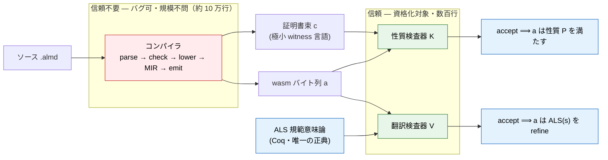
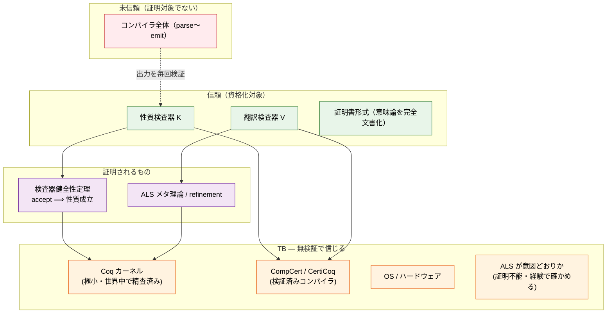
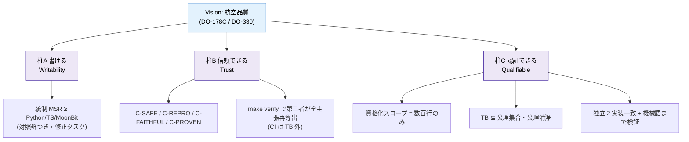
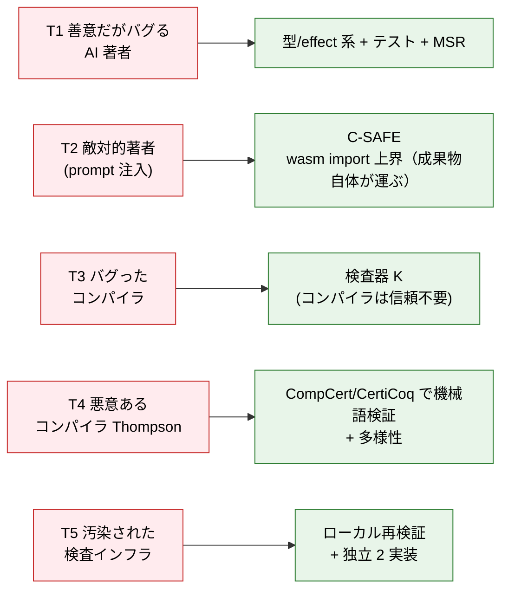
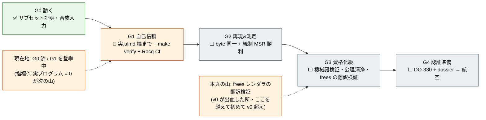
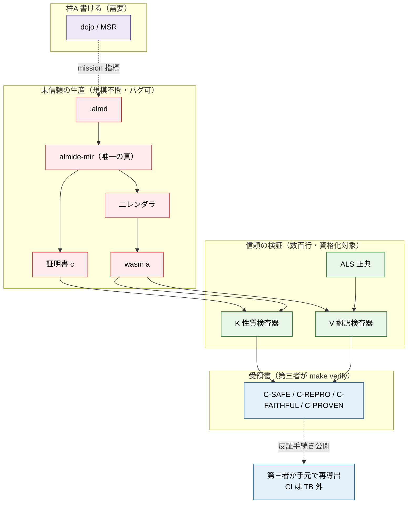

<!-- description: v1 system map — mermaid diagrams of the whole trust architecture: each component's what / why / which area it secures, the PCC trust flow, the trust base, the three pillars, the threat model, and the maturity ladder. -->
# v1 System Map — 全体像(mermaid)

> **これは何か**: Almide v1 の信頼アーキテクチャを **一枚ずつの図**で見る地図。
> 各部品について「**何か / なぜ使うか / Almide のどの領域を担保するか**」を示す。
> 詳細な根拠は兄弟文書へ:
> [v1-proof-architecture](v1-proof-architecture.md)(着地形)、
> [receipt-logic](receipt-logic.md)(受領書の形式)、
> [trust-layer](trust-layer.md)(カテゴリ戦略 L0-L4)、
> [completeness-by-construction](completeness-by-construction.md)(意味論台帳)。

---

## 0. 背骨(全図に共通する一文)

> **コンパイラの正しさは証明しない。小さな検査器の健全性だけを証明し、
> コンパイラには毎ビルド「証明書」を吐かせ、検査器が毎回照合する。**
> 確かめるのは作るより桁安い ―― だから信頼が「10 万行」から「数百行」に潰れる。

---

## 1. 信頼の流れ(PCC 鎖)

未信頼のコンパイラが成果物と証明書を吐き、**信頼すべき小さな検査器だけ**が
それを再検証する。信頼境界(赤=信頼不要 / 緑=信頼)が読みどころ。

**担保する領域**: コンパイラが何を吐こうと、証明書が成立しなければ検査器が弾く
=**コンパイラのバグが成果物の信頼を壊せない**。

---

## 2. 信頼の土台(Trusted Base のスタック)

下ほど「無検証で信じるもの(TB)」、上ほど「証明・検査されるもの」。
**信じるべきは最下層だけ**に絞る、というのがこの積み方の主張。

**担保する領域**: 「Coq 証明済み」が嘘にならないこと ―― `Print Assumptions` ⊆
標準 + coqchk 独立再検査で、TB に余計なものが紛れ込まないことを毎回機械確認。

---

## 3. コンポーネント早見表(何 / なぜ / 担保)

| 部品 | 何か | なぜ使う | Almide のどの領域を担保 |
|---|---|---|---|
| **ALS**(規範意味論) | 言語の意味の唯一の正典(Coq 内) | 全バックエンドの基準点。意味の二重定義を防ぐ | 意味論の一貫性(**C-FAITHFUL**) |
| **almide-mir** | 所有権 + レイアウト明示の唯一の真 | レンダラに再決定させない単一決定点 | 所有権決定の一貫性(`is_heap`/last-use/Repr の #643 クラス) |
| **二レンダラ**(wasm 主権 / Rust=Ferrocene) | MIR の**翻訳のみ**・再決定しない | wasm=最小 TCB の正典成果物、Rust=Ferrocene 踏み台 | byte 再現性(**C-REPRO**)・二経路の同値 |
| **証明書形式** | 極小 witness 言語(Metamath 級) | 未信頼コンパイラと信頼検査器の**唯一の継ぎ目** | 検証の独立性・意味の無曖昧さ |
| **性質検査器 K** | 証明書を照合する小プログラム(Coq 証明済) | `accept ⟹ P`。信頼を数百行に絞る | メモリ安全・name 全域・capability 上界・型 concretize・stack 均衡・終端(**C-SAFE/C-PROVEN**) |
| **翻訳検査器 V** | emit wasm が ALS を refine するか毎ビルド確認 | 審査の必殺質問「証明したのはモデルでは?」への答え | モデル↔実物の対応(**C-FAITHFUL**) |
| **Coq/Rocq** | 証明を書きカーネルが再検査 | 信頼を極小カーネルに絞る + 精査の蓄積 | 全証明の健全性(**C-PROVEN**) |
| **CompCert/CertiCoq** | 検証済みコンパイラ | 検査器を機械語まで・抽出穴と Thompson 穴を閉じる | 検査器**自身**の正しさ(脅威 T4) |
| **差分オラクル**(v0 corpus/contracts/interp) | parity 到達まで温存する上位独立 oracle | blind rewrite 却下・退役前に消さない | 回帰検出・**v0 の知識の保存** |
| **dojo**(MSR) | 日次の LLM 筆記性測定 | mission 指標(唯一の指標) | 「書ける」=柱 A の需要側 |
| **make verify-trust** | 第三者が全主張を再導出する単一入口 | CI を TB の外に出す | 受領書の**再現可能性** |

---

## 4. 三本柱と指標(全指標はここに転がる)

**担保する領域**: 柱 A=需要(機械が正確に書けるか)、柱 B=成果物(信頼を渡せるか)、
柱 C=認証(審査に乗るか)。三つが揃って初めて「信頼層」を名乗れる。

---

## 5. 脅威モデル(どの部品がどの脅威を止めるか)

**読みどころ(T2)**: capability の健全性は「コンパイル時チェック」ではなく
**wasm import セクション=成果物自体が運ぶ構造的上界**が担う。だから
**著者がチェックを騙しても無駄** ―― import に無いものは呼べない(wasm 仕様が担保)。

---

## 6. 成熟度ラダー(航空品質への登攀・現在地つき)

**経路の現実**: G4 の航空は最難関・最後。**換金と資格化は隣接市場を先に通る**
―― CRA / 暗号 / AI エージェント基盤(1〜3 年)→ 自動車・産業 ISO 26262 /
IEC 61508(要・会社化)→ **航空は最後**。航空は製品の近期目標ではなく、規律を
生む北極星。

---

## 7. 一枚にまとめると

**全体の担保構造(一言)**: 赤(未信頼)で大量に作り、緑(数百行・資格化対象)で
毎ビルド検証し、青(受領書)で第三者が手元再導出する ―― **信じる対象を数百行に
絞りきり、それ以外は誰も信用しなくてよい状態**。これが Almide v1 が担保する全体像。
