<!-- description: Three-layer codegen architecture for multi-target extensibility -->
<!-- done: 2026-03-18 -->
# Codegen v3: Three-Layer Architecture

**Priority:** High — prerequisite for post-1.0 target expansion (Go, Python)
**Status:** Phase 4 complete, Phase 5 in progress
**Tests:** Rust 72/72 (100%), TS cross-target 106/106 (100%)

## Implemented architecture

```mermaid
flowchart TB
    subgraph BuildTime["Build Time (build.rs)"]
        TOML["stdlib/defs/*.toml"]
        BUILDRS["build.rs"]
        ARGTX["arg_transforms.rs<br/>282 functions × ArgTransform"]
        TOML --> BUILDRS --> ARGTX
    end

    subgraph Pipeline["Runtime Pipeline"]
        IR["IrProgram (typed IR)"]

        subgraph RustPasses["Rust Passes"]
            RP1["StdlibLoweringPass"]
            RP2["ResultPropagationPass"]
            RP3["BuiltinLoweringPass"]
        end

        subgraph TSPasses["TypeScript Passes"]
            TP1["MatchLoweringPass"]
            TP2["ResultErasurePass"]
            TP3["ShadowResolvePass"]
        end

        subgraph Shared["Shared Passes"]
            SP1["FanLoweringPass"]
        end

        subgraph Annotations["Annotations"]
            ANN["clone_vars, deref_vars<br/>lazy_vars, ctor_to_enum<br/>boxed_fields, default_fields<br/>recursive_enums"]
        end

        subgraph Walker["Layer 3: Template Walker (target-agnostic)"]
            TMPL["TOML Templates<br/>rust.toml / typescript.toml"]
            WALK["walker.rs<br/>is_rust() = 0<br/>ctx.target branch = 0"]
            TMPL --> WALK
        end
    end

    IR --> RustPasses --> Shared
    IR --> TSPasses --> Shared
    Shared --> ANN --> WALK
    ARGTX -.-> RP1
    WALK --> OUT["Rust / TypeScript source"]

    style Pipeline fill:#1a1a2e,stroke:#e94560,stroke-width:2px
    style Walker fill:#16213e,stroke:#00ff00
```

## Nanopass list

| Pass | Target | Responsibility |
|------|--------|----------------|
| StdlibLoweringPass | Rust | Module→Named + arg_transforms (Borrow/ToVec/Clone/WrapSome) |
| ResultPropagationPass | Rust | auto-? for effect fn (excluding match subject) |
| BuiltinLoweringPass | Rust | assert→RustMacro, println→RustMacro, value_*→almide_rt_ |
| MatchLoweringPass | TS/Py/Go | match→if/else chain (Constructor, RecordPattern, guard support) |
| ResultErasurePass | TS/Py | ok(x)→x, err(e)→throw, Try→identity, Result ret type→T |
| ShadowResolvePass | TS/Py | let shadowing → assignment (avoid const/let re-declaration) |
| BoxDerefPass | Rust | recursive pattern variable *deref |
| ClonePass | Rust | heap-type variable .clone() |
| FanLoweringPass | All | (placeholder — fan rendering is template-driven) |

## TOML templates (40+ per target)

Both targets generate different code from the same walker:

| Construct | Rust | TypeScript |
|------|------|-----------|
| if_expr | `if {cond} {{ {then} }} else {{ {else} }}` | `(({cond}) ? ({then}) : ({else}))` |
| block_expr | `{{\n{body}\n}}` | `(() => {{\n{body}\n}})()` |
| fan_expr | `std::thread::scope(\|__s\| {{ ... }})` | `await Promise.all([{exprs}])` |
| enum_decl | `#[derive(...)] enum {name} {{ {variants} }}` | `// type {name}\n{variants}` |
| ctor_call | `{enum_name}::{ctor_name}({args})` | `{ctor_name}({args})` |
| tuple_literal | `({elements})` | `[{elements}]` |
| deref_var | `(*{name})` | `{name}` |
| clone_expr | `{expr}.clone()` | `{expr}` |

## Progress

### ✅ Phase 1: Template + Walker (complete)

- TOML template engine (type/attr guards, array rules)
- rust.toml / typescript.toml (60+ constructs)
- IR walker (covers all IrExprKind + IrStmtKind)

### ✅ Phase 2: Nanopass Pipeline (complete)

- 6 Rust passes + 3 TS passes
- build.rs arg_transforms table (282 functions, WrapSome support)

### ✅ Phase 3: Annotations + gen_generated_call removal (complete)

- CodegenAnnotations: clone_vars, deref_vars, lazy_vars, boxed_fields, default_fields
- Completely eliminated gen_generated_call dependency from walker

### ✅ Phase 4: Walker target-agnostic conversion (complete)

- `is_rust()` **42 → 0** (method itself deleted)
- `ctx.target ==` branches **0** (everything including fan is template-driven)
- break-in-IIFE resolved (IIFE avoidance via contains_loop_control)
- TS cross-target **106/106** (0 fail)

### ✅ Phase 5: Complete replacement of existing codegen (complete)

- v3 is the default codegen (`almide run/build/test`)
- `almide emit --target rust/ts` outputs v3
- Legacy codegen accessible via `legacy-rust/legacy-ts`

### Phase 6: New targets (post-1.0)

Go/Python targets are post-1.0. Architecture is ready (only TOML + pass additions needed).

1. Go target: `go.toml` + Go-specific passes
2. Python target: `python.toml` + Python passes

## Success criteria

- [x] spec/lang 45/45 pass (Rust)
- [x] spec/stdlib 14/14 pass (Rust)
- [x] spec/integration 13/13 pass (Rust)
- [x] cross-target 106/106 pass (TS)
- [x] gen_generated_call dependency eliminated
- [x] build.rs arg_transforms table generation
- [x] 9 Nanopasses implemented
- [x] walker `is_rust()` zero
- [x] walker `ctx.target ==` branches zero
- [x] Existing codegen fully replaced
- Go target → [on-hold](../on-hold/go-target.md)
