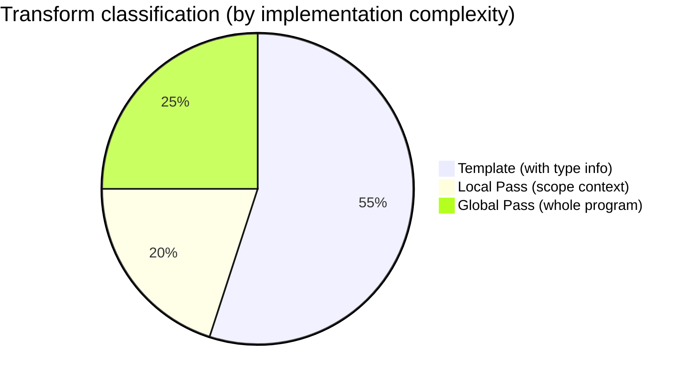
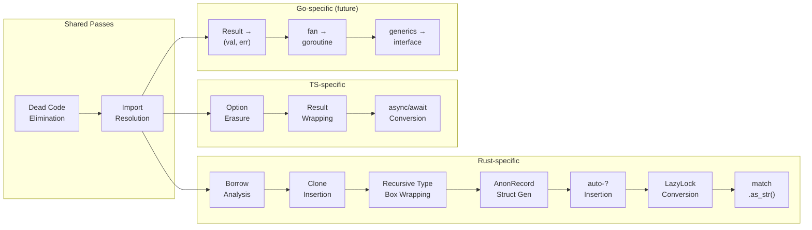

<!-- description: Complete classification of codegen transforms by context depth -->
<!-- done: 2026-03-18 -->
# Codegen v3: Transform Classification

Classify all codegen transforms into 3 levels by the depth of context they require.



## Classification criteria

| Level | Required information | Implementation |
|-------|---------------------|----------------|
| **Template** | Node kind + type info only | TOML + type tags |
| **Local Pass** | Surrounding scope info (inside effect fn, inside loop, etc.) | Small Nanopass |
| **Global Pass** | Whole-program info (all type definitions, usage analysis, etc.) | Analysis + transform Pass |

---

## Level 1: Template (declarable in TOML) — ~55%

The transform target is determined solely by node kind and type info. No context needed.

### Syntax formatting

| Transform | Rust | TypeScript | Python | Go |
|------|------|-----------|--------|-----|
| if/else | `if {c} {{ {t} }} else {{ {e} }}` | `if ({c}) {{ {t} }} else {{ {e} }}` | `if {c}:\n  {t}\nelse:\n  {e}` | `if {c} {{ {t} }} else {{ {e} }}` |
| match | `match {s} {{ {arms} }}` | IIFE + if/else chain | if/elif chain | switch |
| fn decl | `fn {n}({p}) -> {r} {{ {b} }}` | `function {n}({p}): {r} {{ {b} }}` | `def {n}({p}) -> {r}:` | `func {n}({p}) {r} {{ {b} }}` |
| let binding | `let {n}: {t} = {v};` | `const {n}: {t} = {v};` | `{n}: {t} = {v}` | `{n} := {v}` |
| var binding | `let mut {n}: {t} = {v};` | `let {n}: {t} = {v};` | `{n}: {t} = {v}` | `var {n} {t} = {v}` |
| for loop | `for {v} in {iter} {{ {b} }}` | `for (const {v} of {iter}) {{ {b} }}` | `for {v} in {iter}:` | `for _, {v} := range {iter} {{ {b} }}` |
| while loop | `while {c} {{ {b} }}` | `while ({c}) {{ {b} }}` | `while {c}:` | `for {c} {{ {b} }}` |
| function call | `{f}({a})` | `{f}({a})` | `{f}({a})` | `{f}({a})` |
| field access | `{e}.{f}` | `{e}.{f}` | `{e}.{f}` | `{e}.{f}` |
| record literal | `{T} {{ {fields} }}` | `{{ {fields} }}` | `{T}({fields})` | `{T}{{ {fields} }}` |
| list literal | `vec![{elems}]` | `[{elems}]` | `[{elems}]` | `[]{T}{{ {elems} }}` |

### Type mapping

| Almide type | Rust | TypeScript | Python | Go |
|-----------|------|-----------|--------|-----|
| `Int` | `i64` | `number` | `int` | `int64` |
| `Float` | `f64` | `number` | `float` | `float64` |
| `String` | `String` | `string` | `str` | `string` |
| `Bool` | `bool` | `boolean` | `bool` | `bool` |
| `List[T]` | `Vec<T>` | `T[]` | `list[T]` | `[]T` |
| `Map[K,V]` | `HashMap<K,V>` | `Map<K,V>` | `dict[K,V]` | `map[K]V` |
| `Option[T]` | `Option<T>` | `T \| null` | `Optional[T]` | `*T` or `(T, bool)` |
| `Result[T,E]` | `Result<T,E>` | `{ok,value}\|{ok,error}` | `T` (raise) | `(T, error)` |
| `Unit` | `()` | `void` | `None` | ` ` |

### Expression transforms (can branch on type tags)

| Transform | Condition | Rust | TS |
|------|------|------|-----|
| `some(x)` | always | `Some({x})` | `{x}` |
| `none` | type known | `None::<{T}>` | `null` |
| `none` | type unknown | `None` | `null` |
| `ok(x)` | always | `Ok({x})` | `{{ ok: true, value: {x} }}` |
| `err(x)` | always | `Err({x}.to_string())` | `{{ ok: false, error: {x} }}` |
| `a == b` | always | `almide_eq!({a}, {b})` | `__deep_eq({a}, {b})` |
| `a != b` | always | `almide_ne!({a}, {b})` | `!__deep_eq({a}, {b})` |
| `a ++ b` | String | `format!("{{}}{{}}", {a}, {b})` | `{a} + {b}` |
| `a ++ b` | List | `AlmideConcat::concat({a}, {b})` | `[...{a}, ...{b}]` |
| `a ** b` | Int | `{a}.pow({b} as u32)` | `{a} ** {b}` |
| `a ** b` | Float | `{a}.powf({b})` | `{a} ** {b}` |
| string interp | always | `format!("{fmt}", {args})` | `` `{template}` `` |

**Give templates type tags:**

```toml
[concat]
rust.when_type = "String"
rust.template = "format!(\"{{}}{{}}\", {left}, {right})"
rust.when_type = "List"
rust.template = "AlmideConcat::concat({left}, {right})"

ts.template = "{left} + {right}"   # TS is the same regardless of type
```

---

## Level 2: Local Pass (requires scope context) — ~20%

Cannot be determined from a single node; requires local context like "which function are we inside?" or "are we in a loop?"

| # | Transform | Required context | target | Description |
|---|-----------|-----------------|--------|-------------|
| 1 | **auto-? insertion** | whether inside effect fn | Rust | Append `?` to Result-returning calls |
| 2 | **effect fn return wrap** | whether fn is effect | Rust | Wrap return value in `Ok(...)` |
| 3 | **match subject auto-? stripping** | whether match subject is Result type | Rust | Remove `?` when deconstructing with match after insertion |
| 4 | **match subject .as_str()** | subject is String type + literal pattern | Rust | `match s.as_str() { "a" => ... }` |
| 5 | **top-level let → LazyLock** | whether let is top-level | Rust | `static X: LazyLock<T> = ...` |
| 6 | **TS Result erasure context** | whether deconstructing Result in match | TS | Don't erase inside match |
| 7 | **Loop variable ownership** | whether inside for/while loop | Rust | Clone strategy for loop variables |

**Implementation:** Each Pass walks the IR with a scope stack (`[GlobalScope, FnScope(effect=true), LoopScope]`). Consults the stack at each node visit to determine transforms.

```rust
struct ScopeContext {
    in_effect_fn: bool,
    in_loop: bool,
    is_top_level: bool,
    match_subject_ty: Option<Ty>,
}

// Example: auto-? Pass
fn rewrite_call(call: &IrExpr, ctx: &ScopeContext) -> IrExpr {
    if ctx.in_effect_fn && call.ty.is_result() {
        IrExpr::try_wrap(call)  // append ?
    } else {
        call.clone()
    }
}
```

---

## Level 3: Global Pass (requires whole-program analysis) — ~25%

Cannot be determined from a single function. Requires analysis of the entire program's type graph, usage sites, and dependencies.

| # | Transform | Required analysis | target | Description |
|---|-----------|------------------|--------|-------------|
| 1 | **Borrow analysis** | Usage patterns of all function arguments | Rust | Whether to emit parameter as `&T` or `T` |
| 2 | **Clone insertion** | Variable use count (use-count) | Rust | `.clone()` for variables used 2+ times |
| 3 | **Recursive type Box wrapping** | Cycle detection in type graph | Rust | `enum Tree { Node(Box<Tree>, Box<Tree>), Leaf }` |
| 4 | **Anonymous record struct generation** | Collect record shapes across entire program | Rust | `struct AlmdRec_age_name { age: i64, name: String }` |
| 5 | **Fan/concurrency lowering** | Type + captured variables of each branch | all targets | `fan { a, b }` → thread spawn + join / Promise.all |
| 6 | **Monomorphization** | All instantiation sites for generics | Rust | `fn foo<T>` → `fn foo_i64`, `fn foo_string` |
| 7 | **Dead code elimination** | Call graph of entire program | all targets | Remove unused functions |
| 8 | **Import resolution** | Module dependency graph | all targets | Generate target-specific import statements |

**Implementation:** Each Pass receives the entire IR and has a 2-stage structure: analysis phase (collection) → transform phase (rewriting).

```rust
// Example: Borrow analysis Pass
fn analyze(program: &IrProgram) -> BorrowInfo {
    // Phase 1: Collect parameter usage patterns for all functions
    let mut info = BorrowInfo::new();
    for func in &program.functions {
        for param in &func.params {
            info.record_usage(param, analyze_usage(func, param));
        }
    }
    info
}

fn rewrite(program: &IrProgram, info: &BorrowInfo) -> IrProgram {
    // Phase 2: Change parameter types to &T based on collection results
    // ...
}
```

---

## Pass composition by target



---

## Summary: Implementation ratios

| Level | Transform count | Estimated size | Approach |
|-------|----------------|----------------|----------|
| Template (TOML) | ~25 types | ~100-150 lines/target | Declarative. Branch on type tags |
| Local Pass | ~7 types | ~300 lines/target | Small Nanopass. Scope stack |
| Global Pass | ~8 types | ~500 lines (shared+target-specific) | 2-stage: analysis → transform |

**Actual cost of adding a target:**

| target | Template | Local Pass | Global Pass | Runtime | Total |
|--------|----------|-----------|-------------|---------|------|
| Rust (current) | 150 lines | 300 lines | 500 lines | existing | ~950 lines |
| TypeScript (current) | 120 lines | 150 lines | 200 lines | existing | ~470 lines |
| Go (future) | 130 lines | 200 lines | 300 lines | ~200 lines | ~830 lines |
| Python (future) | 100 lines | 100 lines | 150 lines | ~200 lines | ~550 lines |

Current ~1500 lines/target → **v3 ~500-950 lines/target. 40-65% reduction.**

GC languages like Python don't need ownership analysis, making them lightest. Rust has ownership, making it heaviest.
