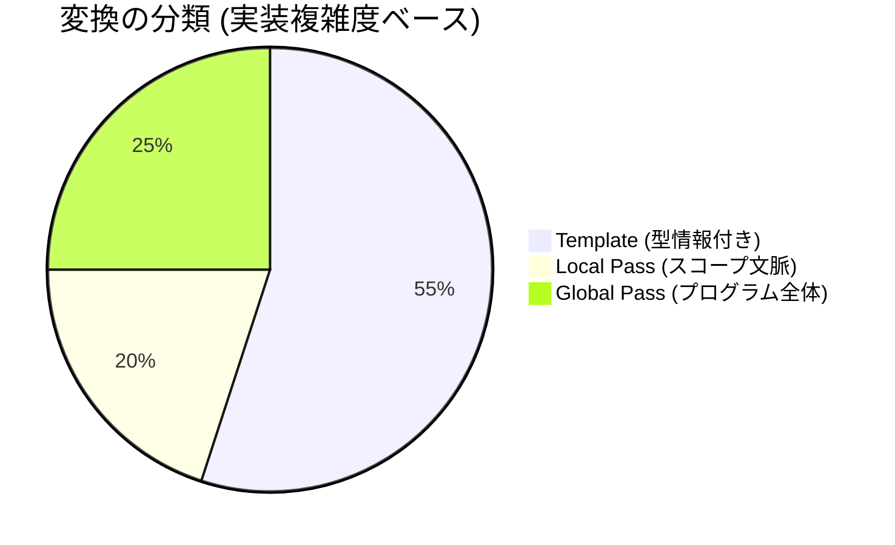
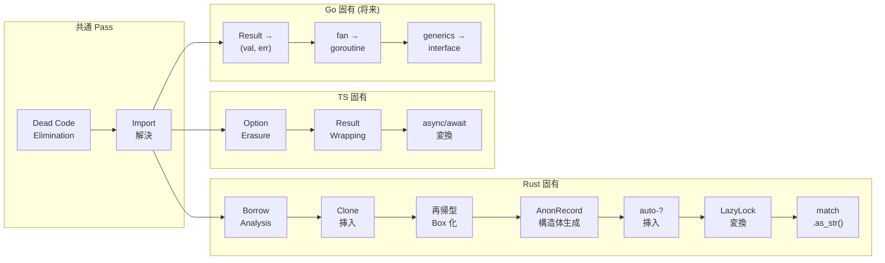

<!-- description: Complete classification of codegen transforms by context depth -->
# Codegen v3: Transform Classification

Codegen がやっている全変換を、必要な文脈の深さで 3 段階に分類する。



## 分類基準

| レベル | 必要な情報 | 実装方式 |
|--------|-----------|---------|
| **Template** | ノードの種類 + 型情報のみ | TOML + 型タグ |
| **Local Pass** | 周囲のスコープ情報 (effect fn 内か、ループ内か等) | 小さな Nanopass |
| **Global Pass** | プログラム全体の情報 (全型定義、使用箇所分析等) | 解析 + 変換 Pass |

---

## Level 1: Template（TOML で宣言可能）— ~55%

ノードの種類と型情報だけで変換先が決まる。文脈不要。

### 構文フォーマット

| 変換 | Rust | TypeScript | Python | Go |
|------|------|-----------|--------|-----|
| if/else | `if {c} {{ {t} }} else {{ {e} }}` | `if ({c}) {{ {t} }} else {{ {e} }}` | `if {c}:\n  {t}\nelse:\n  {e}` | `if {c} {{ {t} }} else {{ {e} }}` |
| match | `match {s} {{ {arms} }}` | IIFE + if/else chain | if/elif chain | switch |
| fn 宣言 | `fn {n}({p}) -> {r} {{ {b} }}` | `function {n}({p}): {r} {{ {b} }}` | `def {n}({p}) -> {r}:` | `func {n}({p}) {r} {{ {b} }}` |
| let 束縛 | `let {n}: {t} = {v};` | `const {n}: {t} = {v};` | `{n}: {t} = {v}` | `{n} := {v}` |
| var 束縛 | `let mut {n}: {t} = {v};` | `let {n}: {t} = {v};` | `{n}: {t} = {v}` | `var {n} {t} = {v}` |
| for ループ | `for {v} in {iter} {{ {b} }}` | `for (const {v} of {iter}) {{ {b} }}` | `for {v} in {iter}:` | `for _, {v} := range {iter} {{ {b} }}` |
| while ループ | `while {c} {{ {b} }}` | `while ({c}) {{ {b} }}` | `while {c}:` | `for {c} {{ {b} }}` |
| 関数呼び出し | `{f}({a})` | `{f}({a})` | `{f}({a})` | `{f}({a})` |
| フィールドアクセス | `{e}.{f}` | `{e}.{f}` | `{e}.{f}` | `{e}.{f}` |
| レコードリテラル | `{T} {{ {fields} }}` | `{{ {fields} }}` | `{T}({fields})` | `{T}{{ {fields} }}` |
| リストリテラル | `vec![{elems}]` | `[{elems}]` | `[{elems}]` | `[]{T}{{ {elems} }}` |

### 型マッピング

| Almide 型 | Rust | TypeScript | Python | Go |
|-----------|------|-----------|--------|-----|
| `Int` | `i64` | `number` | `int` | `int64` |
| `Float` | `f64` | `number` | `float` | `float64` |
| `String` | `String` | `string` | `str` | `string` |
| `Bool` | `bool` | `boolean` | `bool` | `bool` |
| `List[T]` | `Vec<T>` | `T[]` | `list[T]` | `[]T` |
| `Map[K,V]` | `HashMap<K,V>` | `Map<K,V>` | `dict[K,V]` | `map[K]V` |
| `Option[T]` | `Option<T>` | `T \| null` | `Optional[T]` | `*T` or `(T, bool)` |
| `Result[T,E]` | `Result<T,E>` | `{ok,value}\|{ok,error}` | `T` (raise) | `(T, error)` |
| `Unit` | `()` | `void` | `None` | ` ` |

### 式の変換（型タグで分岐可能）

| 変換 | 条件 | Rust | TS |
|------|------|------|-----|
| `some(x)` | 常に | `Some({x})` | `{x}` |
| `none` | 型が既知 | `None::<{T}>` | `null` |
| `none` | 型が不明 | `None` | `null` |
| `ok(x)` | 常に | `Ok({x})` | `{{ ok: true, value: {x} }}` |
| `err(x)` | 常に | `Err({x}.to_string())` | `{{ ok: false, error: {x} }}` |
| `a == b` | 常に | `almide_eq!({a}, {b})` | `__deep_eq({a}, {b})` |
| `a != b` | 常に | `almide_ne!({a}, {b})` | `!__deep_eq({a}, {b})` |
| `a ++ b` | String | `format!("{{}}{{}}", {a}, {b})` | `{a} + {b}` |
| `a ++ b` | List | `AlmideConcat::concat({a}, {b})` | `[...{a}, ...{b}]` |
| `a ** b` | Int | `{a}.pow({b} as u32)` | `{a} ** {b}` |
| `a ** b` | Float | `{a}.powf({b})` | `{a} ** {b}` |
| 文字列補間 | 常に | `format!("{fmt}", {args})` | `` `{template}` `` |

**テンプレートに型タグを持たせる:**

```toml
[concat]
rust.when_type = "String"
rust.template = "format!(\"{{}}{{}}\", {left}, {right})"
rust.when_type = "List"
rust.template = "AlmideConcat::concat({left}, {right})"

ts.template = "{left} + {right}"   # TS は型によらず同じ
```

---

## Level 2: Local Pass（スコープ文脈が必要）— ~20%

ノード単体では決まらず、「今どの関数の中にいるか」「ループ内か」等の局所的な文脈が必要。

| # | 変換 | 必要な文脈 | target | 説明 |
|---|------|-----------|--------|------|
| 1 | **auto-? 挿入** | effect fn 内かどうか | Rust | Result 返却の呼び出しに `?` を付加 |
| 2 | **effect fn return wrap** | fn が effect かどうか | Rust | 戻り値を `Ok(...)` で包む |
| 3 | **match subject の auto-? 剥がし** | match の subject が Result 型か | Rust | `?` 挿入後に match で分解する場合は `?` を外す |
| 4 | **match subject の .as_str()** | subject が String 型 + literal pattern | Rust | `match s.as_str() { "a" => ... }` |
| 5 | **top-level let → LazyLock** | let が top-level かどうか | Rust | `static X: LazyLock<T> = ...` |
| 6 | **TS Result erasure の文脈** | match で Result を分解中か | TS | match 内では erasure しない |
| 7 | **ループ内変数の所有権** | for/while ループ内か | Rust | ループ変数の clone 戦略 |

**実装方式:** 各 Pass は IR を走査し、スコープスタック（`[GlobalScope, FnScope(effect=true), LoopScope]`）を持つ。ノードを訪問するたびにスタックを参照して変換を決定。

```rust
struct ScopeContext {
    in_effect_fn: bool,
    in_loop: bool,
    is_top_level: bool,
    match_subject_ty: Option<Ty>,
}

// 例: auto-? Pass
fn rewrite_call(call: &IrExpr, ctx: &ScopeContext) -> IrExpr {
    if ctx.in_effect_fn && call.ty.is_result() {
        IrExpr::try_wrap(call)  // ? を付加
    } else {
        call.clone()
    }
}
```

---

## Level 3: Global Pass（プログラム全体の解析が必要）— ~25%

1 つの関数だけ見ても決まらない。プログラム全体の型グラフ、使用箇所、依存関係の解析が必要。

| # | 変換 | 必要な解析 | target | 説明 |
|---|------|-----------|--------|------|
| 1 | **Borrow analysis** | 全関数の引数の使用パターン | Rust | パラメータを `&T` にするか `T` にするか |
| 2 | **Clone 挿入** | 変数の使用回数カウント (use-count) | Rust | 2 回以上使う変数に `.clone()` |
| 3 | **再帰型 Box 化** | 型グラフの循環検出 | Rust | `enum Tree { Node(Box<Tree>, Box<Tree>), Leaf }` |
| 4 | **Anonymous record 構造体生成** | 全プログラム中の record 形状を収集 | Rust | `struct AlmdRec_age_name { age: i64, name: String }` |
| 5 | **Fan/並行処理 lowering** | 各ブランチの型 + キャプチャ変数 | 全 target | `fan { a, b }` → thread spawn + join / Promise.all |
| 6 | **Monomorphization** | ジェネリクスの全インスタンス化箇所 | Rust | `fn foo<T>` → `fn foo_i64`, `fn foo_string` |
| 7 | **Dead code elimination** | 全プログラムの call graph | 全 target | 使われていない関数を除去 |
| 8 | **Import 解決** | モジュール依存グラフ | 全 target | target 別の import 文生成 |

**実装方式:** 各 Pass は IR 全体を受け取り、解析フェーズ（収集）→ 変換フェーズ（書き換え）の 2 段構成。

```rust
// 例: Borrow analysis Pass
fn analyze(program: &IrProgram) -> BorrowInfo {
    // Phase 1: 全関数のパラメータ使用パターンを収集
    let mut info = BorrowInfo::new();
    for func in &program.functions {
        for param in &func.params {
            info.record_usage(param, analyze_usage(func, param));
        }
    }
    info
}

fn rewrite(program: &IrProgram, info: &BorrowInfo) -> IrProgram {
    // Phase 2: 収集結果に基づいてパラメータ型を &T に変更
    // ...
}
```

---

## Target 別の Pass 構成



---

## まとめ: 実装比率

| レベル | 変換数 | 実装量 (推定) | 方式 |
|--------|-------|-------------|------|
| Template (TOML) | ~25 種 | ~100-150 行/target | 宣言的。型タグで分岐 |
| Local Pass | ~7 種 | ~300 行/target | 小 Nanopass。スコープスタック |
| Global Pass | ~8 種 | ~500 行 (共通+target固有) | 解析→変換の 2 段構成 |

**Target 追加の実コスト:**

| target | Template | Local Pass | Global Pass | Runtime | 合計 |
|--------|----------|-----------|-------------|---------|------|
| Rust (現行) | 150 行 | 300 行 | 500 行 | 既存 | ~950 行 |
| TypeScript (現行) | 120 行 | 150 行 | 200 行 | 既存 | ~470 行 |
| Go (将来) | 130 行 | 200 行 | 300 行 | ~200 行 | ~830 行 |
| Python (将来) | 100 行 | 100 行 | 150 行 | ~200 行 | ~550 行 |

現行 ~1500 行/target → **v3 で ~500-950 行/target。40-65% 削減。**

Python のような GC 言語は所有権解析が不要なので最も軽い。Rust は所有権があるので最も重い。
