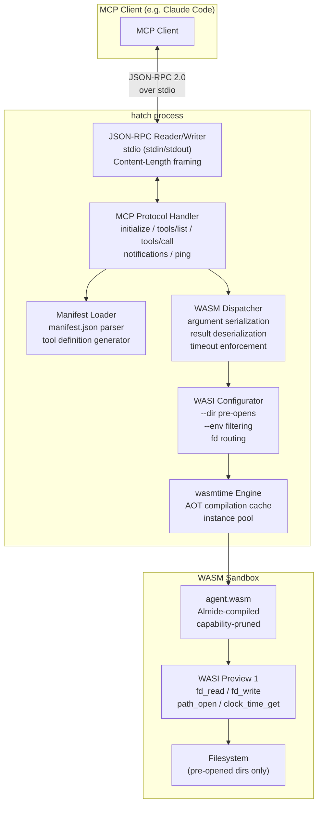
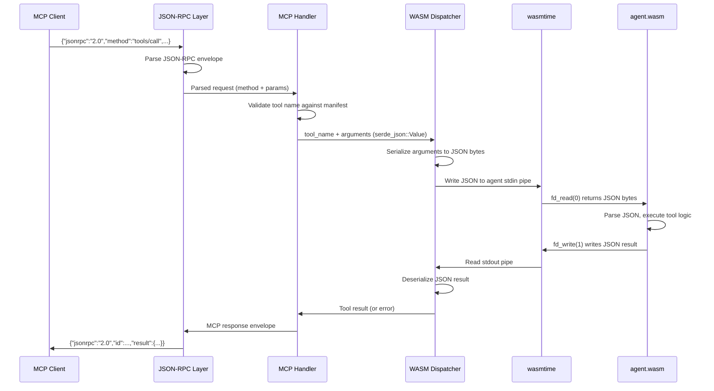
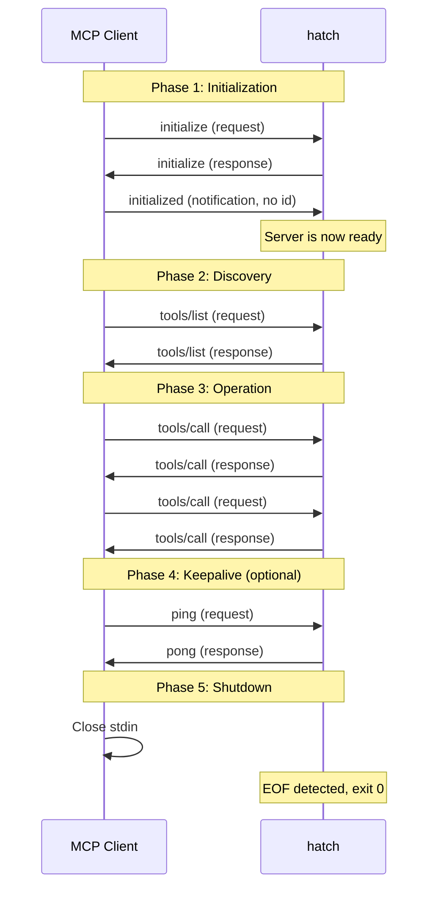
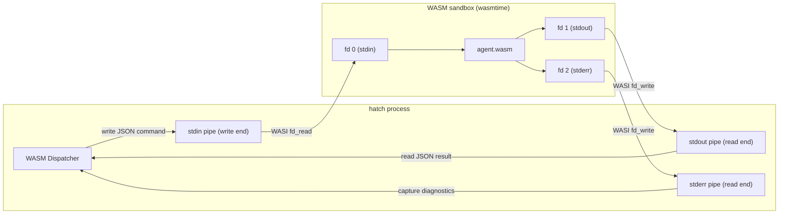
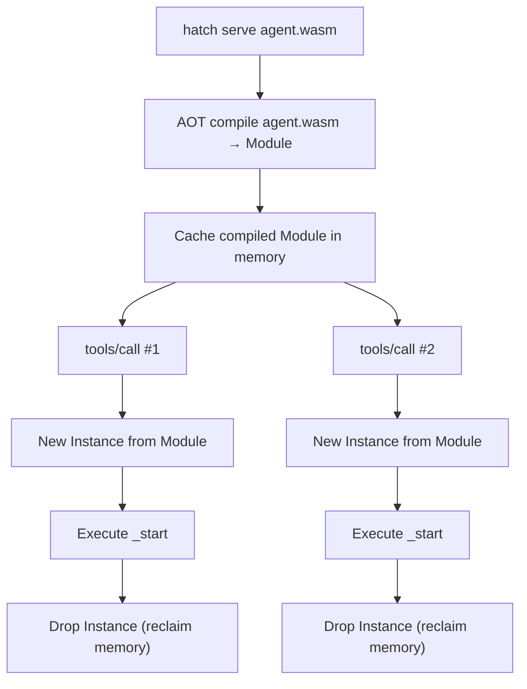
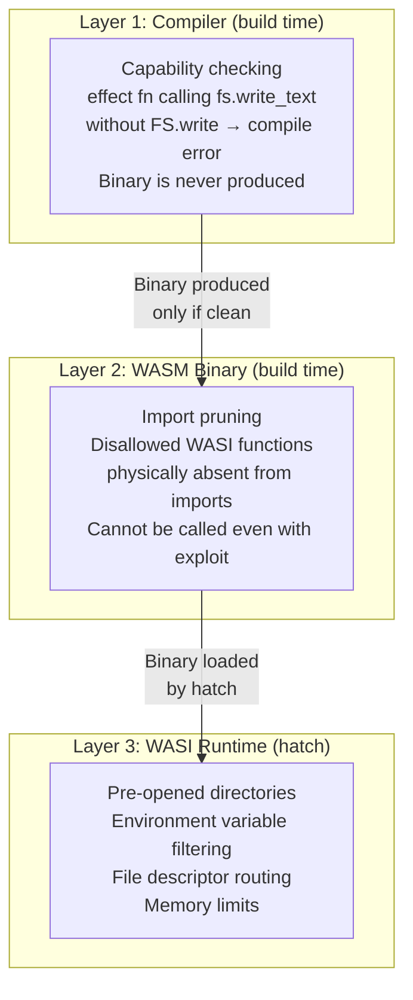

# hatch — Almide WASM Agent MCP Bridge

Standalone tool that loads an Almide-compiled WASM binary and exposes it as an MCP server over JSON-RPC 2.0 / stdio. hatch is the bridge between the Almide capability-checked WASM sandbox and any MCP client (Claude Code, Cursor, GitHub Copilot, OpenAI Agents SDK, or custom).

## Why standalone

MCP is a protocol, not a language feature. If MCP is superseded (A2A, WebMCP, or something new), hatch is replaced — the compiler and language are untouched. The WASM binary remains valid. Only the bridge changes.

This also means hatch has its own release cycle, its own version, and its own test suite — independent of the Almide compiler.

## Architecture

### Component Diagram



### Internal Data Flow



### Module Breakdown

| Module | Responsibility | Approximate LOC |
|--------|---------------|-----------------|
| `jsonrpc.rs` | stdio reader/writer, Content-Length framing, JSON-RPC 2.0 parse/serialize | 100 |
| `mcp.rs` | MCP protocol state machine: initialize, tools/list, tools/call, ping, notifications | 150 |
| `manifest.rs` | manifest.json parser, tool definition validation, JSON Schema extraction | 80 |
| `dispatch.rs` | JSON args → agent stdin, agent stdout → JSON result, timeout, error recovery | 120 |
| `wasi.rs` | wasmtime Engine/Store/Linker setup, WASI capability configuration, pre-opens | 100 |
| `cli.rs` | clap CLI: serve, inspect, validate subcommands | 50 |
| **Total** | | **~600** |

No framework dependency. No async runtime. Blocking stdio is correct for MCP stdio transport.

## What hatch does

```
manifest.json  ──→  hatch  ──→  MCP Server (JSON-RPC 2.0 / stdio)
agent.wasm     ──→  hatch  ──→  wasmtime (WASM runtime)
```

1. **Read manifest.json** — generate MCP tool definitions (name, description, JSON Schema params)
2. **Load agent.wasm** into wasmtime — apply WASI capabilities (`--dir`, `--env`)
3. **MCP protocol loop** — `initialize` → `initialized` → `tools/list` → `tools/call` → dispatch to WASM
4. **Invoke WASM function** — pass args via stdin pipe → read result from stdout pipe → return MCP response

## What hatch does NOT do

- WIT parsing (manifest.json is enough)
- Component Model (core module direct execution)
- A2A protocol (separate tool if needed)
- HTTP transport (stdio only for v1; Streamable HTTP is future)
- Tool discovery logic (manifest declares everything at build time)
- WASM compilation (that is `almide build --target wasm`)
- Permission prompting (the binary is already capability-proven at compile time)

---

## manifest.json

### Full Specification

Generated by `almide build --target wasm`. Contains everything hatch needs to serve the agent. The compiler extracts tool definitions from Almide source annotations and produces this file alongside `agent.wasm`.

```json
{
  "schema_version": "1.0",
  "name": "code-review-agent",
  "version": "0.1.0",
  "description": "Reviews code for style, correctness, and security issues",
  "capabilities": ["FS.read", "IO.stdin", "IO.stdout"],
  "tools": [
    {
      "name": "read_file",
      "description": "Read file contents at the given path",
      "inputSchema": {
        "type": "object",
        "properties": {
          "path": {
            "type": "string",
            "description": "File path to read"
          }
        },
        "required": ["path"],
        "additionalProperties": false
      }
    },
    {
      "name": "review_code",
      "description": "Analyze source code and return review comments",
      "inputSchema": {
        "type": "object",
        "properties": {
          "path": {
            "type": "string",
            "description": "File path to review"
          },
          "severity": {
            "type": "string",
            "enum": ["error", "warning", "info"],
            "description": "Minimum severity level to report"
          },
          "max_issues": {
            "type": "integer",
            "description": "Maximum number of issues to return",
            "default": 50
          }
        },
        "required": ["path"],
        "additionalProperties": false
      }
    },
    {
      "name": "list_dir",
      "description": "List directory contents",
      "inputSchema": {
        "type": "object",
        "properties": {
          "path": {
            "type": "string",
            "description": "Directory path"
          }
        },
        "required": ["path"],
        "additionalProperties": false
      }
    }
  ],
  "wasi_imports": [
    "fd_read",
    "fd_write",
    "fd_close",
    "path_open",
    "path_filestat_get"
  ],
  "entry": "_start"
}
```

### Field Reference

| Field | Type | Required | Description |
|-------|------|----------|-------------|
| `schema_version` | string | yes | Manifest format version. Currently `"1.0"`. hatch rejects unknown major versions. |
| `name` | string | yes | Agent name. Used in MCP `serverInfo.name`. Must match `[a-z0-9-]+`. |
| `version` | string | yes | Semver version. Reported in MCP `serverInfo.version`. |
| `description` | string | no | Human-readable description of what the agent does. |
| `capabilities` | string[] | yes | Almide capability categories the agent requires. Must match the `[permissions].allow` from `almide.toml`. |
| `tools` | object[] | yes | MCP tool definitions. Each contains `name`, `description`, `inputSchema`. |
| `tools[].name` | string | yes | Tool name. Must match `[a-z_][a-z0-9_]*`. Used in `tools/call`. |
| `tools[].description` | string | yes | Human-readable description. Shown to LLM for tool selection. |
| `tools[].inputSchema` | object | yes | JSON Schema (draft 2020-12) describing the tool's parameters. |
| `wasi_imports` | string[] | yes | WASI Preview 1 functions the binary imports. hatch validates these against the actual WASM imports. |
| `entry` | string | yes | WASM entry point function. Typically `"_start"` for WASI modules. |

### Tool Declaration in Almide Source

Tools are declared as `effect fn` with doc comments. The compiler extracts the function signature, parameter names, types, and doc strings to generate the `tools` array in `manifest.json`.

```almide
/// Read file contents at the given path
effect fn read_file(path: String) -> Result[String, String] =
  fs.read_text(path)

/// Analyze source code and return review comments
effect fn review_code(
  path: String,
  severity: String,  /// Minimum severity level to report
  max_issues: Int,   /// Maximum number of issues to return
) -> Result[String, String] = {
  let content = fs.read_text(path)!
  analyze(content, severity, max_issues)
}
```

### JSON Schema Generation from Almide Types

The compiler maps Almide types to JSON Schema types at build time:

| Almide Type | JSON Schema | Notes |
|-------------|-------------|-------|
| `String` | `{"type": "string"}` | |
| `Int` | `{"type": "integer"}` | |
| `Float` | `{"type": "number"}` | |
| `Bool` | `{"type": "boolean"}` | |
| `List[T]` | `{"type": "array", "items": <T>}` | Recursive schema generation |
| `Option[T]` | `<T>` with `"required"` omitted | Parameter becomes optional |
| Record type | `{"type": "object", "properties": {...}}` | Field names become property keys |
| Variant type | `{"oneOf": [...]}` | Each variant case becomes an alternative |

### Versioning

The `schema_version` field follows semver:
- **Patch** (1.0.x): Additive optional fields. Old hatch ignores new fields.
- **Minor** (1.x.0): New required fields with defaults. Old hatch still works.
- **Major** (x.0.0): Breaking changes. hatch rejects unknown major versions with a clear error.

hatch validates `schema_version` on startup. If the manifest was generated by a newer compiler than hatch supports, the error message tells the user which hatch version to upgrade to.

---

## CLI

```bash
# Serve: start MCP server on stdio
hatch serve agent.wasm
hatch serve agent.wasm --dir /workspace --dir /data
hatch serve agent.wasm --env API_KEY=xxx
hatch serve agent.wasm --timeout 30s

# Inspect: show manifest without starting server
hatch inspect agent.wasm

# Validate: check manifest against WASM binary
hatch validate agent.wasm
```

### `hatch serve`

Starts the MCP server. Reads JSON-RPC from stdin, writes responses to stdout. Does not exit until stdin closes (client disconnects) or a fatal error occurs.

| Flag | Description |
|------|-------------|
| `--dir <path>` | Pre-open a directory for WASI filesystem access. Repeatable. |
| `--env <KEY=VALUE>` | Pass an environment variable to the WASM agent. Repeatable. |
| `--timeout <duration>` | Per-tool-call timeout. Default `30s`. Accepts `10s`, `1m`, `5m`. |
| `--aot` | Force AOT compilation on startup (slower start, faster calls). Default: on. |
| `--no-aot` | Disable AOT compilation (faster start, slower calls). For development. |

### `hatch inspect`

Prints the manifest contents in human-readable form. Does not start a server.

```
Agent:   code-review-agent v0.1.0
Caps:    FS.read, IO.stdin, IO.stdout
Entry:   _start
WASI:    fd_read, fd_write, fd_close, path_open, path_filestat_get

Tools (3):
  read_file(path: string)
    Read file contents at the given path
  review_code(path: string, severity?: string, max_issues?: integer)
    Analyze source code and return review comments
  list_dir(path: string)
    List directory contents
```

### `hatch validate`

Checks that the manifest and WASM binary are consistent:

1. Parses `manifest.json`, validates schema
2. Loads `agent.wasm`, inspects imports section
3. Verifies every `wasi_imports` entry matches an actual WASM import
4. Verifies no WASM import exists that is NOT in `wasi_imports` (catches capability drift)
5. Verifies the `entry` function exists and has the correct signature
6. Exit code 0 = valid, 1 = invalid (with diagnostic)

---

## MCP Protocol Implementation

hatch implements the MCP specification (2025-03-26) over stdio transport. All messages use JSON-RPC 2.0 with `Content-Length` header framing.

### Wire Format

Each message is framed as:

```
Content-Length: <byte_count>\r\n
\r\n
<JSON-RPC body>
```

hatch reads `Content-Length`, then reads exactly that many bytes. This is the same framing used by LSP.

### Connection Lifecycle



### `initialize`

The client sends `initialize` as the first request. hatch responds with server capabilities.

**Request:**

```json
{
  "jsonrpc": "2.0",
  "id": 1,
  "method": "initialize",
  "params": {
    "protocolVersion": "2025-03-26",
    "capabilities": {},
    "clientInfo": {
      "name": "claude-code",
      "version": "1.0.0"
    }
  }
}
```

**Response:**

```json
{
  "jsonrpc": "2.0",
  "id": 1,
  "result": {
    "protocolVersion": "2025-03-26",
    "serverInfo": {
      "name": "hatch/code-review-agent",
      "version": "0.1.0"
    },
    "capabilities": {
      "tools": {
        "listChanged": false
      }
    }
  }
}
```

`listChanged: false` because hatch tools are static (declared at compile time in manifest.json). The tool list never changes during a session.

**Error — protocol version mismatch:**

```json
{
  "jsonrpc": "2.0",
  "id": 1,
  "error": {
    "code": -32600,
    "message": "Unsupported protocol version: 2024-01-01. Supported: 2025-03-26"
  }
}
```

### `initialized` (notification)

After receiving the `initialize` response, the client sends `initialized` as a notification (no `id` field). This signals the server that it may begin processing requests.

```json
{
  "jsonrpc": "2.0",
  "method": "notifications/initialized"
}
```

hatch transitions its internal state machine from `Initializing` to `Ready`. Any `tools/list` or `tools/call` received before `initialized` is rejected with error code `-32002` ("Server not initialized").

```json
{
  "jsonrpc": "2.0",
  "id": 2,
  "error": {
    "code": -32002,
    "message": "Server not yet initialized. Send 'initialized' notification first."
  }
}
```

### `tools/list`

Returns all tools declared in manifest.json. Since hatch tools are static, this always returns the complete list.

**Request:**

```json
{
  "jsonrpc": "2.0",
  "id": 2,
  "method": "tools/list",
  "params": {}
}
```

**Response:**

```json
{
  "jsonrpc": "2.0",
  "id": 2,
  "result": {
    "tools": [
      {
        "name": "read_file",
        "description": "Read file contents at the given path",
        "inputSchema": {
          "type": "object",
          "properties": {
            "path": {
              "type": "string",
              "description": "File path to read"
            }
          },
          "required": ["path"],
          "additionalProperties": false
        }
      },
      {
        "name": "review_code",
        "description": "Analyze source code and return review comments",
        "inputSchema": {
          "type": "object",
          "properties": {
            "path": {
              "type": "string",
              "description": "File path to review"
            },
            "severity": {
              "type": "string",
              "enum": ["error", "warning", "info"],
              "description": "Minimum severity level to report"
            },
            "max_issues": {
              "type": "integer",
              "description": "Maximum number of issues to return",
              "default": 50
            }
          },
          "required": ["path"],
          "additionalProperties": false
        }
      },
      {
        "name": "list_dir",
        "description": "List directory contents",
        "inputSchema": {
          "type": "object",
          "properties": {
            "path": {
              "type": "string",
              "description": "Directory path"
            }
          },
          "required": ["path"],
          "additionalProperties": false
        }
      }
    ]
  }
}
```

**Pagination:**

The MCP spec supports cursor-based pagination for `tools/list`. hatch supports this for forward compatibility, though in practice agent binaries have tens of tools, not thousands.

Request with cursor:

```json
{
  "jsonrpc": "2.0",
  "id": 3,
  "method": "tools/list",
  "params": {
    "cursor": "eyJvZmZzZXQiOjEwfQ=="
  }
}
```

Response with `nextCursor` (only present when more tools remain):

```json
{
  "jsonrpc": "2.0",
  "id": 3,
  "result": {
    "tools": [ ... ],
    "nextCursor": "eyJvZmZzZXQiOjIwfQ=="
  }
}
```

hatch uses base64-encoded JSON (`{"offset": N}`) as cursor values. Page size is 100 tools. When the response contains all remaining tools, `nextCursor` is omitted.

### `tools/call`

Dispatches a tool invocation to the WASM agent and returns the result.

**Request:**

```json
{
  "jsonrpc": "2.0",
  "id": 4,
  "method": "tools/call",
  "params": {
    "name": "read_file",
    "arguments": {
      "path": "src/main.py"
    }
  }
}
```

**Successful response:**

```json
{
  "jsonrpc": "2.0",
  "id": 4,
  "result": {
    "content": [
      {
        "type": "text",
        "text": "def main():\n    print('hello')\n\nif __name__ == '__main__':\n    main()\n"
      }
    ],
    "isError": false
  }
}
```

**Tool returns an application error** (the Almide `effect fn` returned `err(...)`):

```json
{
  "jsonrpc": "2.0",
  "id": 4,
  "result": {
    "content": [
      {
        "type": "text",
        "text": "File not found: src/main.py"
      }
    ],
    "isError": true
  }
}
```

Note: application errors use `isError: true` inside the `result`, NOT a JSON-RPC error. This is per the MCP spec — tool failures are still successful RPC calls.

**Unknown tool name:**

```json
{
  "jsonrpc": "2.0",
  "id": 4,
  "error": {
    "code": -32602,
    "message": "Unknown tool: 'delete_file'. Available tools: read_file, review_code, list_dir"
  }
}
```

**Invalid arguments (schema validation failure):**

```json
{
  "jsonrpc": "2.0",
  "id": 4,
  "error": {
    "code": -32602,
    "message": "Invalid arguments for tool 'read_file': missing required property 'path'"
  }
}
```

**WASM trap (unreachable, stack overflow, OOM):**

```json
{
  "jsonrpc": "2.0",
  "id": 4,
  "result": {
    "content": [
      {
        "type": "text",
        "text": "Agent execution failed: WASM trap: unreachable instruction at offset 0x1a3f"
      }
    ],
    "isError": true
  }
}
```

WASM traps are returned as `isError: true` tool results, not JSON-RPC errors. The MCP session remains alive — hatch reinstantiates the WASM module for the next call.

**Timeout:**

```json
{
  "jsonrpc": "2.0",
  "id": 4,
  "result": {
    "content": [
      {
        "type": "text",
        "text": "Agent execution timed out after 30s"
      }
    ],
    "isError": true
  }
}
```

hatch uses wasmtime's epoch-based interruption. The WASM execution is terminated cleanly, memory is reclaimed, and the module is reinstantiable.

### `ping`

Keepalive. hatch responds immediately.

**Request:**

```json
{
  "jsonrpc": "2.0",
  "id": 99,
  "method": "ping"
}
```

**Response:**

```json
{
  "jsonrpc": "2.0",
  "id": 99,
  "result": {}
}
```

### Unknown Method

Any method not in `{initialize, notifications/initialized, tools/list, tools/call, ping}` gets:

```json
{
  "jsonrpc": "2.0",
  "id": 5,
  "error": {
    "code": -32601,
    "message": "Method not found: resources/list"
  }
}
```

### JSON-RPC Error Codes

| Code | Meaning | When |
|------|---------|------|
| `-32700` | Parse error | Malformed JSON |
| `-32600` | Invalid request | Missing `jsonrpc`, `method`, or `id` |
| `-32601` | Method not found | Unknown MCP method |
| `-32602` | Invalid params | Missing required argument, wrong type, unknown tool |
| `-32002` | Server not initialized | Request before `initialized` notification |

---

## WASM Agent Communication

### Overview

hatch communicates with `agent.wasm` through WASI standard I/O file descriptors. The protocol is simple: hatch writes a JSON command to the agent's stdin, the agent processes it and writes a JSON result to stdout.



### fd 0 (stdin) — hatch writes, agent reads

When `tools/call` arrives, hatch serializes a command object and writes it to the agent's stdin pipe:

```json
{
  "tool": "read_file",
  "arguments": {
    "path": "src/main.py"
  }
}
```

The agent's `_start` function enters a read loop:
1. Call `fd_read(0, ...)` to read bytes from stdin
2. Parse the JSON command
3. Dispatch to the appropriate tool handler function
4. Write the result to stdout
5. Loop (wait for next command) or exit

The JSON is length-prefixed: hatch writes a 4-byte little-endian u32 length, then the JSON bytes. The agent reads the length first, then reads exactly that many bytes. This avoids delimiter ambiguity.

```
[4 bytes: length (LE u32)] [N bytes: JSON payload]
```

### fd 1 (stdout) — agent writes, hatch reads

The agent writes its result to stdout using the same length-prefixed protocol:

```
[4 bytes: length (LE u32)] [N bytes: JSON payload]
```

**Successful result:**

```json
{
  "ok": "def main():\n    print('hello')\n"
}
```

**Application error (Almide `err(...)`):**

```json
{
  "err": "File not found: src/main.py"
}
```

hatch maps these to MCP responses:
- `{"ok": value}` → `{"content": [{"type": "text", "text": value}], "isError": false}`
- `{"err": message}` → `{"content": [{"type": "text", "text": message}], "isError": true}`

### fd 2 (stderr) — diagnostics

The agent may write diagnostic information to stderr (via Almide's `eprintln` / `IO.stderr` capability). hatch captures stderr output but does NOT include it in MCP responses by default. Instead:

- Stderr is logged to hatch's own stderr (visible in terminal when running manually)
- On WASM trap, stderr contents are appended to the error message for debugging
- Stderr is never sent to the MCP client unless the agent explicitly writes to stdout

This prevents debug output from polluting tool results.

### Instance Lifecycle

hatch uses a **per-call fresh instance** model:



The wasmtime `Module` (compiled code) is created once and reused. Each `tools/call` creates a fresh `Instance` with clean memory. This means:

- No state leaks between calls
- A trap in call N does not affect call N+1
- Memory is fully reclaimed after each call
- The WASM linear memory starts fresh (heap_ptr = initial, scratch_ptr = 0)

### Error Handling

#### WASM Traps

When the agent hits an `unreachable` instruction, overflows the stack, or exceeds memory limits, wasmtime raises a trap. hatch catches the trap and:

1. Captures the trap message (e.g., `"unreachable instruction executed"`)
2. Captures the WASM instruction offset (for debugging)
3. Reads any stderr output the agent produced before the trap
4. Returns an `isError: true` MCP result with the combined diagnostic
5. Drops the instance (memory is reclaimed)
6. Remains ready for the next call (the Module is still valid)

Trap types and their causes:

| Trap | Cause | Recovery |
|------|-------|----------|
| `unreachable` | Bug in agent code (e.g., `todo()` or compiler-generated unreachable) | Report to developer |
| `call stack exhausted` | Unbounded recursion without tail call optimization | Increase stack size or fix recursion |
| `out of bounds memory access` | Bug in agent code or compiler codegen | Report to developer |
| `indirect call type mismatch` | Corrupted function table | Report to developer |
| `memory.grow failed` | Agent exceeded memory limit | Increase `--max-memory` or optimize agent |

#### Timeout

hatch uses wasmtime's **epoch-based interruption**:

1. On `tools/call`, hatch starts a background timer thread
2. The timer increments the wasmtime engine epoch every 10ms
3. The WASM instance is configured with a deadline epoch (e.g., 3000 increments = 30s)
4. If the epoch exceeds the deadline, wasmtime raises a trap: `"epoch deadline exceeded"`
5. hatch catches this trap and returns a timeout error

Epoch interruption is cooperative at the instruction level — wasmtime checks the epoch at loop backedges and function calls. The worst-case latency between the deadline and actual interruption is one WASM basic block execution (microseconds in practice).

#### Malformed Agent Output

If the agent writes invalid JSON to stdout, or writes nothing before exiting:

```json
{
  "jsonrpc": "2.0",
  "id": 4,
  "result": {
    "content": [
      {
        "type": "text",
        "text": "Agent produced invalid output: expected JSON, got 42 bytes of non-JSON data"
      }
    ],
    "isError": true
  }
}
```

---

## Security

### Defense in Depth

hatch enforces security at three layers. The first two are applied before hatch even runs (by the Almide compiler). The third is applied by hatch + wasmtime at runtime.



### WASI Capability Application

hatch configures wasmtime's WASI context based on CLI flags and manifest capabilities:

```rust
// Pseudocode for WASI configuration
let mut wasi = WasiCtxBuilder::new();

// stdin/stdout/stderr: always piped (hatch controls both ends)
wasi.stdin(pipe_from_hatch);
wasi.stdout(pipe_to_hatch);
wasi.stderr(pipe_to_hatch_diagnostics);

// Pre-opened directories: only what --dir specifies
for dir in cli.dirs {
    wasi.preopened_dir(dir, dir, DirPerms::from_caps(&manifest.capabilities))?;
}

// Environment variables: only what --env specifies
for (key, value) in cli.envs {
    wasi.env(key, value);
}

// No inherited environment. No inherited file descriptors.
// No network access. No process spawning.
```

### Pre-opened Directories

WASI sandbox means the agent has NO filesystem access by default. It can only access directories explicitly pre-opened by hatch via `--dir`:

```bash
hatch serve agent.wasm --dir /workspace --dir /data/readonly
```

This creates two pre-opened directories:
- `/workspace` — mapped to guest path `/workspace`
- `/data/readonly` — mapped to guest path `/data/readonly`

The agent calling `fs.read_text("/etc/passwd")` gets a WASI error: no pre-opened directory covers `/etc`. This is enforced by wasmtime, not by hatch code — it is inescapable from within WASM.

**Read vs write permissions** are determined by the manifest capabilities:

| Manifest capability | Pre-open permissions |
|---------------------|---------------------|
| `FS.read` only | `DirPerms::READ` (path_open with read flag only) |
| `FS.read` + `FS.write` | `DirPerms::READ \| DirPerms::WRITE` |
| Neither | No pre-opens configured (even with `--dir`, hatch refuses to start) |

### Environment Variable Filtering

The agent receives ONLY the environment variables passed via `--env`. The host environment is never inherited:

```bash
# Agent sees API_KEY and MODEL, nothing else
hatch serve agent.wasm --env API_KEY=sk-xxx --env MODEL=claude-3

# Agent sees zero environment variables
hatch serve agent.wasm
```

Even if `Env.read` is in the manifest capabilities, `env.get("HOME")` returns `none` unless `--env HOME=/home/user` was passed.

### What the Agent CANNOT Do

Regardless of capabilities, Almide source code, or any exploit attempt, the WASM agent cannot:

| Action | Why it is impossible |
|--------|---------------------|
| Access files outside `--dir` paths | WASI pre-open scoping (wasmtime enforced) |
| Read host environment variables | No inherited env (explicit `--env` only) |
| Open network connections | No WASI socket imports (not in WASI Preview 1 imports) |
| Spawn processes | No `proc_exec` or equivalent WASI import |
| Access host memory | WASM linear memory is isolated (wasmtime enforced) |
| Call functions not in its imports | WASM validation rejects calls to missing imports |
| Escape the sandbox via JIT spray | wasmtime uses W^X memory mapping (no JIT spray) |
| Read its own binary | WASM has no self-reflection capability |
| Communicate with other processes | No IPC, no shared memory, no signals |
| Write to hatch's stdout | Agent stdout is a pipe; hatch controls the MCP stdio channel separately |

### Memory Limits

hatch configures wasmtime memory limits to prevent runaway agents:

```bash
hatch serve agent.wasm --max-memory 256MB
```

Default: 256MB per instance. If the agent's `memory.grow` exceeds this, wasmtime returns -1 (grow failure). The Almide bump allocator treats this as a trap (`unreachable`), which hatch catches and reports.

---

## Claude Code Integration

### Model A: Additive (MCP tool)

```json
// .claude/.mcp.json
{
  "mcpServers": {
    "hatch": {
      "type": "stdio",
      "command": "hatch",
      "args": ["serve", "agent.wasm", "--dir", "/workspace"]
    }
  }
}
```

Claude uses native tools AND hatch tools. Developer chooses which to use based on the task. Tools from hatch appear as `mcp__hatch__read_file`, `mcp__hatch__review_code`, etc.

### Model B: Substitutive (full harness)

```json
// .claude/settings.json
{
  "permissions": {
    "deny": ["Bash", "Edit", "Write"],
    "allow": ["Read", "Glob", "Grep", "mcp__hatch__*"]
  },
  "hooks": {
    "PreToolUse": [{
      "matcher": "Bash|Edit|Write",
      "hooks": [{
        "type": "command",
        "command": "echo '{\"decision\":\"deny\",\"reason\":\"Use hatch MCP tools instead\"}'"
      }]
    }]
  }
}
```

```json
// .claude/.mcp.json
{
  "mcpServers": {
    "hatch": {
      "type": "stdio",
      "command": "hatch",
      "args": ["serve", "agent.wasm", "--dir", "/workspace"]
    }
  }
}
```

Claude can ONLY operate through hatch. All writes go through capability-checked WASM. Native Bash/Edit/Write are denied at the permission layer AND the hook layer (defense in depth).

---

## Deployment Patterns

### Local Development

The simplest setup. Developer runs hatch directly, connects Claude Code via `.mcp.json`.

```bash
# Terminal 1: build the agent
almide build src/main.almd --target wasm -o agent.wasm

# The .mcp.json config starts hatch automatically when Claude Code connects
```

```json
// .claude/.mcp.json
{
  "mcpServers": {
    "hatch": {
      "type": "stdio",
      "command": "hatch",
      "args": ["serve", "./agent.wasm", "--dir", "."]
    }
  }
}
```

Rebuild-restart cycle: after modifying Almide source and rebuilding, restart the MCP connection in Claude Code (hatch picks up the new `agent.wasm` on next startup).

### CI/CD Validation

Use `hatch validate` in CI pipelines to catch manifest/binary drift before deployment.

```yaml
# GitHub Actions
name: Validate Agent
on: [push, pull_request]
jobs:
  validate:
    runs-on: ubuntu-latest
    steps:
      - uses: actions/checkout@v4

      - name: Install Almide
        run: |
          curl -fsSL https://almide.dev/install.sh | sh
          echo "$HOME/.local/bin" >> $GITHUB_PATH

      - name: Install hatch
        run: |
          curl -fsSL https://almide.dev/hatch/install.sh | sh
          echo "$HOME/.local/bin" >> $GITHUB_PATH

      - name: Build agent
        run: almide build src/main.almd --target wasm -o agent.wasm

      - name: Validate agent
        run: hatch validate agent.wasm

      - name: Smoke test
        run: |
          echo '{"jsonrpc":"2.0","id":1,"method":"initialize","params":{"protocolVersion":"2025-03-26","capabilities":{},"clientInfo":{"name":"ci","version":"1.0.0"}}}' \
          | hatch serve agent.wasm --dir /tmp --timeout 5s \
          | head -1 | jq -e '.result.serverInfo.name'
```

### Production: systemd Service

For always-on agents (e.g., a code review bot running on a server), use systemd to manage hatch.

```ini
# /etc/systemd/system/hatch-review.service
[Unit]
Description=hatch MCP server for code-review-agent
After=network.target

[Service]
Type=simple
User=hatch
Group=hatch
ExecStart=/usr/local/bin/hatch serve /opt/agents/code-review/agent.wasm \
    --dir /var/data/repos \
    --env MODEL=claude-3 \
    --timeout 60s \
    --max-memory 512MB
Restart=on-failure
RestartSec=5
StandardInput=socket
StandardOutput=socket

# Hardening
NoNewPrivileges=true
ProtectSystem=strict
ProtectHome=true
PrivateTmp=true
ReadOnlyPaths=/opt/agents
ReadWritePaths=/var/data/repos

[Install]
WantedBy=multi-user.target
```

Note: For production with remote MCP clients, Streamable HTTP transport (future) would replace stdio. Until then, a reverse proxy or socat can bridge a TCP socket to hatch's stdio.

### Production: Docker Sidecar

Run hatch as a sidecar container alongside the MCP client.

```dockerfile
# Dockerfile.hatch
FROM debian:bookworm-slim

COPY --from=almide/hatch:latest /usr/local/bin/hatch /usr/local/bin/hatch
COPY agent.wasm /opt/agent/agent.wasm
COPY manifest.json /opt/agent/manifest.json

ENTRYPOINT ["hatch", "serve", "/opt/agent/agent.wasm", "--dir", "/workspace"]
```

```yaml
# docker-compose.yml
services:
  hatch:
    build:
      context: .
      dockerfile: Dockerfile.hatch
    volumes:
      - ./workspace:/workspace:ro
    stdin_open: true
    # The MCP client connects to hatch's stdio via docker attach or a socket bridge

  app:
    image: your-app:latest
    depends_on:
      - hatch
```

The Docker image is minimal — hatch is a single static binary (~15MB), and `agent.wasm` is typically <100KB. Total image size under 30MB.

### Multi-Agent

Multiple hatch instances, each serving a different agent with different capabilities. A single MCP client (Claude Code) connects to all of them.

```json
// .claude/.mcp.json
{
  "mcpServers": {
    "reviewer": {
      "type": "stdio",
      "command": "hatch",
      "args": ["serve", "review-agent.wasm", "--dir", "/workspace"]
    },
    "formatter": {
      "type": "stdio",
      "command": "hatch",
      "args": ["serve", "format-agent.wasm", "--dir", "/workspace"]
    },
    "security": {
      "type": "stdio",
      "command": "hatch",
      "args": ["serve", "security-agent.wasm", "--dir", "/workspace"]
    }
  }
}
```

Each hatch instance is an independent process with its own WASM sandbox. Agent isolation is absolute — they share nothing (no memory, no files, no communication channel). Claude Code sees tools from all three: `mcp__reviewer__*`, `mcp__formatter__*`, `mcp__security__*`.

---

## Performance

### Startup Time

| Phase | Time | Notes |
|-------|------|-------|
| Parse manifest.json | <1ms | Small JSON file, serde_json |
| Load + validate WASM binary | ~5ms | wasmtime binary validation |
| AOT compile to native code | ~50-200ms | One-time cost, cached in memory for session |
| MCP initialize handshake | <1ms | Two JSON-RPC messages |
| **Total cold start** | **~60-200ms** | Dominated by AOT compilation |

With `--no-aot` (interpreter mode): cold start drops to ~10ms, but per-call execution is 10-100x slower. Only useful for development iteration.

### Per-Call Overhead

| Phase | Time | Notes |
|-------|------|-------|
| JSON-RPC parse (request) | <0.1ms | serde_json, small payload |
| Tool name lookup | <0.01ms | HashMap lookup against manifest |
| Argument serialization | <0.1ms | serde_json serialize to bytes |
| WASM instance creation | ~0.1ms | Fresh instance from cached Module |
| stdin pipe write | <0.1ms | Kernel pipe, small payload |
| **WASM execution** | **varies** | Application logic (the actual tool work) |
| stdout pipe read | <0.1ms | Kernel pipe, result payload |
| Result deserialization | <0.1ms | serde_json parse |
| JSON-RPC serialize (response) | <0.1ms | serde_json, small payload |
| Instance drop | <0.05ms | Memory deallocation |
| **Total overhead (excluding WASM execution)** | **~0.5-1ms** | |

The overhead is negligible. A tool call that reads a file and returns its contents spends 99%+ of its time in WASM execution and WASI I/O, not in hatch dispatch.

### Memory Usage

| Component | Memory | Notes |
|-----------|--------|-------|
| hatch process baseline | ~5MB | Rust binary, wasmtime engine, manifest data |
| Compiled Module (AOT) | ~2-10MB | Depends on agent.wasm size; compiled native code is larger than WASM bytecode |
| Per-instance WASM memory (memory 0) | 4MB initial | 64 pages initial, growable to `--max-memory` limit |
| Per-instance WASM memory (memory 1) | 64KB initial | 1 page scratch buffer, growable on demand |
| Per-instance overhead (Store, WASI ctx) | ~0.5MB | wasmtime bookkeeping |
| **Total during tool call** | **~12-20MB** | One instance active at a time (sequential dispatch) |
| **Total idle** | **~7-15MB** | No active instance, only cached Module |

hatch processes one `tools/call` at a time (sequential). There is never more than one WASM instance alive simultaneously. This keeps memory usage predictable and low.

### Comparison

| Metric | hatch + agent.wasm | Docker + Python agent | Native binary agent |
|--------|--------------------|-----------------------|--------------------|
| Cold start | 60-200ms | 2-10s | <10ms |
| Per-call overhead | ~1ms | ~50-200ms (HTTP) | ~0.1ms |
| Idle memory | ~10MB | ~100-500MB | ~5MB |
| Agent binary size | 10-100KB | 50-500MB (image) | 5-50MB |
| Sandbox strength | WASM + WASI (capability-proven) | Container (runtime-checked) | None (OS process) |

---

## Future

- **Streamable HTTP transport** — remote hatch server (MCP spec 2025-03-26 supports this)
- **A2A Agent Card** — `hatch a2a agent.wasm` generates `/.well-known/agent.json`
- **OCI distribution** — `hatch push agent.wasm ghcr.io/org/agent:latest`
- **Multi-agent compose** — `hatch compose agents.toml` runs multiple agents with orchestrated capabilities
- **AOT cache on disk** — persist compiled modules to skip AOT compilation on restart
- **Structured output** — tools returning `{"type": "image", ...}` or `{"type": "resource", ...}` MCP content types
